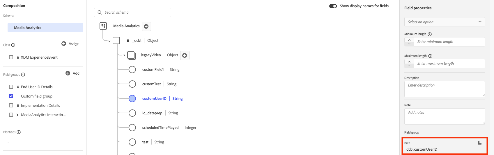
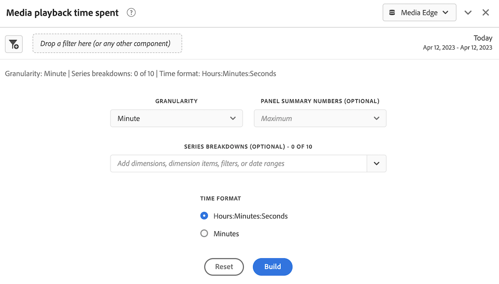

# Implementare Streaming Media Collection utilizzando l’Edge Network

La rete Edge di Adobe Experience Platform consente di inviare dati destinati a più prodotti a una posizione centralizzata. Experience Edge inoltra le informazioni appropriate ai prodotti desiderati. Questo concetto consente di consolidare le attività di implementazione, in particolare per quanto riguarda più soluzioni di dati.

L’immagine seguente illustra come implementare Adobe Streaming Media Collection per utilizzare Experience Platform Edge per rendere i dati disponibili in Analysis Workspace, in Adobe Analytics o Customer Journey Analytics:

Per una panoramica di tutte le opzioni di implementazione, inclusi i metodi di implementazione che non utilizzano Experience Platform Edge, vedi [Implementare Streaming Media Collection](/help/implementation/overview.md).

Indipendentemente dal fatto che si utilizzi Adobe Experience Platform Web SDK, Adobe Experience Platform Mobile SDK, Adobe Experience Platform Roku SDK o l’API per implementare Streaming Media Collection con Experience Edge, è necessario prima completare le sezioni seguenti:

## Configurare lo schema in Adobe Experience Platform

Per standardizzare la raccolta dati da utilizzare nelle applicazioni che sfruttano Adobe Experience Platform, Adobe ha creato lo standard aperto e pubblicamente documentato Experience Data Model (XDM).

Per creare e impostare uno schema:

1. In Adobe Experience Platform, iniziare a creare lo schema come descritto in [Creare e modificare gli schemi nell&#39;interfaccia utente](https://experienceleague.adobe.com/docs/experience-platform/xdm/ui/resources/schemas.html?lang=it).

1. Nella pagina dei dettagli dello schema durante la creazione dello schema, scegliere [!UICONTROL **Evento esperienza**] quando si sceglie la classe base per lo schema.

   

1. Seleziona [!UICONTROL **Avanti**].

1. Specifica il nome e la descrizione dello schema, quindi seleziona [!UICONTROL **Fine**].

1. Nell&#39;area [!UICONTROL **Composizione**], nella sezione [!UICONTROL **Gruppi di campi**], selezionare [!UICONTROL **Aggiungi**], quindi cercare e aggiungere i seguenti nuovi gruppi di campi allo schema:
   * `Adobe Analytics ExperienceEvent Template`
   * `Implementation Details`
   * `MediaAnalytics Interaction Details`

   Dopo aver aggiunto i gruppi di campi, questi devono essere visualizzati nella sezione [!UICONTROL **Gruppi di campi**], come segue:

   

1. Seleziona [!UICONTROL **Salva**] per salvare le modifiche.

1. (Facoltativo) Puoi nascondere alcuni campi non utilizzati dall’API di Media Edge. Nascondere questi campi semplifica la lettura e la comprensione dello schema, ma non è obbligatorio. Questi campi fanno riferimento solo a quelli del gruppo di campi `MediaAnalytics Interaction Details`.

+++ Espandi qui per visualizzare le istruzioni sui campi che puoi nascondere.

   1. Nell&#39;area [!UICONTROL **Struttura**], selezionare il campo `Media Collection Details`, quindi selezionare [!UICONTROL **Gestisci campi correlati**].

      

   1. Abilita l&#39;opzione per [!UICONTROL **mostrare i nomi visualizzati per i campi**], quindi aggiorna lo schema come segue:

      * Nel campo `Media Collection Details` > `Advertising Details`, nascondi i seguenti campi di reporting: `Ad Completed`, `Ad Started` e `Ad Time Played`.

      * Nel campo `Media Collection Details` > `Advertising Pod Details`, nascondi il seguente campo di reporting: `Ad Break ID`

      * Nel campo `Media Collection Details` > `Chapter Details`, nascondere i seguenti campi di reporting: `Chapter Completed`, `Chapter ID`, `Chapter Started` e `Chapter Time Played`.

      * Nel campo `Media Collection Details`, nascondere il campo `List Of States`.

        

      * Nel campo `Media Collection Details` > `List Of States End` e `Media Collection Details` > `List Of States Start`, nascondi i seguenti campi di reporting: `Player State Count`, `Player State Set` e `Player State Time`.

        

      * Nel campo `Media Collection Details` > `Qoe Data Details`, nascondere i seguenti campi di reporting: `Average Bitrate`, `Average Bitrate Bucket`, `Bitrate Change Impacted Streams`, `Bitrate Changes`, `Buffer Impacted Streams`, `Buffer Events`, `Dropped Frame Impacted Streams`, `Drops Before Starts`, `Errors`, `External Error IDs`, `Error Impacted Streams`, `Media SDK Error IDs`, `Player SDK Error IDs`, `Stalling Impacted Streams`, `Stalling Events`, `Total Buffer Duration` e `Total Stalling Duration`.

      * Nel campo `Media Collection Details` > `Session Details`, nascondere i seguenti campi di reporting: `10% Progress Marker`, `25% Progress Marker`, `50% Progress Marker`, `75% Progress Marker`, `95% Progress Marker`, `Ad Count`, `Average Minute Audience`, `Content Completes`, `Chapter Count`, `Content Starts`, `Content Time Spent`, `Estimated Streams`, `Federated Data`, `Media Segment Views`, `Media Downloaded Flag`, `Media Starts`, `Media Session ID`, `Media Session Server Timeout`, `Media Time Spent`, `Pause Events`, `Pause Impacted Streams`, `Pev3`, `Pccr`, `Total Pause Duration`, `Unique Time Played` e `Video Segment`.

   1. Seleziona [!UICONTROL **Conferma**] per salvare le modifiche.

   1. Nell&#39;area [!UICONTROL **Struttura**], abilitare l&#39;opzione per [!UICONTROL **Mostra nomi visualizzati per i campi**], quindi selezionare il campo `List Of Media Collection Downloaded Content Events`.

   1. Seleziona [!UICONTROL **Gestisci campi correlati**], quindi aggiorna lo schema come segue:

      * Nel campo `List Of Media Collection Downloaded Content Events` > `Media Details` > `Advertising Details`, nascondi i seguenti campi di reporting: `Ad Completed`, `Ad Started` e `Ad Time Played`.

      * Nel campo `List Of Media Collection Downloaded Content Events` > `Media Details` > `Advertising Pod Details`, nascondi il seguente campo di reporting: `Ad Break ID`

      * Nel campo `List Of Media Collection Downloaded Content Events` > `Media Details` > `Chapter Details`, nascondi i seguenti campi di reporting: `Chapter Completed`, `Chapter ID`, `Chapter Started` e `Chapter Time Played`.

      * Nel campo `List Of Media Collection Downloaded Content Events` > `Media Details`, nascondi il campo `List Of States`.

      * Nel campo `List Of Media Collection Downloaded Content Events` > `Media Details` > `List Of States End` e `Media Collection Details` > `List Of States Start`, nascondi i seguenti campi di reporting: `Player State Count`, `Player State Set` e `Player State Time`.

      * Nel campo `List Of Media Collection Downloaded Content Events` > `Media Details` > `Qoe Data Details`, nascondi i seguenti campi di reporting: `Average Bitrate`, `Average Bitrate Bucket`, `Bitrate Change Impacted Streams`, `Bitrate Changes`, `Buffer Events`, `Buffer Impacted Streams`, `Drops Before Starts`, `Dropped Frame Impacted Streams`, `Error Impacted Streams`, `Errors`, `External Error IDs`, `Media SDK Error IDs`, `Player SDK Error IDs`, `Stalling Events`, `Stalling Impacted Streams`, `Total Buffer Duration` e `Total Stalling Duration`.

      * Nel campo `List Of Media Collection Downloaded Content Events` > `Media Details` > `Session Details`, nascondere i seguenti campi di reporting: `10% Progress Marker`, `25% Progress Marker`, `50% Progress Marker`, `75% Progress Marker`, `95% Progress Marker`, `Ad Count`, `Average Minute Audience`, `Chapter Count`, `Content Completes`, `Content Starts`, `Content Time Spent`, `Estimated Streams`, `Federated Data`, `Media Downloaded Flag`, `Media Segment Views`, `Media Session ID`, `Media Session Server Timeout`, `Media Starts`, `Media Time Spent`, `Pause Events`, `Pause Impacted Streams`, `Pccr`, `Pev3`, `Total Pause Duration`, `Unique Time Played` e `Video Segment`.

      * Nel campo `List Of Media Collection Downloaded Content Events` > `Media Details`, nascondi il campo `Media Session ID`.

   1. Seleziona [!UICONTROL **Conferma**] per salvare le modifiche.

   1. Nell&#39;area [!UICONTROL **Struttura**] selezionare il campo `Media Reporting Details`, quindi selezionare [!UICONTROL **Gestisci campi correlati**].

   1. Abilita l&#39;opzione per [!UICONTROL **mostrare i nomi visualizzati per i campi**], quindi aggiorna lo schema come segue:

      * Nel campo `Media Reporting Details`, nascondere i campi seguenti: `Error Details`, `List Of States End`, `List of States Start` e `Media Session ID`.

   1. Seleziona [!UICONTROL **Conferma**] > [!UICONTROL **Salva**] per salvare le modifiche.

+++

1. (Facoltativo) Puoi aggiungere metadati personalizzati allo schema. Questo consente di includere metadati aggiuntivi definiti dall&#39;utente che possono essere personalizzati per esigenze o contesti specifici. Questa flessibilità è utile negli scenari in cui gli schemi esistenti non coprono i punti di dati desiderati. Puoi anche lavorare con metadati personalizzati con le API di Media Edge. Per ulteriori informazioni, consulta [Creare metadati personalizzati con le API di Media Edge](https://developer.adobe.com/cja-apis/docs/endpoints/media-edge/custom-metadata/).)

+++ Espandi qui per visualizzare le istruzioni su come aggiungere metadati personalizzati allo schema.

   1. Individua il nome del tenant dell&#39;organizzazione selezionando [!UICONTROL **Informazioni account**] > [!UICONTROL **Organizzazioni assegnate**] > [!UICONTROL _**Nome organizzazione**_] > [!UICONTROL **Tenant**].

      Questi campi personalizzati verranno ricevuti tramite questo percorso. Ad esempio, nome tenant: _dcbl → percorso myCustomField: _dcbl.myCustomField.

   1. Aggiungi un gruppo di campi personalizzato allo schema multimediale definito.

      

   1. Aggiungi al gruppo di campi tutti i campi personalizzati di cui desideri tenere traccia.

      

   1. [Utilizza il percorso generato](https://experienceleague.adobe.com/it/docs/experience-platform/xdm/ui/fields/overview#type-specific-properties) per il campo personalizzato nel payload della richiesta.

      

+++

1. Continua con [Crea un set di dati in Adobe Experience Platform](#create-a-dataset-in-adobe-experience-platform).

## Creare un set di dati in Adobe Experience Platform

1. Assicurarsi di impostare uno schema come descritto in [Configurare lo schema in Adobe Experience Platform](#set-up-the-schema-in-adobe-experience-platform).

1. In Adobe Experience Platform, inizia a creare il set di dati come descritto nella [Guida dell&#39;interfaccia utente dei set di dati](https://experienceleague.adobe.com/docs/experience-platform/catalog/datasets/user-guide.html?lang=it#create).

   Quando selezioni uno schema per il set di dati, scegli quello creato in precedenza, come descritto in [Configurare lo schema in Adobe Experience Platform](#set-up-the-schema-in-adobe-experience-platform).

1. Continua con [Configura uno stream di dati nel Customer Journey Analytics](#configure-a-datastream-in-adobe-experience-platform).

## Configurare uno stream di dati in Adobe Experience Platform

1. Assicurarsi di aver creato un set di dati come descritto in [Creare un set di dati in Adobe Experience Platform](#create-a-dataset-in-adobe-experience-platform).

1. Creare un nuovo stream di dati come descritto in [Configurare uno stream di dati](https://experienceleague.adobe.com/docs/experience-platform/edge/datastreams/configure.html?lang=it).

   Durante la creazione dello stream di dati, accertati di effettuare le seguenti selezioni di configurazione:

   * Nel campo [!UICONTROL **Schema evento**] durante la creazione dello stream di dati, accertati di selezionare lo schema creato in [Imposta lo schema in Adobe Experience Platform](#set-up-the-schema-in-adobe-experience-platform). Seleziona [!UICONTROL **Salva**].

     >[!IMPORTANT]
     >
     >Non selezionare [!UICONTROL **Salva e aggiungi mapping**] perché in questo modo verranno generati errori di mapping per il campo Timestamp.

     

   * Aggiungi uno dei seguenti servizi al flusso di dati, a seconda che si stia utilizzando Adobe Analytics o Customer Journey Analytics:

      * [!UICONTROL **Adobe Analytics**] (se si utilizza Adobe Analytics)

        Se utilizzi Adobe Analytics, accertati di definire una suite di rapporti come descritto in [Creare una suite di rapporti](https://experienceleague.adobe.com/it/docs/analytics/admin/admin-tools/manage-report-suites/c-new-report-suite/t-create-a-report-suite).

      * [!UICONTROL **Adobe Experience Platform**] (se si utilizza il Customer Journey Analytics)

     Per informazioni su come aggiungere un servizio a un flusso di dati, vedere la sezione &quot;Aggiungere servizi a un flusso di dati&quot; in [Configurare un flusso di dati](https://experienceleague.adobe.com/docs/experience-platform/edge/datastreams/configure.html?lang=it#view-details).

     

      * Espandi [!UICONTROL **Opzioni avanzate**], quindi abilita l&#39;opzione [!UICONTROL **Media Analytics**].

     

1. Ora puoi implementare l&#39;[API Media Edge](/help/implementation/edge/implementation-edge-api.md) o [Media Edge SDK](/help/implementation/edge/edge-mobile-sdk.md) per iniziare a raccogliere i dati di analisi dei contenuti multimediali.

   Dopo aver raccolto alcuni dati, puoi [creare una connessione nel Customer Journey Analytics](#create-a-connection-in-customer-journey-analytics).

## Creare una connessione in Customer Journey Analytics

>[!NOTE]
>
>La procedura seguente è necessaria solo se si utilizza Customer Journey Analytics.

1. Assicurarsi di aver creato uno stream di dati come descritto in [Configurare uno stream di dati nel Customer Journey Analytics](#configure-a-datastream-in-adobe-experience-platform).

1. In Customer Journey Analytics, creare una connessione come descritto in [Creare una connessione](https://experienceleague.adobe.com/docs/analytics-platform/using/cja-connections/create-connection.html?lang=it).

   Durante la creazione della connessione, per implementare Streaming Media Collection sono necessarie le seguenti selezioni di configurazione:

   1. Selezionare il set di dati creato in precedenza, come descritto in [Creare un set di dati in Adobe Experience Platform](#create-a-dataset-in-adobe-experience-platform).

   1. Verificare che l&#39;impostazione [!UICONTROL **Importa tutti i nuovi dati**] sia abilitata.

1. Continua con [Crea una visualizzazione dati nel Customer Journey Analytics](#create-a-new-data-view-in-customer-journey-analytics).

## Creazione di una visualizzazione dati nel Customer Journey Analytics

>[!NOTE]
>
>La procedura seguente è necessaria solo se si utilizza Customer Journey Analytics.

1. Assicurarsi di aver creato una connessione nel Customer Journey Analytics come descritto in [Creare una connessione nel Customer Journey Analytics](#create-a-connection-in-customer-journey-analytics).

1. In Analisi Percorso clienti creare una visualizzazione dati come descritto in [Creare o modificare una visualizzazione dati](https://experienceleague.adobe.com/docs/analytics-platform/using/cja-dataviews/create-dataview.html?lang=it).

   Durante la creazione della visualizzazione dati, per implementare Streaming Media Collection sono necessarie le seguenti selezioni di configurazione:

   1. Nel campo [!UICONTROL **Connessione**], selezionare la connessione creata in precedenza, come descritto in [Creare una connessione nel Customer Journey Analytics](#create-a-connection-in-customer-journey-analytics).

      La selezione della connessione creata può richiedere fino a 15 minuti.

   1. Nella sezione [!UICONTROL **Campi schema**] della scheda [!UICONTROL **Componenti**], cerca ogni componente elencato nelle tabelle seguenti e trascinalo nel pannello [!UICONTROL **Metriche**]. Se esistono più campi con lo stesso nome, utilizza il percorso XDM per assicurarti che sia il campo corretto.

      **Contenuto principale - Metriche del contenuto**

      | Nome componente | Percorso XDM |
      |----------|---------|
      | Avvio file multimediale | mediaReporting.sessionDetails.isViewed |
      | Visualizzazioni segmento multimediale | mediaReporting.sessionDetails.hasSegmentView |
      | Avvio contenuti | mediaReporting.sessionDetails.isPlayed |
      | Completamenti contenuto | mediaReporting.sessionDetails.isCompleted |
      | Tempo trascorso dei contenuti | mediaReporting.sessionDetails.timePlayed |
      | Tempo trascorso dei contenuti multimediali | mediaReporting.sessionDetails.totalTimePlayed |
      | Tempo specifico riprodotto | mediaReporting.sessionDetails.uniqueTimePlayed |
      | Marcatore progresso 10% | mediaReporting.sessionDetails.hasProgress10 |
      | Pubblico medio per minuto | mediaReporting.sessionDetails.averageMinuteAudience |

      **Capitolo e annunci - Metriche capitolo e annunci**

      | Nome componente | Percorso XDM |
      |----------|---------|
      | Capitolo avviato | mediaReporting.chapterDetails.isStarted |
      | Capitolo completato | mediaReporting.chapterDetails.isCompleted |
      | Tempo capitolo riprodotto | mediaReporting.chapterDetails.timePlayed |
      | Annuncio avviato | mediaReporting.advertisingDetails.isStarted |
      | Annuncio completato | mediaReporting.advertisingDetails.isCompleted |
      | Tempo di riproduzione dell’annuncio | mediaReporting.advertisingDetails.timePlayed |

      **QoE - Metriche QoE**

      | Nome componente | Percorso XDM |
      |----------|---------|
      | Ora di inizio | mediaReporting.qoeDataDetails.timeToStart |
      | Perdite prima degli inizi | mediaReporting.qoeDataDetails.isDroppedBeforeStart |
      | Flussi interessati dal buffer | mediaReporting.qoeDataDetails.hasBufferImpactedStreams |
      | Flussi interessati dalla modifica del bitrate | mediaReporting.qoeDataDetails.hasBitrateChangeImpactedStreams |
      | Modifiche bitrate | mediaReporting.qoeDataDetails.bitrateChangeCount |
      | Bitrate medio | mediaReporting.qoeDataDetails.bitrateAverage |
      | Frame rilasciati | mediaReporting.qoeDataDetails.droppedFrames |
      | Errori | mediaReporting.qoeDataDetails.errorCount |
      | Flussi interessati dall’errore | mediaReporting.qoeDataDetails.hasErrorImpactedStreams |
      | Flussi interessati da fotogrammi saltati | mediaReporting.qoeDataDetails.hasDroppedFrameImpactedStreams |

      **Stato del lettore - Metriche dello stato del lettore**

      | Nome componente | Percorso XDM |
      |----------|---------|
      | Stato del lettore impostato | mediaReporting.states.isSet |
      | Conteggio dello stato del lettore | mediaReporting.states.count |
      | Ora stato lettore | mediaReporting.states.time |

   1. Aggiorna le etichette (nel menu a discesa [!UICONTROL **Etichette di contesto**]) per i componenti nella tabella seguente. Cerca e trascina nel pannello i componenti che non sono già presenti nel pannello metriche.

      | Nome componente | Etichetta contesto |
      |---------|----------|
      | Timeout del server della sessione multimediale | Media: secondi dall’ultima chiamata |
      | Tempo trascorso dei contenuti multimediali | Media: tempo trascorso contenuti multimediali |
      | Durata totale buffer | Media: durata totale buffer |
      | Tempo di avvio | Media: tempo di avvio |
      | Durata totale pausa | Media: durata totale pausa |

   1. Per aggiungere suddivisioni al progetto di Customer Journey Analytics, aggiungi le dimensioni seguenti al pannello [!UICONTROL **Dimension**]:

      | Percorso XDM | Nome componente |
      |---------|----------|
      | mediaReporting.states.name | Nome stato lettore |
      | mediaReporting.sessionDetails.ID | ID sessione multimediale |

      Oltre alle dimensioni in questa tabella, puoi aggiungere qualsiasi altra dimensione che desideri rendere disponibile per filtrare i dati per nei progetti di Customer Journey Analytics.

1. Seleziona [!UICONTROL **Salva e continua**] > [!UICONTROL **Salva e termina**] per salvare le modifiche.

1. Continua con [Crea e configura un progetto nel Customer Journey Analytics](#create-and-configure-a-project-in-customer-journey-analytics).

## Creazione e configurazione di un progetto nel Customer Journey Analytics

1. Assicurarsi di aver creato una visualizzazione dati nel Customer Journey Analytics come descritto in [Creare una visualizzazione dati nel Customer Journey Analytics](#create-a-new-data-view-in-customer-journey-analytics).

1. Nel Customer Journey Analytics, nella scheda [!UICONTROL **Workspace**], nell&#39;area [!UICONTROL **Progetti**], selezionare [!UICONTROL **Crea progetto**].

1. Seleziona [!UICONTROL **Progetto vuoto**] > [!UICONTROL **Crea**].

1. Nel nuovo progetto, seleziona la visualizzazione dati creata in precedenza.

   Durante la creazione di pannelli nel progetto, puoi utilizzare tutti i componenti aggiunti alla visualizzazione dati, come descritto in [Creare una visualizzazione dati nel Customer Journey Analytics](#create-a-new-data-view-in-customer-journey-analytics).

   I seguenti 4 pannelli sono esempi di pannelli che puoi creare:

   

   

   

   

1. Seleziona l&#39;icona **Pannelli** nella barra a sinistra, quindi trascina nel pannello [!UICONTROL **Visualizzatori simultanei di contenuti multimediali**] e nel pannello [!UICONTROL **Tempo di riproduzione dei contenuti multimediali trascorso**].

   I 2 pannelli dovrebbero essere simili al seguente:

   

   

1. (Condizionale) Se hai aggiunto metadati personalizzati allo schema, come descritto nel passaggio 8 di [Configura lo schema in Adobe Experience Platform](#set-up-the-schema-in-adobe-experience-platform), devi impostare la persistenza per i campi personalizzati, come descritto in [Impostazioni dei componenti di persistenza](https://experienceleague.adobe.com/it/docs/analytics-platform/using/cja-dataviews/component-settings/persistence) nella guida del Customer Journey Analytics.

   Quando i dati arrivano nel Customer Journey Analytics, sarà disponibile la dimensione ID utente personalizzato.

   

   >[!NOTE]
   >
   >Se imposti Adobe Analytics come flusso a monte per lo stream di dati, i metadati personalizzati sono presenti anche in ContextData, con il nome impostato nello schema (senza il prefisso tenant, ad esempio myCustomField). In questo modo è possibile utilizzare tutte le funzionalità di Adobe Analytics disponibili per ContextData, ad esempio [la creazione di una regola di elaborazione](https://experienceleague.adobe.com/it/docs/analytics/admin/admin-tools/manage-report-suites/edit-report-suite/report-suite-general/c-processing-rules/processing-rules).

1. Condividi il progetto come descritto in [Condividi progetti](https://experienceleague.adobe.com/docs/analytics-platform/using/cja-workspace/curate-share/share-projects.html?lang=it).

   >[!NOTE]
   >
   >   Se gli utenti con cui desideri condividere il file non sono disponibili, assicurati che gli utenti abbiano accesso come utente e amministratore al Customer Journey Analytics in Adobe Admin Console.

1. Continua con [Invia dati ad Experience Platform Edge](#send-data-to-experience-platform-edge).

## Inviare dati ad Experience Platform Edge

A seconda del tipo di dati che desideri inviare ad Experience Platform Edge, puoi utilizzare uno dei seguenti metodi:

### Web: utilizzare Adobe Experience Platform Web SDK

* [Introduzione](https://developer.adobe.com/client-sdks/documentation/media-for-edge-network/)

* [Inviare dati web ad Edge con Adobe Experience Platform Web SDK](/help/implementation/edge/edge-web-sdk.md)

* [Esegui migrazione a Adobe Streaming Media per estensione Edge Network](https://developer.adobe.com/client-sdks/documentation/adobe-media-analytics/migration-guide/)

### Mobile: utilizzare Adobe Experience Platform Mobile SDK

Utilizza le seguenti risorse di documentazione per completare l’implementazione sia per iOS che per Android:

* [Introduzione](https://developer.adobe.com/client-sdks/documentation/media-for-edge-network/)

* [Riferimento API](https://developer.adobe.com/client-sdks/documentation/media-for-edge-network/api-reference/)

* [Esegui migrazione a Adobe Streaming Media per estensione Edge Network](https://developer.adobe.com/client-sdks/documentation/adobe-media-analytics/migration-guide/)

### Roku: Adobe Experience Platform Roku SDK

* [Introduzione](https://developer.adobe.com/client-sdks/documentation/media-for-edge-network/)

* [SDK Adobe Experience Platform Roku](https://github.com/adobe/aepsdk-roku/tree/main)

* [Esegui migrazione a Adobe Streaming Media per l&#39;estensione di Edge Network](https://developer.adobe.com/client-sdks/documentation/adobe-media-analytics/migration-guide/) <!-- is the information here also applicable for Roku? -->

### API: Web e altro

L’API è attualmente l’unico modo supportato per inviare dati web ad Experience Platform Edge.

L’API è disponibile anche se desideri utilizzare un’implementazione personalizzata delle API di Edge.

Per ulteriori informazioni sull’API di Media Edge, consulta le risorse seguenti:

* [Panoramica API di Media Edge](https://experienceleague.adobe.com/docs/experience-platform/edge-network-server-api/media-edge-apis/overview.html?lang=it)

* [Introduzione all&#39;API di Media Edge](https://experienceleague.adobe.com/docs/experience-platform/edge-network-server-api/media-edge-apis/getting-started.html?lang=it)

* [Guida alla risoluzione dei problemi relativi all&#39;API di Media Edge](https://experienceleague.adobe.com/docs/experience-platform/edge-network-server-api/media-edge-apis/troubleshooting.html?lang=it)

* [Utilizzo del file delle specifiche API Open per le API Media Edge](https://developer.adobe.com/data-collection-apis/docs/api/media-edge/)
