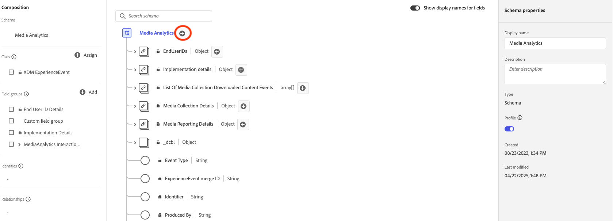

# Panoramica sull’implementazione di Edge

L’Edge Network di Adobe Experience Platform consente di inviare dati destinati a più prodotti a un singolo endpoint, che inoltra le informazioni appropriate a ciascun prodotto. Questo consolida lo sforzo di implementazione su più soluzioni di dati ed è il modo consigliato per implementare Streaming Media Collection sia per Adobe Analytics che per Customer Journey Analytics.

Indipendentemente dalla base di codice utilizzata, ovvero Web SDK, Mobile SDK (iOS o Android), Roku SDK o l’API di Media Edge, è innanzitutto necessario completare la configurazione della piattaforma descritta in questa pagina: crea uno schema, crea un set di dati e configura un datastream.

## Prerequisiti

1. **Completare i prerequisiti generali.** Consulta i [prerequisiti generali](/help/getting-started/prereqs.md).

1. **Conferma una soluzione Adobe compatibile.** Devi disporre di un’implementazione funzionante di Customer Journey Analytics, Adobe Analytics, Adobe Journey Optimizer o Real-Time Customer Data Platform:
   * [Guida di Customer Journey Analytics](https://experienceleague.adobe.com/docs/analytics-platform/using/cja-landing.html?lang=it)
   * [Implementare Adobe Analytics](https://experienceleague.adobe.com/docs/analytics/implementation/home.html?lang=it)
   * [Documentazione di Adobe Journey Optimizer](https://experienceleague.adobe.com/docs/journey-optimizer.html?lang=it)
   * [Documentazione di Real-Time Customer Data Platform](https://experienceleague.adobe.com/docs/real-time-customer-data-platform.html?lang=it)

## Configurare lo schema in Adobe Experience Platform

Per standardizzare la raccolta dei dati tra le applicazioni che utilizzano Adobe Experience Platform, Adobe ha creato lo standard Experience Data Model (XDM) aperto e documentato pubblicamente.

1. In Adobe Experience Platform, iniziare a creare lo schema come descritto in [Creare e modificare gli schemi nell&#39;interfaccia utente](https://experienceleague.adobe.com/docs/experience-platform/xdm/ui/resources/schemas.html?lang=it).

1. Nella pagina Dettagli schema, scegliere **[!UICONTROL Experience Event]** come classe base per lo schema.

   

1. Seleziona **[!UICONTROL Next]**.

1. Specificare il nome e la descrizione dello schema, quindi selezionare **[!UICONTROL Finish]**.

1. Nell&#39;area **[!UICONTROL Composition]**, nella sezione **[!UICONTROL Field groups]**, selezionare **[!UICONTROL Add]**, quindi cercare e aggiungere i seguenti gruppi di campi allo schema:
   * `End User ID Details`
   * `Implementation Details`
   * `MediaAnalytics Interaction Details`

   Dopo aver aggiunto i gruppi di campi, questi vengono visualizzati nella sezione **[!UICONTROL Field groups]**:

   

1. Seleziona **[!UICONTROL Save]** per salvare le modifiche.

1. (Facoltativo) Puoi nascondere alcuni campi non utilizzati dall’API di Media Edge. Nascondere questi campi semplifica la lettura dello schema, ma non è obbligatorio. Questi campi fanno riferimento solo a quelli del gruppo di campi `MediaAnalytics Interaction Details`.

   +++ Espandi per visualizzare le istruzioni sui campi che puoi nascondere.

   1. Nell&#39;area **[!UICONTROL Structure]**, selezionare il campo `Media Collection Details`, quindi selezionare **[!UICONTROL Manage related fields]**.

      

   1. Abilita l&#39;opzione a **[!UICONTROL Show display names for fields]**, quindi aggiorna lo schema come segue:

      * Nel campo `Media Collection Details` > `Advertising Details`, nascondi i seguenti campi di reporting: `Ad Completed`, `Ad Started` e `Ad Time Played`.

      * Nel campo `Media Collection Details` > `Advertising Pod Details`, nascondi il seguente campo di reporting: `Ad Break ID`

      * Nel campo `Media Collection Details` > `Chapter Details`, nascondere i seguenti campi di reporting: `Chapter Completed`, `Chapter ID`, `Chapter Started` e `Chapter Time Played`.

      * Nel campo `Media Collection Details`, nascondere il campo `List Of States`.

        

      * Nel campo `Media Collection Details` > `List Of States End` e `Media Collection Details` > `List Of States Start`, nascondi i seguenti campi di reporting: `Player State Count`, `Player State Set` e `Player State Time`.

        

      * Nel campo `Media Collection Details` > `Qoe Data Details`, nascondere i seguenti campi di reporting: `Average Bitrate`, `Average Bitrate Bucket`, `Bitrate Change Impacted Streams`, `Bitrate Changes`, `Buffer Impacted Streams`, `Buffer Events`, `Dropped Frame Impacted Streams`, `Drops Before Starts`, `Errors`, `External Error IDs`, `Error Impacted Streams`, `Media SDK Error IDs`, `Player SDK Error IDs`, `Stalling Impacted Streams`, `Stalling Events`, `Total Buffer Duration` e `Total Stalling Duration`.

      * Nel campo `Media Collection Details` > `Session Details`, nascondere i seguenti campi di reporting: `10% Progress Marker`, `25% Progress Marker`, `50% Progress Marker`, `75% Progress Marker`, `95% Progress Marker`, `Ad Count`, `Average Minute Audience`, `Content Completes`, `Chapter Count`, `Content Starts`, `Content Time Spent`, `Estimated Streams`, `Federated Data`, `Media Segment Views`, `Media Downloaded Flag`, `Media Starts`, `Media Session ID`, `Media Session Server Timeout`, `Media Time Spent`, `Pause Events`, `Pause Impacted Streams`, `Pev3`, `Pccr`, `Total Pause Duration`, `Unique Time Played` e `Video Segment`.

   1. Seleziona **[!UICONTROL Confirm]** per salvare le modifiche.

   1. Nell&#39;area **[!UICONTROL Structure]**, abilitare l&#39;opzione a **[!UICONTROL Show display names for fields]**, quindi selezionare il campo `List Of Media Collection Downloaded Content Events`.

   1. Selezionare **[!UICONTROL Manage related fields]**, quindi aggiornare lo schema come segue:

      * Nel campo `List Of Media Collection Downloaded Content Events` > `Media Details` > `Advertising Details`, nascondi i seguenti campi di reporting: `Ad Completed`, `Ad Started` e `Ad Time Played`.

      * Nel campo `List Of Media Collection Downloaded Content Events` > `Media Details` > `Advertising Pod Details`, nascondi il seguente campo di reporting: `Ad Break ID`

      * Nel campo `List Of Media Collection Downloaded Content Events` > `Media Details` > `Chapter Details`, nascondi i seguenti campi di reporting: `Chapter Completed`, `Chapter ID`, `Chapter Started` e `Chapter Time Played`.

      * Nel campo `List Of Media Collection Downloaded Content Events` > `Media Details`, nascondi il campo `List Of States`.

      * Nel campo `List Of Media Collection Downloaded Content Events` > `Media Details` > `List Of States End` e `Media Collection Details` > `List Of States Start`, nascondi i seguenti campi di reporting: `Player State Count`, `Player State Set` e `Player State Time`.

      * Nel campo `List Of Media Collection Downloaded Content Events` > `Media Details` > `Qoe Data Details`, nascondi i seguenti campi di reporting: `Average Bitrate`, `Average Bitrate Bucket`, `Bitrate Change Impacted Streams`, `Bitrate Changes`, `Buffer Events`, `Buffer Impacted Streams`, `Drops Before Starts`, `Dropped Frame Impacted Streams`, `Error Impacted Streams`, `Errors`, `External Error IDs`, `Media SDK Error IDs`, `Player SDK Error IDs`, `Stalling Events`, `Stalling Impacted Streams`, `Total Buffer Duration` e `Total Stalling Duration`.

      * Nel campo `List Of Media Collection Downloaded Content Events` > `Media Details` > `Session Details`, nascondere i seguenti campi di reporting: `10% Progress Marker`, `25% Progress Marker`, `50% Progress Marker`, `75% Progress Marker`, `95% Progress Marker`, `Ad Count`, `Average Minute Audience`, `Chapter Count`, `Content Completes`, `Content Starts`, `Content Time Spent`, `Estimated Streams`, `Federated Data`, `Media Downloaded Flag`, `Media Segment Views`, `Media Session ID`, `Media Session Server Timeout`, `Media Starts`, `Media Time Spent`, `Pause Events`, `Pause Impacted Streams`, `Pccr`, `Pev3`, `Total Pause Duration`, `Unique Time Played` e `Video Segment`.

      * Nel campo `List Of Media Collection Downloaded Content Events` > `Media Details`, nascondi il campo `Media Session ID`.

   1. Seleziona **[!UICONTROL Confirm]** per salvare le modifiche.

   1. Nell&#39;area **[!UICONTROL Structure]**, selezionare il campo `Media Reporting Details`, quindi selezionare **[!UICONTROL Manage related fields]**.

   1. Abilita l&#39;opzione a **[!UICONTROL Show display names for fields]**, quindi aggiorna lo schema come segue:

      * Nel campo `Media Reporting Details`, nascondere i campi seguenti: `Error Details`, `List Of States End`, `List of States Start` e `Media Session ID`.

   1. Seleziona **[!UICONTROL Confirm]** > **[!UICONTROL Save]** per salvare le modifiche.

   +++

1. (Facoltativo) Puoi aggiungere metadati personalizzati allo schema. Questo consente di includere metadati aggiuntivi definiti dall&#39;utente per esigenze o contesti specifici. Per ulteriori informazioni sui metadati personalizzati con l&#39;API di Media Edge, vedi [Supporto per metadati personalizzati](custom-metadata.md).

   +++ Espandi per visualizzare le istruzioni sull’aggiunta di metadati personalizzati allo schema.

   1. Individuare il nome tenant dell&#39;organizzazione selezionando **[!UICONTROL Account info]** > **[!UICONTROL Assigned orgs]** > [!UICONTROL _&#x200B;**nome organizzazione**&#x200B;_] > **[!UICONTROL tenant]**.

      I campi personalizzati vengono ricevuti tramite questo percorso. Ad esempio, nome tenant: _dcbl → percorso myCustomField: _dcbl.myCustomField.

   1. Aggiungi un gruppo di campi personalizzato allo schema multimediale definito.

      

   1. Aggiungi al gruppo di campi tutti i campi personalizzati di cui desideri tenere traccia.

      

   1. [Utilizza il percorso generato](https://experienceleague.adobe.com/it/docs/experience-platform/xdm/ui/fields/overview#type-specific-properties) per il campo personalizzato nel payload della richiesta.

      

   +++

1. Continua con [Crea un set di dati in Adobe Experience Platform](#create-a-dataset-in-adobe-experience-platform).

## Creare un set di dati in Adobe Experience Platform

1. Assicurarsi di impostare uno schema come descritto in [Configurare lo schema in Adobe Experience Platform](#set-up-the-schema-in-adobe-experience-platform).

1. In Adobe Experience Platform, inizia a creare il set di dati come descritto nella [Guida dell&#39;interfaccia utente dei set di dati](https://experienceleague.adobe.com/docs/experience-platform/catalog/datasets/user-guide.html?lang=it#create).

   Quando selezioni uno schema per il set di dati, scegli lo schema creato in precedenza.

1. Continua con [Configurare uno stream di dati in Adobe Experience Platform](#configure-a-datastream-in-adobe-experience-platform).

## Configurare uno stream di dati in Adobe Experience Platform

1. Assicurarsi di aver creato un set di dati come descritto in [Creare un set di dati in Adobe Experience Platform](#create-a-dataset-in-adobe-experience-platform).

1. Creare un nuovo stream di dati come descritto in [Configurare uno stream di dati](https://experienceleague.adobe.com/docs/experience-platform/edge/datastreams/configure.html?lang=it).

   Durante la creazione dello stream di dati, effettua le seguenti selezioni:

   * Nel campo **[!UICONTROL Event Schema]** selezionare lo schema creato in [Configurare lo schema in Adobe Experience Platform](#set-up-the-schema-in-adobe-experience-platform). Seleziona **[!UICONTROL Save]**.

     >[!IMPORTANT]
     >
     >Non selezionare **[!UICONTROL Save and Add Mapping]**, perché in questo modo si verificano errori di mappatura per il campo Timestamp.

     

   * Aggiungi uno dei seguenti servizi al flusso di dati, a seconda che si utilizzi Adobe Analytics o Customer Journey Analytics:

      * **[!UICONTROL Adobe Analytics]** (se si utilizza Adobe Analytics)

        Se utilizzi Adobe Analytics, definisci una suite di rapporti come descritto in [Creare una suite di rapporti](https://experienceleague.adobe.com/it/docs/analytics/admin/admin-tools/manage-report-suites/c-new-report-suite/t-create-a-report-suite).

      * **[!UICONTROL Adobe Experience Platform]** (se si utilizza Customer Journey Analytics)

     Per informazioni sull&#39;aggiunta di un servizio a un flusso di dati, vedere &quot;Aggiungere servizi a un flusso di dati&quot; in [Configurare un flusso di dati](https://experienceleague.adobe.com/docs/experience-platform/edge/datastreams/configure.html?lang=it#view-details).

     

   * Espandere **[!UICONTROL Advanced Options]**, quindi abilitare l&#39;opzione **[!UICONTROL Media Analytics]**.

     

## Scegli il metodo di implementazione

Con lo schema, il set di dati e lo stream di dati impostati, implementa una delle seguenti basi di codice per iniziare a inviare dati multimediali in streaming ad Edge Network. Ogni pagina descrive la configurazione specifica per i contenuti multimediali in streaming; il codice per evento e per variabile risiede in [Eventi](/help/implementation/events/overview.md) e [Variabili](/help/implementation/variables/overview.md).

| Codebase | In-code | Tramite tag |
|---|---|---|
| Web | [Web SDK](web-sdk.md) | [Estensione tag Web SDK](web-sdk-tags.md) |
| iOS | [iOS](ios.md) | [iOS (Tag)](ios-tags.md) |
| Android | [Android](android.md) | [Android (Tag)](android-tags.md) |
| Roku | [Roku](roku.md) | — |
| API | [API Media Edge](media-edge-api.md) | — |

## Passaggio successivo

Dopo aver iniziato la raccolta dei dati, puoi configurare la generazione rapporti:

* [Configurare la generazione di rapporti per le implementazioni di Edge](/help/reporting/setup/edge-reporting.md) (Customer Journey Analytics)
* [Imposta il reporting per le implementazioni solo Analytics](/help/reporting/setup/analytics-reporting.md) (se lo stream di dati alimenta Adobe Analytics)

>[!MORELIKETHIS]
>
>* [Supporto metadati personalizzati](custom-metadata.md)
>* [Schema di reporting XDM](reporting-schema.md)
>* [Panoramica eventi](/help/implementation/events/overview.md)
