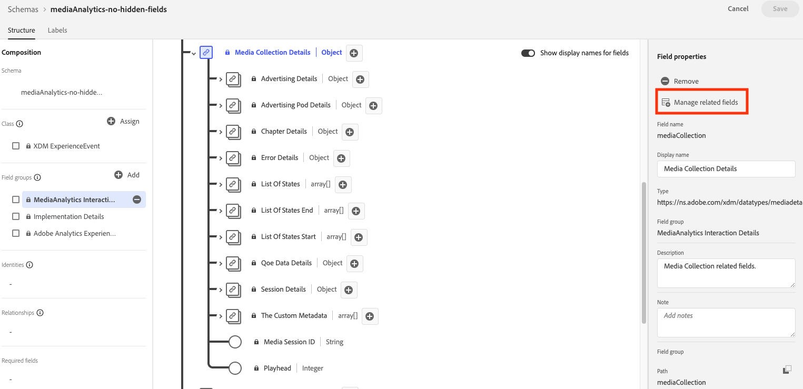

# Installare Media Analytics con Experience Platform Edge

Adobe Experience Platform Edge consente di inviare dati destinati a più prodotti a una posizione centralizzata. Experience Edge inoltra le informazioni appropriate ai prodotti desiderati. Questo concetto consente di consolidare le attività di implementazione, in particolare per quanto riguarda più soluzioni di dati.

L’immagine seguente illustra un’implementazione di Media Analytics che utilizza Experience Platform Edge:

>[!IMPORTANT]
>
>Attualmente, puoi inviare dati a Experience Edge solo utilizzando l’SDK di Adobe Experience Platform Mobile.

<!-- Replace the above sentence with this after it web releases: You can send data to Experience Edge using any of the following implementation methods:

* Adobe Experience Platform Web SDK (Coming soon)
* Adobe Experience Platform Mobile SDK
* Edge Network Server API

Regardless of which Experience Edge implementation method you use for configuring media tracking, you must first complete the following sections:

-->

Completa le sezioni seguenti per implementare Media Analytics con Experience Platform Edge:

* [Definire una suite di rapporti](#define-a-report-suite)
* [Configurare lo schema in Adobe Experience Platform](#set-up-the-schema-in-adobe-experience-platform)
* [Creare un set di dati in Adobe Experience Platform](#create-a-dataset-in-adobe-experience-platform)
* [Configurare uno stream di dati in Adobe Experience Platform](#configure-a-datastream-in-adobe-experience-platform)
* [Creare una connessione in Customer Journey Analytics](#create-a-connection-in-customer-journey-analytics)
* [Creazione di una visualizzazione dati nel Customer Journey Analytics](#create-a-data-view-in-customer-journey-analytics)
* [Creazione e configurazione di un progetto nel Customer Journey Analytics](#create-and-configure-a-project-in-customer-journey-analytics)
* [Inviare dati ad Experience Platform Edge con l’estensione Edge](#send-data-to-experience-platform-edge-with-the-edge-extension)

## Definire una suite di rapporti

>[!NOTE]
>
>Una suite di rapporti è necessaria solo se utilizzi Adobe Analytics. Una suite di rapporti non è necessaria se intendi utilizzare il Customer Journey Analytics per i rapporti.

Se prevedi di utilizzare Adobe Analytics per il reporting, devi disporre di una suite di rapporti da utilizzare con l’implementazione di Streaming Media. Per informazioni sulla definizione di una suite di rapporti, consulta [Report Suite Manager](https://experienceleague.adobe.com/docs/analytics/admin/admin-tools/manage-report-suites/report-suites-admin.html?lang=en).

Dopo aver definito una suite di rapporti, continua con [Configurare lo schema in Adobe Experience Platform](#set-up-the-schema-in-adobe-experience-platform).

## Configurare lo schema in Adobe Experience Platform

Per standardizzare la raccolta dati da utilizzare nelle applicazioni che sfruttano Adobe Experience Platform, Adobe ha creato lo standard aperto e pubblicamente documentato Experience Data Model (XDM).

Per creare e impostare uno schema:

1. In Adobe Experience Platform, inizia a creare lo schema come descritto in [Creare e modificare gli schemi nell’interfaccia utente](https://experienceleague.adobe.com/docs/experience-platform/xdm/ui/resources/schemas.html?lang=en).

   Durante la creazione dello schema, scegli [!UICONTROL **XDM ExperienceEvent**] dal [!UICONTROL **Crea schema**] menu a discesa.

1. In [!UICONTROL **Composizione**] area, nel [!UICONTROL **Gruppi di campi**] sezione, seleziona [!UICONTROL **Aggiungi**], quindi cerca e aggiungi i seguenti nuovi gruppi di campi allo schema:
   * `Adobe Analytics ExperienceEvent Template`
   * `Implementation Details`
   * `MediaAnalytics Interaction Details`

   Dopo aver aggiunto i gruppi di campi, questi devono essere visualizzati nel [!UICONTROL **Gruppi di campi**] sezione, come segue:

   

1. In [!UICONTROL **Struttura**] , selezionare la `endUserIds` > `_experience` gruppo di campi, quindi seleziona [!UICONTROL **Gestire i campi correlati**].

   

1. Aggiorna lo schema come segue:

   * In `Adobe Analytics ExperienceEvent Template` gruppo di campi, nascondi tutti i campi tranne `EndUserIDs`.

   * In `endUserIds` > `_experience` > `Adobe Advertising Cloud end user IDs` gruppo di campi, nasconde tutti i campi tranne `Identifier` campo.

   * In `endUserIds` > `_experience` > `Adobe Analytics Cloud Custom end user IDs` gruppo di campi, nasconde tutti i campi tranne `Identifier` campo.

      

1. Seleziona [!UICONTROL **Conferma**] per salvare le modifiche.

1. In [!UICONTROL **Struttura**] , selezionare la `Implementation Details` gruppo di campi, seleziona [!UICONTROL **Gestire i campi correlati**], quindi aggiorna lo schema come segue:

   * In `Implementation Details` > `Implementation details` gruppo di campi, nascondi tutti i campi tranne `version`.

      

1. Seleziona [!UICONTROL **Conferma**] per salvare le modifiche.

1. In [!UICONTROL **Struttura**] , selezionare la `Media Collection Details` gruppo di campi, seleziona [!UICONTROL **Gestire i campi correlati**], quindi aggiorna lo schema come segue:

   * In `Media Collection Details` gruppo di campi, nascondere `List Of States` gruppo di campi.

      

   * In `Media Collection Details` > `Advertising Details` gruppo di campi, nascondi i campi di reporting seguenti: `Ad Completed`, `Ad Started`, e `Ad Time Played`.

   * In `Media Collection Details` > `Advertising Pod Details` gruppo di campi, nascondi il seguente campo di reporting: `Ad Break ID`

   * In `Media Collection Details` > `Chapter Details` gruppo di campi, nascondi i seguenti campi di reporting: `Chapter ID`, `Chapter Completed`, `Chapter Started`, e `Chapter Time Played`.

   * In `Media Collection Details` > `Qoe Data Details` gruppo di campi, nascondi i seguenti campi di reporting: `Average Bitrate`, `Average Bitrate Bucket`, `Bitrate Changes`, `Buffer Events`, `Total Buffer Duration`, `Errors`, `External Error IDs`, `Bitrate Change Impacted Streams`, `Buffer Impacted Streams`, `Dropped Frame Impacted Streams`, `Error Impacted Streams`, `Stalling Impacted Streams`, `Drops Before Starts`, `Media SDK Error IDs`, `Player SDK Error IDs`, `Stalling Events`, e `Total Stalling Duration`.

   * In `Media Collection Details` > `Session Details` gruppo di campi, nascondi i seguenti campi di reporting: `Media Session ID`, `Ad Count`, `Average Minute Audience`, `Chapter Count`, `Estimated Streams`, `Pause Impacted Streams`, `10% Progress Marker`, `25% Progress Marker`, `50% Progress Marker`, `75% Progress Marker`, `95% Progress Marker`, `Media Segment Views`, `Content Completes`, `Media Downloaded Flag`, `Federated Data`, `Content Starts`, `Media Starts`, `Pause Events`, `Total Pause Duration`, `Media Session Server Timeout`, `Video Segment`, `Content Time Spent`, `Media Time Spent`, `Unique Time Played`, `Pev3`, e `Pccr`.

   * In `Media Collection Details` > `List Of States End` e `Media Collection Details` > `List Of States Start` gruppi di campi, nascondi i seguenti campi di reporting: `Player State Count`, `Player State Set`, e `Player State Time`.

      

1. Seleziona [!UICONTROL **Conferma**] per salvare le modifiche.

1. In [!UICONTROL **Struttura**] , selezionare la `List Of Media Collection Downloaded Content Events` gruppo di campi, seleziona [!UICONTROL **Gestire i campi correlati**], quindi aggiorna lo schema come segue:

   * In `List Of Media Collection Downloaded Content Events` > `Media Details` gruppo di campi, nascondere `List Of States` gruppo di campi.

   * In `List Of Media Collection Downloaded Content Events` > `Media Details` > `Advertising Details` gruppo di campi, nascondi i campi di reporting seguenti: `Ad Completed`, `Ad Started`, e `Ad Time Played`.

   * In `List Of Media Collection Downloaded Content Events` > `Media Details` > `Advertising Pod Details` gruppo di campi, nascondi il seguente campo di reporting: `Ad Break ID`

   * In `List Of Media Collection Downloaded Content Events` > `Media Details` > `Chapter Details` gruppo di campi, nascondi i seguenti campi di reporting: `Chapter ID`, `Chapter Completed`, `Chapter Started`, e `Chapter Time Played`.

   * In `List Of Media Collection Downloaded Content Events` > `Media Details` > `Qoe Data Details` gruppo di campi, nascondi i seguenti campi di reporting: `Average Bitrate`, `Average Bitrate Bucket`, `Bitrate Changes`, `Buffer Events`, `Total Buffer Duration`, `Errors`, `External Error IDs`, `Bitrate Change Impacted Streams`, `Buffer Impacted Streams`, `Dropped Frame Impacted Streams`, `Error Impacted Streams`, `Stalling Impacted Streams`, `Drops Before Starts`, `Media SDK Error IDs`, `Player SDK Error IDs`, `Stalling Events`, e `Total Stalling Duration`.

   * In `List Of Media Collection Downloaded Content Events` > `Media Details` > `Session Details` gruppo di campi, nascondi i seguenti campi di reporting: `Media Session ID`, `Ad Count`, `Average Minute Audience`, `Chapter Count`, `Estimated Streams`, `Pause Impacted Streams`, `10% Progress Marker`, `25% Progress Marker`, `50% Progress Marker`, `75% Progress Marker`, `95% Progress Marker`, `Media Segment Views`, `Content Completes`, `Media Downloaded Flag`, `Federated Data`, `Content Starts`, `Media Starts`, `Pause Events`, `Total Pause Duration`, `Media Session Server Timeout`, `Video Segment`, `Content Time Spent`, `Media Time Spent`, `Unique Time Played`, `Pev3`, e `Pccr`.

   * In `List Of Media Collection Downloaded Content Events` > `Media Details` > `List Of States End` e `Media Collection Details` > `List Of States Start` gruppi di campi, nascondi i seguenti campi di reporting: `Player State Count`, `Player State Set`, e `Player State Time`.

   * In `List Of Media Collection Downloaded Content Events` > `Media Details`  gruppo di campi, nascondere `Media Session ID` campo.

1. Seleziona [!UICONTROL **Conferma**] per salvare le modifiche.

1. In [!UICONTROL **Struttura**] , selezionare la `Media Reporting Details` gruppo di campi, seleziona [!UICONTROL **Gestire i campi correlati**], quindi aggiorna lo schema come segue:

   * In `Media Reporting Details` gruppo di campi, nascondere i seguenti gruppi di campi: `Error Details`, `List Of States End`, `List of States Start`, `Playhead`, e `Media Session ID`.

1. Seleziona [!UICONTROL **Conferma**] > [!UICONTROL **Salva**]  per salvare le modifiche.

1. Continua con [Creare un set di dati in Adobe Experience Platform](#create-a-dataset-in-adobe-experience-platform).

## Creare un set di dati in Adobe Experience Platform

1. Assicurati di impostare uno schema come descritto in [Configurare lo schema in Adobe Experience Platform](#set-up-the-schema-in-adobe-experience-platform).

1. In Adobe Experience Platform, inizia a creare il set di dati come descritto in [Guida all’interfaccia utente dei set di dati](https://experienceleague.adobe.com/docs/experience-platform/catalog/datasets/user-guide.html?lang=it#create).

   Quando selezioni uno schema per il set di dati, scegli lo schema creato in precedenza, come descritto in [Configurare lo schema in Adobe Experience Platform](#set-up-the-schema-in-adobe-experience-platform).

1. Continua con [Configurare uno stream di dati nel Customer Journey Analytics](#configure-a-datastream-in-adobe-experience-platform).

## Configurare uno stream di dati in Adobe Experience Platform

1. Assicurati di aver creato un set di dati come descritto in [Creare un set di dati in Adobe Experience Platform](#create-a-dataset-in-adobe-experience-platform).

1. Creare un nuovo stream di dati come descritto in [Configurare uno stream di dati](https://experienceleague.adobe.com/docs/experience-platform/edge/datastreams/configure.html?lang=en).

   Durante la creazione dello stream di dati, accertati di effettuare le seguenti selezioni di configurazione:

   * In [!UICONTROL **Schema Evento**] durante la creazione dello stream di dati, accertati di selezionare lo schema creato in [Configurare lo schema in Adobe Experience Platform](#set-up-the-schema-in-adobe-experience-platform). Seleziona [!UICONTROL **Salva**].

      >[!IMPORTANT]
          >
      > Non selezionare [!UICONTROL **Save and Add Mapping**] perché così facendo si verificheranno errori di mappatura per il campo Timestamp.
      

      

   * Aggiungi uno dei seguenti servizi al flusso di dati, a seconda che si stia utilizzando Adobe Analytics o Customer Journey Analytics:

      * [!UICONTROL **Adobe Analytics**] (se utilizzi Adobe Analytics)

         Se utilizzi Adobe Analytics, accertati di definire una suite di rapporti come descritto nella sezione [Definire una suite di rapporti](#define-a-report-suite) in questo articolo.

      * [!UICONTROL **Adobe Experience Platform**] (se si utilizza Customer Journey Analytics)
      Per informazioni su come aggiungere un servizio a un flusso di dati, consulta la sezione &quot;Aggiungere servizi a un flusso di dati&quot; in [Configurare uno stream di dati](https://experienceleague.adobe.com/docs/experience-platform/edge/datastreams/configure.html?lang=en#view-details).

      

   * Espandi [!UICONTROL **Opzioni avanzate**], quindi attiva [!UICONTROL **Media Analytics**] opzione.

      

1. Continua con [Crea una connessione nel Customer Journey Analytics](#create-a-connection-in-customer-journey-analytics).

## Creare una connessione in Customer Journey Analytics

>[!NOTE]
>
>La procedura seguente è necessaria solo se si utilizza Customer Journey Analytics.

1. Assicurati di aver creato un flusso di dati come descritto in [Configurare uno stream di dati nel Customer Journey Analytics](#configure-a-datastream-in-adobe-experience-platform).

1. In Customer Journey Analytics, creare una connessione come descritto in [Creare una connessione](https://experienceleague.adobe.com/docs/analytics-platform/using/cja-connections/create-connection.html?lang=it).

   Durante la creazione della connessione, per l’implementazione di Streaming Media sono necessarie le seguenti selezioni di configurazione:

   1. Seleziona il set di dati creato in precedenza, come descritto in [Creare un set di dati in Adobe Experience Platform](#create-a-dataset-in-adobe-experience-platform).

   1. Assicurati che [!UICONTROL **Importa tutti i nuovi dati**] è attivata.

1. Continua con [Creazione di una visualizzazione dati nel Customer Journey Analytics](#create-a-new-data-view-in-customer-journey-analytics).

## Creazione di una visualizzazione dati nel Customer Journey Analytics

>[!NOTE]
>
>La procedura seguente è necessaria solo se si utilizza Customer Journey Analytics.

1. Assicurarsi di aver creato una connessione nel Customer Journey Analytics come descritto in [Crea una connessione nel Customer Journey Analytics](#create-a-connection-in-customer-journey-analytics).

1. In Analisi del Percorso di clienti, crea una visualizzazione dati come descritto in [Creare o modificare una visualizzazione dati](https://experienceleague.adobe.com/docs/analytics-platform/using/cja-dataviews/create-dataview.html?lang=it).

   Durante la creazione della visualizzazione dati, per l’implementazione di Streaming Media sono necessarie le seguenti selezioni di configurazione:

   1. In [!UICONTROL **Connessione**] selezionare la connessione creata in precedenza, come descritto in [Crea una connessione nel Customer Journey Analytics](#create-a-connection-in-customer-journey-analytics).

      La selezione della connessione creata può richiedere fino a 15 minuti.

   1. Il giorno [!UICONTROL **Componenti**] , nella scheda [!UICONTROL **Campi schema**] , cerca ogni componente elencato nelle tabelle seguenti e trascinalo nella sezione [!UICONTROL **Metriche**] pannello. Se esistono più campi con lo stesso nome, utilizza il percorso XDM per assicurarti che sia il campo corretto.

      **Contenuto principale - Metriche del contenuto**

      | Nome componente | Percorso XDM |
      |----------|---------|
      | Avvio file multimediale | mediaReporting.sessionDetails.isViewed |
      | Visualizzazioni segmento multimediale | mediaReporting.sessionDetails.hasSegmentView |
      | Avvio contenuti | mediaReporting.sessionDetails.isPlayed |
      | Completamenti contenuto | mediaReporting.sessionDetails.isCompleted |
      | Tempo trascorso dei contenuti | mediaReporting.sessionDetails.timePlayed |
      | Tempo trascorso dei contenuti multimediali | mediaReporting.sessionDetails.totalTimePlayed |
      | Tempo specifico riprodotto | mediaReporting.sessionDetails.uniqueTimePlayed |
      | Marcatore progresso 10% | mediaReporting.sessionDetails.hasProgress10 |
      | Pubblico medio per minuto | mediaReporting.sessionDetails.averageMinuteAudience |

      **Capitolo e annunci - Metriche Capitolo e annunci**

      | Nome componente | Percorso XDM |
      |----------|---------|
      | Capitolo avviato | mediaReporting.chapterDetails.isStarted |
      | Capitolo completato | mediaReporting.chapterDetails.isCompleted |
      | Tempo capitolo riprodotto | mediaReporting.chapterDetails.timePlayed |
      | Annuncio avviato | mediaReporting.advertisingDetails.isStarted |
      | Annuncio completato | mediaReporting.advertisingDetails.isCompleted |
      | Tempo di riproduzione dell’annuncio | mediaReporting.advertisingDetails.timePlayed |

      **QoE - Metriche QoE**

      | Nome componente | Percorso XDM |
      |----------|---------|
      | Ora di inizio | mediaReporting.qoeDataDetails.timeToStart |
      | Perdite prima degli inizi | mediaReporting.qoeDataDetails.isDroppedBeforeStart |
      | Flussi interessati dal buffer | mediaReporting.qoeDataDetails.hasBufferImpactedStreams |
      | Flussi interessati dalla modifica del bitrate | mediaReporting.qoeDataDetails.hasBitrateChangeImpactedStreams |
      | Modifiche bitrate | mediaReporting.qoeDataDetails.bitrateChangeCount |
      | Bitrate medio | mediaReporting.qoeDataDetails.bitrateAverage |
      | Frame rilasciati | mediaReporting.qoeDataDetails.droppedFrames |
      | Errori | mediaReporting.qoeDataDetails.errorCount |
      | Flussi interessati dall’errore | mediaReporting.qoeDataDetails.hasErrorImpactedStreams |
      | Flussi interessati da fotogrammi saltati | mediaReporting.qoeDataDetails.hasDroppedFrameImpactedStreams |

      **Stato del lettore - Metriche dello stato del lettore**

      | Nome componente | Percorso XDM |
      |----------|---------|
      | Stato del lettore impostato | mediaReporting.states.isSet |
      | Conteggio dello stato del lettore | mediaReporting.states.count |
      | Ora stato lettore | mediaReporting.states.time |

   1. Aggiornare le etichette (in [!UICONTROL **Etichette di contesto**] menu a discesa) per i componenti nella tabella seguente. Cerca e trascina nel pannello i componenti che non sono già presenti nel pannello metriche.

      | Nome componente | Etichetta contesto |
      |---------|----------|
      | Timeout del server della sessione multimediale | Media: secondi dall’ultima chiamata |
      | Tempo trascorso dei contenuti multimediali | Media: tempo trascorso contenuti multimediali |
      | Durata totale buffer | Media: durata totale buffer |
      | Tempo di avvio | Media: tempo di avvio |
      | Durata totale pausa | Media: durata totale pausa |

   1. Per aggiungere suddivisioni al progetto di Customer Journey Analytics, aggiungi le dimensioni seguenti alla sezione [!UICONTROL **Dimension**] pannello:

      | Percorso XDM | Nome componente |
      |---------|----------|
      | mediaReporting.states.name | Nome stato lettore |
      | mediaReporting.sessionDetails.ID | ID sessione multimediale |

      Oltre alle dimensioni in questa tabella, puoi aggiungere qualsiasi altra dimensione che desideri rendere disponibile per filtrare i dati per nei progetti di Customer Journey Analytics.

1. Seleziona [!UICONTROL **Salva e continua**] > [!UICONTROL **Salva e termina**] per salvare le modifiche.

1. Continua con [Creazione e configurazione di un progetto nel Customer Journey Analytics](#create-and-configure-a-project-in-customer-journey-analytics).

## Creazione e configurazione di un progetto nel Customer Journey Analytics

1. Assicurati di aver creato una visualizzazione dati nel Customer Journey Analytics come descritto in [Creazione di una visualizzazione dati nel Customer Journey Analytics](#create-a-new-data-view-in-customer-journey-analytics).

1. Nel Customer Journey Analytics, nel [!UICONTROL **Workspace**] , nella scheda [!UICONTROL **Progetti**] area, seleziona [!UICONTROL **Crea progetto**].

1. Seleziona [!UICONTROL **Progetto vuoto**] > [!UICONTROL **Crea**].

1. Nel nuovo progetto, seleziona la visualizzazione dati creata in precedenza.

   Quando crei i pannelli nel progetto, puoi utilizzare tutti i componenti aggiunti alla visualizzazione dati, come descritto in [Creazione di una visualizzazione dati nel Customer Journey Analytics](#create-a-new-data-view-in-customer-journey-analytics).

   I seguenti 4 pannelli sono esempi di pannelli che puoi creare:

   

   

   

   

1. Seleziona la **Pannelli** nella barra a sinistra, quindi trascina [!UICONTROL **Visualizzatori simultanei contenuti multimediali**] e [!UICONTROL **Tempo di riproduzione dei contenuti multimediali trascorso**] pannello.

   I 2 pannelli dovrebbero essere simili al seguente:

   

   

1. Condividere il progetto come descritto in [Condividere progetti](https://experienceleague.adobe.com/docs/analytics-platform/using/cja-workspace/curate-share/share-projects.html?lang=it).

   >[!NOTE]
   >
   >   Se gli utenti con cui desideri condividere il file non sono disponibili, assicurati che gli utenti abbiano accesso come utente e amministratore al Customer Journey Analytics in Adobe Admin Console.

1. Continua con [Invia dati a Experience Platform Edge](#send-data-to-experience-platform-edge).

## Inviare dati ad Experience Platform Edge utilizzando l’SDK di AEP Mobile

Puoi utilizzare Adobe Experience Platform Mobile SDK per inviare dati mobili a Experience Platform Edge. In alternativa, puoi utilizzare un’implementazione personalizzata delle API Edge.<!-- I guess we don't need/want to document this? -->)

Utilizza le seguenti risorse di documentazione per completare l’implementazione:

| Sistema operativo mobile | Risorse |
|---------|----------|
| **iOS** | Sono disponibili le seguenti risorse per l’invio di dati mobili di iOS: <ul><li>[Configurazione dell’SDK per dispositivi mobili tramite l’interfaccia utente di Data Collection](https://github.com/adobe/aepsdk-edgemedia-ios/blob/dev/Documentation/getting-started.md)</li><li>[Migrazione da Media SDK a Edge Media SDK](https://github.com/adobe/aepsdk-edgemedia-ios/blob/dev/Documentation/migration-guide.md)</li><li>[Riferimento API per Edge Media](https://github.com/adobe/aepsdk-edgemedia-ios/blob/dev/Documentation/api-reference.md)</li></ul> |
| **Android** | Sono disponibili le seguenti risorse per l’invio di dati mobili Android: <ul><li>[Configurazione dell’SDK per dispositivi mobili tramite l’interfaccia utente di Data Collection](https://github.com/adobe/aepsdk-edgemedia-android/blob/dev/Documentation/getting-started.md)</li><li>[Migrazione da Media SDK a Edge Media SDK](https://github.com/adobe/aepsdk-edgemedia-android/blob/dev/Documentation/migration-guide.md)</li><li>[Riferimento API per Edge Media](https://github.com/adobe/aepsdk-edgemedia-android/blob/dev/Documentation/api-reference.md)</li></ul> |

<!--

+++Adobe Experience Platform Mobile SDK

If you plan to use the Mobile SDK extension in Adobe Experience Platform Data Collection to send data to Edge, complete the following sections:

### Create a mobile property

Create a mobile property, as described in [Set up a mobile property](https://developer.adobe.com/client-sdks/documentation/getting-started/create-a-mobile-property/). 

Content initially copied from here: https://experienceleague.adobe.com/docs/analytics/implementation/aep-edge/mobile-sdk/overview.html?lang=en 

The Adobe Experience Platform Mobile SDK helps power Adobe's Experience Cloud solutions and services in your mobile apps. It is available for Android, iOS, and various cross-platform development frameworks. Configuration is handled through Adobe Experience Platform Data Collection.
>[!IMPORTANT]
>
>An Adobe Analytics extension is also available in Adobe Experience Platform Data Collection. If you install this extension, you do not take advantage of XDM or the Edge Network.

### Register the extensions and load your tag configuration

Use code in your app to register the necessary extensions and load your tag configuration. For more information, see [Set up the configuration](https://developer.adobe.com/client-sdks/documentation/user-guides/getting-started-with-platform/overview/#set-up-the-configuration) in [Getting started with Adobe Experience Platform](https://developer.adobe.com/client-sdks/documentation/user-guides/getting-started-with-platform/overview/#set-up-the-configuration).

### Implement and test fuctionality

Implement and test app functionality using a combination of tags data elements, rules, additional extensions, and SDK API calls. Inspect, validate, and debug data collection and experiences for your mobile application.

For more information, see [Use the sample application](https://developer.adobe.com/client-sdks/documentation/user-guides/getting-started-with-platform/overview/#use-the-sample-application) in [Getting started with Adobe Experience Platform](https://developer.adobe.com/client-sdks/documentation/user-guides/getting-started-with-platform/overview/#set-up-the-configuration).

### Extend and validate your mobile app implementation

Before pushing the mobile app extension to your production environment, first validate that it works.

(What are the steps to do this?)

-->

<!--

+++Adobe Experience Platform Web SDK (Coming soon)

>[!NOTE]
>
>The Adobe Experience Platform Web SDK is not yet available. This page will be updated when it becomes available.

<!-- Content initially copied from here: https://experienceleague.adobe.com/docs/analytics/implementation/aep-edge/web-sdk/overview.html?lang=en -->

<!-- Use the Web SDK extension in Adobe Experience Platform Data Collection to send data to Edge.

You can use the [Adobe Experience Platform Web SDK](https://experienceleague.adobe.com/docs/experience-platform/tags/extensions/client/sdk/overview.html) to send data to Adobe Analytics. This implementation method works by translating the [Experience Data Model (XDM)](https://experienceleague.adobe.com/docs/experience-platform/xdm/home.html) into a format used by Analytics.

You can send data to Experience Edge directly using the Web SDK, or through the Web SDK extension in Tags. -->

<!-- ### Web SDK

A high-level overview of the implementation tasks:

<table style="width:100%">

<tr>
<th style="width:5%"></th><th style="width:60%"><b>Task</b></th><th style="width:35%"><b>More Information</b></th>
</tr>

<tr>
<td>1</td>
<td>Ensure you have <b>defined a report suite</b>.</td>
<td><a href="../../../admin/admin/c-manage-report-suites/report-suites-admin.md">Report Suite Manager</a></td>
</tr>

<tr>
<td>2</td>
<td><b>Setup schemas and datasets</b>. To standardize data collection for use across applications that leverage Adobe Experience Platform, Adobe has created the open and publicly documented standard, Experience Data Model (XDM).</td>
<td><a href="https://experienceleague.adobe.com/docs/experience-platform/xdm/ui/overview.html?lang=en">Schemas UI overview</a> and <a href="https://experienceleague.adobe.com/docs/experience-platform/catalog/datasets/user-guide.html?lang=en">Datasets UI overview</a></td>
</tr>

<tr>
<td>3</td>
<td><b>Create a data layer</b> to manage the tracking of the data on your website.</td>
<td><a href="../../prepare/data-layer.md">Create a data layer</a></td>
</tr>

<tr>
<td> 4</td>
<td><b>Install the prebuilt standalone version</b>. You can reference the library (<code>alloy.js</code>) on the CDN directly on your page or download and host it on your own infrastructure. Alternatively, you can use the NPM package.</td>
<td><a href="https://experienceleague.adobe.com/docs/experience-platform/edge/fundamentals/installing-the-sdk.html?lang=en#option-2%3A-installing-the-prebuilt-standalone-version">Installing the prebuilt standalone version</a> and <a href="https://experienceleague.adobe.com/docs/experience-platform/edge/fundamentals/installing-the-sdk.html?lang=en#option-3%3A-using-the-npm-package">Using the NPM package</a></td>
</tr>

<tr>
<td>5</td>
<td><b>Configure a datastream</b>. A datastream represents the server-side configuration when implementing the Adobe Experience Platform Web SDK.</td>
<td><a href="https://experienceleague.adobe.com/docs/experience-platform/edge/datastreams/configure.html?lang=en">Configure a datastream<a></td> 
</tr>

<td>6</td>
<td><b>Add an Adobe Analytics service</b> to your datastream. That service controls whether and how data is sent to Adobe Analytics.</td>
<td><a href="https://experienceleague.adobe.com/docs/experience-platform/edge/datastreams/configure.html?lang=en#analytics">Add Adobe Analytics service to a datastream</a></td>
</tr>

<tr>
<td>7</td>
<td><b>Configure the Web SDK</b>. Ensure the library that you installed in step 4 is properly configured with the datastream ID (formerly known as edge configuration id (<code>edgeConfigId</code>)), organization id (<code>orgId</code>), and other available options.</td>
<td><a href="https://experienceleague.adobe.com/docs/experience-platform/edge/fundamentals/configuring-the-sdk.html?lang=en">Configure the Web SDK</a></td>
</tr>

<tr>
<td>8</td>
<td><b>Execute commands</b> and/or <b>track events</b>. After the base code has been implemented on your webpage, you can begin executing commands and tracking events with the SDK.
</td>
<td><a href="https://experienceleague.adobe.com/docs/experience-platform/edge/fundamentals/executing-commands.html?lang=en">Execute commands</a> and <a href="https://experienceleague.adobe.com/docs/experience-platform/edge/fundamentals/tracking-events.html?lang=en">Track events</a></td>
</tr>

<tr>
<td>9</td><td><b>Extend and validate your implementation</b> before pushing it out to production.</td><td></td> 
</tr>
</table>

### Web SDK extension

A high-level overview of the implementation tasks:

<table style="width:100%">

<tr>
<th style="width:5%"></th><th style="width:60%"><b>Task</b></th><th style="width:35%"><b>More Information</b></th>
</tr>

<tr>
<td>1</td>
<td>Ensure you have <b>defined a report suite</b>.</td>
<td><a href="../../../admin/admin/c-manage-report-suites/report-suites-admin.md">Report Suite Manager</a></td>
</tr>

<tr>
<td>2</td>
<td><b>Setup schemas and datasets</b>. To standardize data collection for use across applications that leverage Adobe Experience Platform, Adobe has created the open and publicly documented standard, Experience Data Model (XDM).</td>
<td><a href="https://experienceleague.adobe.com/docs/experience-platform/xdm/ui/overview.html?lang=en">Schemas UI overview</a> and <a href="https://experienceleague.adobe.com/docs/experience-platform/catalog/datasets/user-guide.html?lang=en">Datasets UI overview</a></td>
</tr>

<tr>
<td>3</td>
<td><b>Create a data layer</b> to manage the tracking of the data on your website.</td>
<td><a href="../../prepare/data-layer.md">Create a data layer</a></td>
</tr>

<tr>
<td>4</td>
<td><b>Configure a datastream</b>. A datastream represents the server-side configuration when implementing the Adobe Experience Platform Web SDK.</td>
<td><a href="https://experienceleague.adobe.com/docs/experience-platform/edge/datastreams/configure.html?lang=en">Configure a datastream<a></td> 
</tr>

<tr>
<td>5</td> 
<td><b>Add an Adobe Analytics service</b> to your datastream. That service controls whether and how data is sent to Adobe Analytics.</td>
<td><a href="https://experienceleague.adobe.com/docs/experience-platform/edge/datastreams/configure.html?lang=en#analytics">Add Adobe Analytics service to a datastream</a></td>
</tr>

<tr>
<td>6</td>
<td><b>Create a tag property</b>. Properties are overarching containers used to reference tag management data.</td>
<td><a href="https://experienceleague.adobe.com/docs/experience-platform/tags/admin/companies-and-properties.html?lang=en#for-web">Create or configure a tag property for web</a></td>
</tr>

<tr>
<td>7</td> 
<td><b>Install and configure the Web SDK extension</b> in your tag property. Configure the Web SDK extension to send data to the datastream configured in step 4.</td>
<td><a href="https://experienceleague.adobe.com/docs/experience-platform/tags/extensions/client/sdk/overview.html?lang=en">Adobe Experience Platform Web SDK extension overview</a></td>
</tr>

<tr>
<td>8</td>
<td><b>Iterate, validate, and publish</b> to production. Add the tag property to your web site. Then use data elements, rules, and so on, to customize your implementation.</td>
<td><a href="https://experienceleague.adobe.com/docs/experience-platform/tags/publish/overview.html?lang=en">Publishing overview</a></td>
</tr>

</table>

### Additional resources

Tags can be highly customized. Learn more about how you can get the most out of Adobe Analytics by including the right data in your implementation.

-   [Tags documentation](https://experienceleague.adobe.com/docs/experience-platform/tags/home.html#): Learn how the interface works and what extensions are available.

-   [Adobe Experience Platform Web SDK documentation](https://experienceleague.adobe.com/docs/web-sdk.html?lang=en)

+++

-->

<!--

### Adobe Experience Platform SDK

A high-level overview of the implementation tasks:

<table style="width:100%">

<tr>
<th style="width:5%"></th><th style="width:60%"><b>Task</b></th><th style="width:35%"><b>More Information</b></th>
</tr>

<tr>
<td>1</td>
<td>Ensure you have <b>defined a report suite</b>.</td>
<td><a href="../../../admin/admin/c-manage-report-suites/report-suites-admin.md">Report Suite Manager</a></td>
</tr>

<tr>
<td>2</td>
<td><b>Setup schemas and datasets</b>. To standardize data collection for use across applications that leverage Adobe Experience Platform, Adobe has created the open and publicly documented standard, Experience Data Model (XDM).</td>
<td><a href="https://experienceleague.adobe.com/docs/experience-platform/xdm/ui/overview.html?lang=en">Schemas UI overview</a> and <a href="https://experienceleague.adobe.com/docs/experience-platform/catalog/datasets/user-guide.html?lang=en">Datasets UI overview</a></td>
</tr>

<tr>
<td>3</td>
<td><b>Configure a datastream</b>. A datastream represents the server-side configuration when implementing the Adobe Experience Platform Web SDK.</td>
<td><a href="https://experienceleague.adobe.com/docs/experience-platform/edge/datastreams/configure.html?lang=en">Configure a datastream<a></td> 
</tr>

<td>4</td>
<td><b>Add an Adobe Analytics service</b> to your datastream. That service controls whether and how data is sent to Adobe Analytics.</td>
<td><a href="https://experienceleague.adobe.com/docs/experience-platform/edge/datastreams/configure.html?lang=en#analytics">Add Adobe Analytics service to a datastream</a></td>
</tr>

<tr>
<td>5</td>
<td><b>Create a mobile property</b>. A property is a container that you fill with extensions, rules, data elements, and libraries.</td>
<td><a href="https://developer.adobe.com/client-sdks/documentation/getting-started/create-a-mobile-property/">Set up a mobile property</a></tr>

<tr>
<td>6</td>
<td><b>Install the Adobe Experience Platform Edge Network extension</b> in the mobile tag property and configure the datastream in the extension.</td>
<td><a href="https://developer.adobe.com/client-sdks/documentation/edge-network/">Adobe Experience Platform Edge Network</a>
</tr>

<tr>
<td>7</td>
<td><b>Use code in your app</b> to register the necessary extensions and load your tag configuration.</td>
<td><a href="https://developer.adobe.com/client-sdks/documentation/user-guides/getting-started-with-platform/overview/#set-up-the-configuration">Set up the configuration</a></td>
</tr>

<tr>
<td>8</td>
<td><b>Implement and test functionality</b> using combination of tag's data elements, rules, additional extensions, and SDK API calls in your app. Inspect, validate, and debug data collection and experiences for your mobile application.</td>
<td><a href="https://developer.adobe.com/client-sdks/documentation/user-guides/getting-started-with-platform/overview/#use-the-sample-application">Use the sample application</a>
</tr>

<tr>
<td>9</td>
<td><b>Extend and validate your mobile app implementation</b> before pushing it out to production.</td>
<td></td> 
</tr>

</table>

### Adobe Analytics extension.

A high-level overview of the implementation tasks:

<table style="width:100%">

<tr>
<th style="width:5%"></th><th style="width:60%"><b>Task</b></th><th style="width:35%"><b>More Information</b></th>
</tr>

<tr>
<td>1</td>
<td>Ensure you have <b>defined a report suite</b>.</td>
<td><a href="../../../admin/admin/c-manage-report-suites/report-suites-admin.md">Report Suite Manager</a></td>
</tr>

<tr>
<td>2</td>
<td><b>Setup schemas and datasets</b>. To standardize data collection for use across applications that leverage Adobe Experience Platform, Adobe has created the open and publicly documented standard, Experience Data Model (XDM).</td>
<td><a href="https://experienceleague.adobe.com/docs/experience-platform/xdm/ui/overview.html?lang=en">Schemas UI overview</a> and <a href="https://experienceleague.adobe.com/docs/experience-platform/catalog/datasets/user-guide.html?lang=en">Datasets UI overview</a></td>
</tr>

<tr>
<td>3</td>
<td><b>Install the Adobe Analytics extension</b> in the mobile tag property and configure the extension to point to your report suite.</td>
<td><a href="https://developer.adobe.com/client-sdks/documentation/adobe-analytics/">Adobe Analytics extension for mobile property</a>
</tr>

<tr>
<td>4</td>
<td><b>Use code in your app</b> to register the necessary extensions and load your tag configuration.</td>
<td><a href="https://developer.adobe.com/client-sdks/documentation/user-guides/getting-started-with-platform/overview/#set-up-the-configuration">Set up the configuration</a></td>
</tr>

<tr>
<td>5</td>
<td><b>Implement and test functionality</b> using combination of tag's data elements, rules, additional extensions, and SDK API calls in your app. Inspect, validate, and debug data collection and experiences for your mobile application.</td>
<td><a href="https://developer.adobe.com/client-sdks/documentation/user-guides/getting-started-with-platform/overview/#use-the-sample-application">Use the sample application</a>
</tr>

<tr>
<td>6</td>
<td><b>Extend and validate your mobile app implementation</b> before pushing it out to production.</td>
<td></td> 
</tr>

</table>

### Additional resources

-   [Tags documentation](https://experienceleague.adobe.com/docs/experience-platform/tags/home.html#)

-   [Mobile SDK documentation](https://developer.adobe.com/client-sdks/documentation/)

-->

<!--

+++

+++Edge Network Server API

Send data directly to Edge using an API.

Content initially copied from here: https://experienceleague.adobe.com/docs/analytics/implementation/aep-edge/edge-api/overview.html?lang=en 

If you are unable to use the Adobe Experience Platform [Web SDK](../web-sdk/overview.md) or [Mobile SDK](../mobile-sdk/overview.md), you can send data to the Edge Network directly through an API.

See [Edge Network Server API documentation](https://experienceleague.adobe.com/docs/experience-platform/edge-network-server-api/overview.html), and an example [integrating with Adobe Analytics](https://experienceleague.adobe.com/docs/experience-platform/edge-network-server-api/interacting-other-adobe-solutions/interacting-adobe-analytics.html).

+++ 

-->

