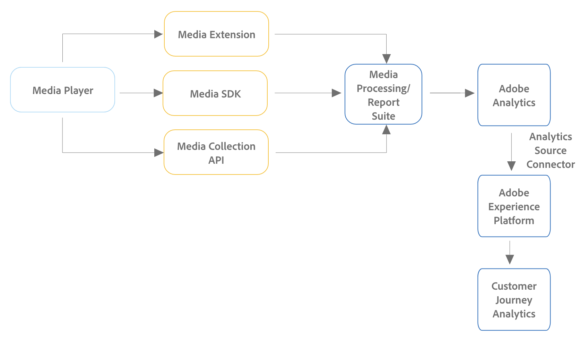

# Implementazione dei servizi di streaming media per Adobe Analytics o Customer Journey Analytics

Esistono diversi modi per implementare Adobe Streaming Media Services. Per un confronto dettagliato dei dispositivi e delle piattaforme supportati per i metodi di implementazione descritti in questa pagina, vedere [Piattaforme e dispositivi supportati](/help/getting-started/supported-devices.md).

## Metodi di implementazione di Edge

Adobe consiglia di utilizzare i metodi di implementazione di Edge Network per tutti i nuovi clienti Adobe Analytics o Customer Journey Analytics.

* **Media for Edge Network SDK / Estensione:** raccoglie dati dal Web, dai dispositivi iOS e Android o dai dispositivi Roku e li invia ad Edge Network. I dati possono quindi essere inviati a Customer Journey Analytics o Adobe Analytics.

  Per ulteriori informazioni su Media for Edge Network SDK / Extension, consulta la [Panoramica sull&#39;implementazione di Edge](/help/implementation/edge/overview.md).

* **API Media Edge:** può essere personalizzata per raccogliere dati da qualsiasi dispositivo o formato (inclusi dispositivi mobili, web e over-the-top) e invia dati ad Edge Network. I dati possono quindi essere inviati a Customer Journey Analytics o Adobe Analytics.

  Per ulteriori informazioni sull&#39;API di Media Edge, consulta [Panoramica dell&#39;API di Media Edge](https://developer.adobe.com/cja-apis/docs/endpoints/media-edge/).

## Metodi di implementazione solo per Adobe Analytics

I metodi di implementazione di Edge descritti in precedenza sono consigliati sia per Customer Journey Analytics che per Adobe Analytics, in particolare per le nuove implementazioni.

Oltre ai metodi di implementazione di Edge, sono disponibili altri metodi di implementazione. Questi metodi di implementazione sono stati progettati per l’utilizzo con Adobe Analytics. Tuttavia, i clienti esistenti con uno dei seguenti metodi di implementazione possono comunque rendere disponibili i dati in Customer Journey Analytics creando una [connessione di origine Analytics](https://experienceleague.adobe.com/docs/experience-platform/sources/ui-tutorials/create/adobe-applications/analytics.html?lang=it).

I metodi di implementazione solo per Adobe Analytics utilizzano il componente aggiuntivo Adobe Analytics for Streaming Media. Per i prerequisiti e un elenco dei metodi, consulta la [Panoramica sull&#39;implementazione di sola Analytics](/help/implementation/analytics-only/overview.md).

* **Estensione Media con tag:** L&#39;estensione Adobe Media Analytics for Audio and Video fornisce la funzionalità per aggiungere l&#39;istanza di tracciamento Media a un sito o a un progetto abilitato per i tag. I dati vengono inviati ad Adobe Analytics.

  Per informazioni sull&#39;installazione, la configurazione e l&#39;implementazione dell&#39;estensione Media con i tag, consulta [Panoramica dell&#39;estensione Adobe Media Analytics (3.x SDK) for Audio and Video](https://experienceleague.adobe.com/docs/experience-platform/tags/extensions/client/media-analytics-3x/overview.html).

* **Media SDK:** Media SDK consente di misurare più piattaforme multimediali, tra cui siti Web, telefoni cellulari, TV connesse, tablet, dispositivi OTT, set-top box e console di gioco. Per ulteriori informazioni, vedere [Piattaforme e dispositivi supportati](/help/getting-started/supported-devices.md).

  I Media SDK utilizzano le API Media Collection per il tracciamento. I dati vengono inviati ad Adobe Analytics.

  Per informazioni sul download e l’installazione di Media SDK e delle estensioni, consulta [Ottenere Media SDK e le estensioni tramite tag e SDK OTT](/help/getting-started/download-sdks.md).

* **API Media Collection:** Poiché le API Media Collection sono personalizzabili, possono essere utilizzate per applicazioni che richiedono funzionalità di tracciamento personalizzate e per dispositivi non supportati da Media SDK. Le API Media Collection tengono traccia degli eventi audio e video utilizzando le chiamate HTTP RESTful. I dati vengono inviati ad Adobe Analytics.

  Per informazioni sull’utilizzo delle API Media Collection, consulta [API Media Collection](media-collection-api/mc-api-overview.md).

