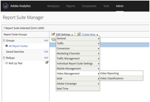

# Panoramica su Milestone{#milestone-overview}

>[!CAUTION]
>
>Questa opzione di misurazione è stata dichiarata obsoleta.

[Documentazione precedente su Milestone](milestone_analytics_video.pdf)

## Configurazione {#configuration}

### Configurazione video Milestone

Per tenere traccia del video, specifica un set di *Variabili di conversione personalizzate* (eVar) e *Eventi personalizzati* da utilizzare nel tracciamento e nel reporting. Uno *Custom Insight* variabile ( `s.prop` ) viene utilizzata anche per i percorsi.

Le variabili selezionate per ogni metrica vengono aggiunte alla pagina di configurazione video. Questo consente al sistema di generare e formattare automaticamente i report video standard. La *nome video* eVar e *visualizzazioni video* sono entrambi necessari. Altre variabili sono facoltative ma consigliate per la misurazione completa. Una volta abilitato il tracciamento video, puoi visualizzare i rapporti generati dai dati video segnalati mediante il tracciamento video.

Puoi anche tenere traccia di qualsiasi numero di metriche aggiuntive per i video. Ad esempio, se utilizzi più lettori video sul tuo sito, puoi compilare un eVar con il nome del lettore. Alcune delle variabili selezionate possono essere utilizzate anche in altre aree del sito. Ad esempio, se utilizzato in tutto il sito, la *tipo di contenuto* può consentire di misurare la percentuale di visualizzazioni di pagina provenienti dal video e collegare gli eventi di conversione al video.

### Configurazione della generazione di rapporti Milestone

Per configurare il reporting video per un’implementazione Milestone, vai a **[!UICONTROL Admin > Report Suite Manager].** Seleziona la suite di rapporti, quindi scegli **[!UICONTROL Video Management > Video Reporting]:**

<!--
{width="248"}
-->



Nella prima schermata, solo Video Core funzionerà con i dati Milestone. Seleziona **[!UICONTROL Video Core]** e fai clic su **[!UICONTROL Save].**


Nella schermata successiva, seleziona **[!UICONTROL Use Custom Variables].**

<!--
{width="470"}
-->


Nella schermata finale, seleziona le due eVar e i tre eventi da utilizzare per la misurazione video:

<!--

-->


## Riferimento a una variabile video {#video-variable-reference}

La tabella seguente contiene ulteriori dettagli sulle variabili commerce e sugli eventi personalizzati per il video:

| Metrica video | Tipo di variabile | Descrizione |
| --- | --- | --- |
| Contenuto | eVar <br/>Scadenza predefinita: Visita | (Obbligatorio) Raccoglie il nome del video, come specificato nell’implementazione. |
| Tipo di contenuto | eVar <br/>Scadenza predefinita: Vista a pagina | Raccoglie dati relativi al tipo di contenuto visualizzato da un visitatore. Agli hit inviati dalla misurazione video è assegnato il tipo di contenuto `video.` <br/>Questa variabile non deve essere riservata esclusivamente al tracciamento video. Se anche altri contenuti segnalano tipi di contenuto utilizzando la stessa variabile, puoi analizzare la distribuzione dei visitatori per diversi tipi di contenuto. Ad esempio, puoi assegnare ad altri tipi di contenuto valori quali `article` o `product page` utilizzando questa variabile. <br/>Dal punto di vista della misurazione video, *Tipo di contenuto* consente di identificare i visitatori del video e quindi di calcolare i tassi di conversione relativi al video. |
| Tempo trascorso dei contenuti | Evento <br/>Tipo: Contatore | Conta il tempo, in secondi, trascorso a guardare un video dall&#39;ultimo processo di raccolta di dati (richiesta immagine). |
| Avvio video | Evento <br/>Tipo: Contatore | Indica che un visitatore ha visualizzato una parte del video. Tuttavia, non fornisce informazioni sulla durata della visualizzazione o sulla parte di video visualizzata dal visitatore. |
| Completamento video | Evento <br/>Tipo: Contatore | Indica che un utente ha visualizzato un video completo. Per impostazione predefinita, l&#39;evento completo è misurato 1 secondo prima della fine del video.  <br/>Durante l’implementazione, puoi specificare a quanti secondi dalla fine del video la visualizzazione potrà essere considerata come una visualizzazione completa. Per i video in diretta e altri flussi che non hanno una fine definita, puoi specificare un punto personalizzato per misurare il completamento. Ad esempio, dopo un tempo di visualizzazione specifico. |

## Variabili del modulo multimediale {#media-module-variables}

Le seguenti variabili consentono di configurare la misurazione video. È necessario definire i valori delle variabili nella tabella Variabili richieste. Inoltre, per tenere traccia degli eventi nel lettore video, devi abilitare autoTrack (per i lettori supportati) o implementare il tracciamento degli eventi del lettore personalizzato utilizzando i metodi open, play, stop e close.

| Variabile    | Descrizione |
| --- | --- |
| `Media.trackUsingContextData` | **Sintassi:** <br/><br/> `s.Media.trackUsingContextData = true;` <br/>Questa opzione consente il tracciamento video integrato. Quando è impostato su true, il modulo multimediale genera dati contestuali per il tracciamento dei contenuti multimediali, anziché come legacy `pev3`. <br/>Utilizzo `Media.contextDataMapping` per mappare i dati contestuali agli eVar ed Eventi selezionati.<br/>Valore predefinito: `false` |
| `Media.contextDataMapping` | **Sintassi:** <br/><br/> `s.Media.contextDataMapping = {`<br/>      `"a.media.name":"eVar2, prop2",` <br/>     `"a.media.segment":"eVar3",` <br/>     `"a.contentType":"eVar1",` <br/>     `"a.media.timePlayed":"event3",` <br/>     `"a.media.view":"event1",` <br/>     `"a.media.segmentView":"event2",` <br/>     `"a.media.complete":"event7",` <br/>     `"a.media.milestones":{` <br/>         `25:"event4",` <br/>         `50:"event5",` <br/>         `75:"event6"` <br/>     ` }` <br/> `};` <br/><br/>Un oggetto che definisce la mappatura delle variabili a eVar ed Eventi da utilizzare per la misurazione video. L’oggetto deve mappare i campi seguenti: <br/><br/> **a.media.name:** (Obbligatorio) Compila le variabili con il nome del video. Fornisci l’eVar selezionato per memorizzare il nome del video e la variabile Custom Insight Video ( `s.prop` ) da utilizzare per il percorso del video. Immetti i valori in un elenco separato da virgole. <br/><br/> **a.media.segment:** (Facoltativo) L&#39;eVar in cui memorizzare il nome del segmento multimediale. a.contentType: (Facoltativo) L’eVar che desideri memorizzare il valore video, che contiene il tracciamento delle visite e dei visitatori abilitato per generare rapporti sulle visite video e sui visitatori. La variabile selezionata è probabilmente già utilizzata per memorizzare dati come la presentazione dell’articolo o la pagina del prodotto <br/><br/> **a.media.view:** (Obbligatorio) L&#39;evento che si desidera conteggiare le visualizzazioni multimediali. <br/><br/> **a.media.segmentView:** (Facoltativo) L’evento che desideri contare le visualizzazioni dei segmenti. <br/><br/> **a.media.complete:** (Facoltativo) L’evento che desideri contare le visualizzazioni complete. <br/><br/> **a.media.timePlayed:** (Facoltativo e fortemente consigliato) L’evento numerico che si desidera memorizzare il numero di secondi di video riprodotti. <br/><br/> **a.media.milestones:** (Facoltativo) Un oggetto che mappa le tappe di s.Media.trackMilestones per contrastare gli eventi. Media.segmentByMilestones deve essere impostato su true se si definiscono le tappe. <br/><br/> **Tracciamento degli annunci** Per tenere traccia degli annunci, sono disponibili le seguenti variabili di dati di contesto: <br/> **a.media.ad.name:** (Obbligatorio) Compila le variabili con il nome dell’annuncio. Fornisci l&#39;eVar selezionato per memorizzare il nome dell&#39;annuncio e la variabile Custom Insight Video ( `s.prop` ) da utilizzare per i percorsi. Immetti i valori in un elenco separato da virgole. <br/><br/> **a.media.ad.pod:** Posizione nel contenuto principale dell’annuncio. <br/><br/> **a.media.ad.podPosition:** Posizione all’interno del pod in cui viene riprodotto l’annuncio. <br/><br/> **a.media.ad.CPM:** CPM o CPM crittografato (con prefisso &quot;~&quot;) che si applica a questa riproduzione. <br/><br/> **a.media.ad.view:** Funziona nello stesso modo `a.media.view` <br/><br/> **a.media.ad.clic:** Conta il numero di clic per l’annuncio (`Media.click` chiamate) <br/><br/> **a.media.ad.timePlayed:** Funziona nello stesso modo `a.media.timePlayed` <br/><br/> **a.media.ad.complete:** Funziona nello stesso modo `a.media.complete` a.media.ad.segment: Funziona nello stesso modo `a.media.segment` <br/><br/> **a.media.ad.segmentView:** Funziona nello stesso modo `a.media.segmentView` <br/><br/> **a.media.ad.milestoni:** Funziona nello stesso modo `a.media.milestones` <br/><br/> **a.media.ad.offsetMilestones:** Funziona nello stesso modo `a.media.offsetMilestones` |
| `Media.trackVars` | **Sintassi:** <br/><br/> `s.Media.trackVars =` <br/>    `"events,` `prop2,` `eVar1,` `eVar2,` `eVar3";` <br/><br/>Un elenco separato da virgole di tutte le variabili impostate nel codice di tracciamento video. |
| `Media.trackEvents` | **Sintassi:** <br/><br/> `s.Media.trackEvents =` <br/>    `"event1,` `event2,` `event3,` `event4,` `event5,` `event6,` `event7"` <br/><br/>Un elenco separato da virgole di tutti gli eventi impostati nel codice di tracciamento video. |

## Variabili facoltative {#optional-variables}

|  Variabile    | Descrizione |
| --- | --- |
| `Media.autoTrack` | **Sintassi:** <br/><br/> `s.Media.autoTrack = true` <br/><br/>Abilita il tracciamento automatico per i lettori supportati. I lettori supportati sono i seguenti: <ul> <li> Open Source Media Framework (OSMF) </li> <li> FLVPlayback (lettori video creati dalla procedura guidata di importazione video in Flash Professional) </li> <li> Silverlight </li> <li> MediaDisplay </li> <li> MediaPlayback </li> <li> API Brightcove versioni 2 e 3 ( consulta [Brightcove](https://integrations.support.brightcove.com/adobe/adobe-aem-brightcove-connector-using-connector.html) </li> <li> Windows Media Player, Quicktime o Real Player con JavaScript </li> </ul> <br/><br/>Se non si utilizza uno dei lettori di cui sopra è possibile utilizzare `Media.open` `Media.play` `Media.stop` `Media.close` per tenere traccia degli eventi del lettore. |
| `Media.autoTrackNetStreams` | **Sintassi:** <br/><br/> `s.Media.autoTrackNetStreams = true` <br/><br/>Flash 10.3 ha introdotto nuove funzionalità per il componente NetStream che consentono un migliore tracciamento video. Se utilizzi un lettore NetStream di Flash personalizzato, puoi abilitare questa variabile per abilitare funzionalità simili a autoTrack. Questo metodo richiede che i video siano visualizzati nel Flash 10.3 o versione successiva. |
| `Media.completeByCloseOffset` | **Sintassi:** <br/><br/> <br/><br/>`s.Media.completeByCloseOffset = true` <br/><br/>Questa impostazione consente di contare una visualizzazione video completa pochi secondi prima della fine effettiva del video.  <br/><br/>L’evento viene inviato in base al numero di secondi specificati in `completeCloseOffsetThreshold`. Questo consente di misurare le visualizzazioni complete nei lettori video che non segnalano mai un offset uguale alla lunghezza del video.<br/><br/>Per impostazione predefinita, questo valore è impostato su true e la soglia è impostata su 1 secondo. Con queste impostazioni predefinite, l’evento completo viene inviato 1 secondo prima della fine del video. |
| `Media.completeCloseOffsetThreshold` | **Sintassi:** <br/><br/> `s.Media.completeCloseOffsetThreshold = 1` <br/><br/>Questa soglia consente di contare una visualizzazione video completa pochi secondi prima della fine effettiva del video.  `Media.completeByCloseOffset` deve essere impostato su true per utilizzare questa soglia.<br/><br/>Il valore intero fornito determina la distanza in secondi dell&#39;offset dalla lunghezza del video alla chiusura e il conteggio come completo. Questo consente di misurare le visualizzazioni complete nei lettori video che non segnalano mai un offset uguale alla lunghezza del video.  <br/><br/>La soglia predefinita è di 1 secondo. |
| `Media.playerName` | **Sintassi:** <br/><br/> `s.Media.playerName = "Custom Player Name"` <br/><br/>Specifica il nome di un lettore video personalizzato. |
| `Media.trackSeconds` | **Sintassi:** <br/><br/> `s.Media.trackSeconds = 15` <br/><br/>Definisce l’intervallo, in secondi, per l’invio di dati di tracciamento video ai server di raccolta dati di Adobe durante la riproduzione del video. Il valore deve essere impostato in incrementi di 5 secondi. <br/><br/> Abilitazione `Media.trackSeconds` attiva solo gli eventi definiti in `Media.contextDataMapping`. Per inviare variabili aggiuntive al di fuori di quelle specificate per la misurazione video, è necessario utilizzare Media.Monitor. |
| `Media.trackMilestones` | Tiene traccia delle milestone come percentuale della lunghezza del video.  <br/><br/> **Sintassi:** <br/><br/> `s.Media.trackMilestones = "25, 50, 75";` <br/><br/>Definisce l’intervallo, in percentuale della lunghezza del video, per l’invio di dati di tracciamento video ai server di raccolta dati di Adobe. Specificare le tappe come un elenco separato da virgole di numeri interi. Ad esempio: 10 = 10%, 23 = 23%.  <br/><br/>Poiché queste tappe sono punti fissi nel video, se un visitatore visualizza oltre la tappa del 10%, quindi si riavvolge e passa nuovamente la tappa del 10%, il modulo multimediale invia i dati di tracciamento più volte. Analogamente, se un visitatore procede rapidamente oltre un’attività cardine, il modulo multimediale non invia i dati di tracciamento per tale attività cardine.  <br/><br/>Abilitazione `Media.trackMilestones` attiva solo gli eventi definiti in `Media.contextDataMapping`. Per inviare variabili aggiuntive al di fuori di quelle specificate per la misurazione video, è necessario utilizzare Media.Monitor. |
| `Media.trackOffsetMilestones` | Tiene traccia delle milestone come secondi trascorsi dall’inizio del video.  <br/><br/> **Sintassi:** <br/><br/> `s.Media.trackOffsetMilestones = "20, 40, 60";` <br/><br/>Definisce l’intervallo, in secondi trascorsi dall’inizio del video, per l’invio di dati di tracciamento video ai server di raccolta dati di Adobe. Specificare le tappe come un elenco separato da virgole di numeri interi. Ad esempio: 20 = 20 secondi, 40 = 40 secondi).  <br/><br/>Poiché queste tappe sono punti fissi nel video, se un visitatore visualizza oltre la tappa di 20 secondi, quindi si riavvolge e passa nuovamente la tappa di 20 secondi, il modulo multimediale invia i dati di tracciamento più volte. Analogamente, se un visitatore procede rapidamente oltre un’attività cardine, il modulo multimediale non invia i dati di tracciamento per tale attività cardine.  <br/><br/> Abilitazione `Media.trackOffsetMilestones` attiva solo gli eventi definiti in `Media.contextDataMapping`. Per inviare variabili aggiuntive al di fuori di quelle specificate per la misurazione video, è necessario utilizzare Media.Monitor. |
| `Media.segmentByMilestones` | **Sintassi:** <br/><br/> `s.Media.segmentByMilestones = true;` <br/><br/>Genera automaticamente il nome del segmento, il numero del segmento e i dati di lunghezza del segmento, in base alla lunghezza del supporto e alle tappe specificate in `Media.trackMilestones` <br/><br/>La segmentazione per tappe è l’unico modo per definire i segmenti quando si utilizza `autoTrack`. <br/><br/>Valore predefinito: `false` |
| `Media.segmentByOffsetMilestones` | **Sintassi:** <br/><br/> `s.Media.segmentByOffsetMilestones = true;` <br/><br/>Genera automaticamente il nome del segmento, il numero del segmento e i dati di lunghezza del segmento, in base alla lunghezza del supporto e alle tappe specificate in `Media.trackOffsetMilestones` <br/><br/>La segmentazione per tappe è l’unico modo per definire i segmenti quando si utilizza `autoTrack`.  <br/><br/>Valore predefinito: `false` |

## Variabili di tracciamento degli annunci {#ad-tracking-variables}

Queste variabili vengono utilizzate per inviare informazioni sugli annunci insieme al metodo openAd . Vedi [Tracciamento annunci video VAST.](https://experienceleague.adobe.com/docs/media-analytics/using/media-overview.html?lang=it)

| Variabile    | Descrizione |
| --- | --- |
| `Media.adTrackSeconds` | **Sintassi:** <br/><br/> `s.Media.adTrackSeconds = 15;` <br/><br/>Definisce l’intervallo, in secondi, per l’invio di dati di tracciamento di annunci video ai server di raccolta dati di Adobe durante la riproduzione del video. Il valore deve essere impostato in incrementi di 5 secondi.  <br/><br/> Abilitazione `Media.adTrackSeconds` attiva solo gli eventi definiti in `Media.contextDataMapping`. Per inviare variabili aggiuntive al di fuori di quelle specificate per la misurazione video, è necessario utilizzare `Media.monitor`. |
| `Media.adTrackMilestones` | Traccia e milestone come percentuale della lunghezza dell’annuncio.  <br/><br/> **Sintassi:** <br/><br/> `s.Media.adTrackMilestones = "25, 50, 75";` <br/><br/>Definisce l’intervallo, in percentuale della lunghezza dell’annuncio, per l’invio di dati di tracciamento degli annunci ai server di raccolta dati di Adobe. Specificare le tappe come un elenco separato da virgole di numeri interi. Ad esempio: 10 = 10%, 23 = 23%).  <br/><br/>Poiché queste tappe sono punti fissi nell’annuncio, se un visitatore visualizza oltre la tappa del 10%, quindi si riavvolge e passa nuovamente la tappa del 10%, il modulo multimediale invia i dati di tracciamento più volte. Analogamente, se un visitatore procede rapidamente oltre un’attività cardine, il modulo multimediale non invia i dati di tracciamento per tale attività cardine.  <br/><br/> Abilitazione `Media.adTrackMilestones` attiva solo gli eventi definiti in `Media.contextDataMapping`. Per inviare variabili aggiuntive al di fuori di quelle specificate per la misurazione video, è necessario utilizzare `Media.monitor`. |
| `Media.adTrackOffsetMilestones` | Tiene traccia e milestone come secondi trascorsi dall’inizio dell’annuncio.  <br/><br/> **Sintassi:** <br/><br/> `s.Media.adTrackOffsetMilestones = "20, 40, 60";` <br/><br/>Definisce l’intervallo, in secondi trascorsi dall’inizio dell’annuncio, per l’invio di dati di tracciamento degli annunci ai server di raccolta dati di Adobe. Specificare le tappe come un elenco separato da virgole di numeri interi. Ad esempio: 20 = 20 secondi, 40 = 40 secondi).  <br/><br/>Poiché queste tappe sono punti fissi nell’annuncio, se un visitatore visualizza oltre la tappa di 20 secondi, quindi si riavvolge e passa nuovamente la tappa di 20 secondi, il modulo multimediale invia i dati di tracciamento più volte. Analogamente, se un visitatore procede rapidamente oltre un’attività cardine, il modulo multimediale non invia i dati di tracciamento per tale attività cardine.  <br/><br/> Abilitazione `Media.adTrackOffsetMilestones` attiva solo gli eventi definiti in `Media.contextDataMapping`. Per inviare variabili aggiuntive al di fuori di quelle specificate per la misurazione video, è necessario utilizzare `Media.monitor`. |
| `Media.adSegmentByMilestones` | **Sintassi:** <br/><br/> `s.Media.adSegmentByMilestones = true;` <br/><br/>Genera automaticamente il nome del segmento, il numero del segmento e i dati di lunghezza del segmento, in base alla lunghezza del supporto e alle tappe specificate in `Media.adTrackMilestones` <br/><br/>La segmentazione per tappe è l’unico modo per definire i segmenti quando si utilizza `autoTrack`.  <br/><br/>Valore predefinito: `false` |
| `Media.adSegmentByOffsetMilestones` | **Sintassi:** <br/><br/> `s.Media.adSegmentByOffsetMilestones = true;` <br/><br/>Genera automaticamente il nome del segmento, il numero del segmento e i dati di lunghezza del segmento, in base alla lunghezza del supporto e alle tappe specificate in `Media.adTrackOffsetMilestones` <br/><br/>La segmentazione per tappe è l’unico modo per definire i segmenti quando si utilizza `autoTrack`. <br/><br/>Valore predefinito: `false` |

## Metodi del modulo multimediale {#media-module-methods}

I metodi del modulo multimediale vengono utilizzati per monitorare manualmente gli eventi del lettore e per tenere traccia di metriche aggiuntive che non fanno parte dei rapporti video standard.

Se utilizzi `Media.autoTrack` e non rilevano metriche aggiuntive, non è necessario chiamare direttamente nessuno di questi metodi. Tutti gli argomenti sono obbligatori, a meno che non sia specificato come facoltativo.

| Metodo    | Descrizione |
| --- | --- |
| `Media.open` | **Sintassi:** <br/><br/> `s.Media.open(mediaName, mediaLength, mediaPlayerName)` <br/><br/>Prepara il modulo multimediale per raccogliere i dati di tracciamento video. Questo metodo accetta i seguenti parametri: <ul><li> **mediaName:** (Obbligatorio) Il nome del video che desideri venga visualizzato nei rapporti video. </li><li>  **mediaLength:** (Obbligatorio) La lunghezza del video in secondi.  </li><li> **mediaPlayerName:** (Obbligatorio) Il nome del lettore multimediale utilizzato per visualizzare il video, come desideri che appaia nei rapporti video. </li></ul> |
| `Media.openAd` | **Sintassi:** <br/><br/> `s.Media.openAd(name, length, playerName, parentName,`<br/>   `parentPod, parentPodPosition, CPM)` <br/><br/>Prepara il modulo multimediale per raccogliere i dati di tracciamento degli annunci. Questo metodo accetta i seguenti parametri: <ul> <li> **nome:** (Obbligatorio) Il nome o l’ID dell’annuncio.  </li> <li> **lunghezza:** (Obbligatorio) La lunghezza dell’annuncio.  </li> <li> **playerName:** (Obbligatorio) Il nome del lettore multimediale utilizzato per visualizzare l&#39;annuncio.  </li> <li> **parentName:** Nome o ID del contenuto principale in cui l’annuncio è incorporato.  </li> <li> **parentPod:** Posizione nel contenuto principale dell’annuncio.  </li> <li> **parentPodPosition:** Posizione all’interno del pod in cui viene riprodotto l’annuncio.  </li> <li> **CPM:** CPM o CPM crittografato (con prefisso &quot;~&quot;) che si applica a questa riproduzione.  </li> </ul> |
| `Media.click` | **Sintassi:** <br/><br/> `s.Media.click(name, offset)` <br/><br/>Monitora quando si fa clic su un annuncio in un video. Questo metodo accetta i seguenti parametri: <ul> <li> **nome:** Nome dell&#39;annuncio. Deve corrispondere al nome utilizzato in Media.openAd.  </li> <li> **offset:** L&#39;offset nell&#39;annuncio quando si è verificato il clic.  </li> </ul> |
| `Media.close` | **Sintassi:** <br/><br/> `s.Media.close(mediaName)` <br/><br/>Termina la raccolta dati video e invia informazioni ai server di raccolta dati di Adobe. Chiama questo metodo alla fine del video. Questo metodo accetta il seguente parametro: <br/><br/> **mediaName:** Nome del video. Deve corrispondere al nome utilizzato in `Media.open`. |
| `Media.complete` | **Sintassi:** <br/><br/> `s.Media.complete(name, offset)` <br/><br/>Questo metodo traccia manualmente un evento completo. Questo metodo viene utilizzato quando devi attivare eventi utilizzando una logica speciale che non può essere gestita utilizzando `Media.completeByCloseOffset`. <br/><br/>Ad esempio, se stai misurando un flusso live che non ha una fine definita, puoi attivare un completamento dopo che un utente visualizza un flusso live per X secondi. È possibile misurare un completamento utilizzando un calcolo percentuale in base alla lunghezza e al tipo di contenuto. Questo metodo accetta i seguenti parametri: <ul> <li> **mediaName:** Nome del video. Deve corrispondere al nome utilizzato in Media.open.  </li> <li> **mediaOffset:** Il numero di secondi trascorsi nel video durante l’invio dell’evento completo. Specificate l&#39;offset in base al video a partire dal secondo zero. <br/><br/>Se il lettore multimediale tiene traccia dei millisecondi, assicurarsi che il valore sia convertito in secondi prima di chiamare Media.complete.  </li> </ul> Se si prevede di chiamare completato manualmente, impostare <br/><br/> `s.Media.completeByCloseOffset = false`. |
| `Media.play` | **Sintassi:** <br/><br/> `s.Media.play(name, offset, segmentNum, segment, segmentLength)` <br/><br/>Chiama questo metodo ogni volta che inizia la riproduzione di un video. Quando utilizzi la misurazione video manuale, puoi fornire i dati del segmento corrente durante l’invio dei dati di misurazione video.  <br/><br/>Se il lettore passa da un segmento all&#39;altro, per qualsiasi motivo, è necessario chiamare `Media.stop` `Media.play`. <br/><br/>Questo metodo accetta i seguenti parametri: <br/><br/> **mediaName:** Nome del video. Deve corrispondere al nome utilizzato in Media.open.  <br/><br/> **mediaOffset:** Il numero di secondi dall&#39;inizio della riproduzione del video. Specificate l&#39;offset in base al video a partire dal secondo zero. Se il lettore multimediale tiene traccia dei millisecondi, assicurarsi che il valore sia convertito in secondi prima di chiamare Media.play.  <br/><br/> **segmentNum:** (Facoltativo) Il numero del segmento corrente, utilizzato dai rapporti di marketing per ordinare la visualizzazione dei segmenti nei rapporti. Il parametro segmentNum deve essere maggiore di zero.  <br/><br/> **segmento:** (Facoltativo) Il nome del segmento corrente.  <br/><br/> **segmentLength:** (Facoltativo) <br/><br/>La lunghezza del segmento corrente, in secondi.  <br/><br/>Ad esempio: <br/><br/> `s.Media.play("My Video", 1800, 2,"Second Quarter", 1800)` <br/><br/> `s.Media.play("My Video", 0, 1,"Preroll", 30)` |
| `Media.stop` | **Sintassi:** <br/><br/> `s.Media.stop(mediaName, mediaOffset)` <br/><br/>Tiene traccia di un evento di arresto (arresto, pausa, ecc.) per il video specificato. Questo metodo accetta i seguenti parametri: <ul> <li> **mediaName:** Nome del video. Deve corrispondere al nome utilizzato in `Media.open`.  </li> <li> **mediaOffset:** Il numero di secondi trascorsi nel video in cui si verifica l’evento di arresto o pausa. Specificate l&#39;offset in base al video a partire dal secondo zero.  </li> </ul> |
| `Media.monitor` | **Sintassi:** <br/><br/> `s.Media.monitor(s, media)` <br/><br/> **Sintassi Silverlight:** <br/><br/> `s.Media.monitor =` <br/>   `new AppMeasurement_Media_Monitor(myMediaMonitor);` <br/><br/>Il monitoraggio dei contenuti multimediali dell’app Silverlight implementa il pattern di progettazione del delegato Objective-C. La `myMediaMonitor` il metodo class prende `s` e `media` Parametri. <br/><br/>Utilizza questo metodo per inviare metriche video aggiuntive. Puoi impostare variabili aggiuntive (Prop, eVar, Eventi) e inviarle utilizzando `Media.track` in base allo stato corrente del video durante la riproduzione. <br/><br/>Vedi [Misurazione di metriche aggiuntive tramite Media.monitor.](https://experienceleague.adobe.com/docs/media-analytics/using/media-overview.html) <br/><br/>Questo metodo accetta i seguenti parametri: <br/><br/>  **s:** La `AppMeasurement` istanza (o JavaScript `s` oggetto). <br/><br/> **media:** Un oggetto con i membri che forniscono lo stato del video. Tali membri includono:  <ul><li> `media.name:` Nome del video. Deve corrispondere al nome utilizzato in `Media.open`; </li><li> `media.length:` Lunghezza del video in secondi indicata nella chiamata a `Media.open`; </li><li> `media.playerName:` Nome del lettore multimediale fornito nella chiamata a `Media.open`; </li><li> `media.openTime:` Un oggetto NSDate contenente dati su quando `Media.open` è stato chiamato; </li><li> `media.offset:` L&#39;offset corrente, in secondi, (punto effettivo nel video) nel video. L&#39;offset inizia a zero (il primo secondo del video è il secondo 0); </li><li> `media.percent:` La percentuale corrente del video riprodotto, in base alla lunghezza del video e all&#39;offset corrente.;  </li><li> `media.timePlayed:` il numero totale di secondi finora riprodotti;  </li><li> `media.eventFirstTime:` Indica se è stata la prima volta che l&#39;evento multimediale è stato chiamato per questo video; </li><li> `media.mediaEvent:` Una stringa contenente il nome dell&#39;evento che ha causato la chiamata di monitoraggio. </li></ul> |
|  | `media.mediaEvent` events: <ul><li> `OPEN:` Quando la riproduzione viene osservata per la prima volta attraverso `Media.autoTrack` o una chiamata a `Media.play`; </li><li> `CLOSE:` Quando la riproduzione termina al completamento del video attraverso `Media.autoTrack` o a una chiamata a `Media.close`;</li><li> `PLAY:` Quando la riproduzione riprende dopo essere stata messa in pausa o sfregata `Media.autoTrack` o una seconda chiamata a `Media.play`;</li><li> `STOP:` Quando la riproduzione si arresta a causa di una pausa dell&#39;inizio dello scorrimento `Media.autoTrack` o una chiamata a `Media.stop`;</li><li> `MONITOR:` Quando il monitoraggio automatico controlla lo stato del video durante la riproduzione (ogni secondo);</li><li> `SECONDS:` Al secondo intervallo definito dalla `Media.trackSeconds` variabile;</li><li> `MILESTONE:` Alle tappe definite dalla `Media.trackMilestones` variabile; </li></ul> |
| `Media.track` | **Sintassi:** <br/><br/> `s.Media.track(mediaName)` <br/><br/>Invia immediatamente lo stato del video corrente, insieme a qualsiasi `Media.trackVars` e Media.trackEvents definiti. Questo metodo viene utilizzato in `Media.monitor`. <br/><br/>Vedi [Misurazione di metriche aggiuntive tramite Media.monitor.](https://experienceleague.adobe.com/docs/media-analytics/using/media-overview.html) <br/><br/>Chiamata `Media.open` e `Media.play` sul video prima di richiamare questo metodo. Questo metodo accetta il seguente parametro: <ul> <li> **mediaName**: Nome del video. Deve corrispondere al nome utilizzato in `Media.open`.</li> </ul> Questo metodo è l’unico modo per inviare variabili aggiuntive durante la riproduzione del video. Ripristina a zero i contatori dell’intervallo di secondi e della percentuale di attività cardine per evitare più hit di tracciamento. |


## Tracciare gli eventi del lettore video {#track-video-player-events}

È possibile tenere traccia dei lettori multimediali creando funzioni collegate ai gestori di eventi del lettore video. Questo consente di chiamare `Media.open`, `Media.play`, `Media.stop`e `Media.close` nei momenti opportuni. Esempio:

* **Carica:** Chiamata `Media.open` e `Media.play`
* **Pausa:** Chiamata `Media.stop`. Ad esempio, se un utente mette in pausa un video dopo 15 secondi, chiama `s.Media.stop("Video1", 15)`
* **Buffer:** Chiamata `Media.stop` durante il buffer del video. Chiamata `Media.play` quando la riproduzione riprende.
* **Riprendi:** Chiamata `Media.play`. Ad esempio, quando un utente riprende un video dopo aver inizialmente riprodotto 15 secondi del video, invoca `s.Media.play("Video1", 15)`.
* **Scrub (cursore):** Quando l’utente trascina il cursore video, chiama `Media.stop`. Quando l’utente rilascia il cursore video, chiama `Media.play`.
* **Fine:** Chiamata `Media.stop`, quindi `Media.close`. Ad esempio, alla fine di un video di 100 secondi, chiama `s.Media.stop("Video1", 100)`, quindi `s.Media.close("Video1")`.

A questo scopo, puoi definire quattro funzioni personalizzate che puoi chiamare dai gestori eventi del lettore multimediale. I vari parametri passati in `Media.open`, `Media.play`, `Media.stop`e `Media.close` vieni dal giocatore. Lo pseudocodice seguente illustra come eseguire questa operazione:

```javascript
/* Call on video load */
function startMovie() {
    s.Media.open(mediaName, mediaLength, mediaPlayerName);
    playMovie();
}

/* Call on video resume from pause and slider release */
function playMovie() {
    s.Media.play(mediaName,
                 mediaOffset,  
                 segmentNum,  
                 segment,  
                 segmentLength);
}
/* Call on video pause and slider grab */
function stopMovie() {
    s.Media.stop(mediaName, mediaOffset);
}

/* Call on video end */
/* Measuring Video for Developers 43 */
function endMovie() {
    stopMovie();
    s.Media.close(mediaName);
}
```

## Autotrack JavaScript {#javascript-autotrack}

Il modulo multimediale JavaScript identifica tutti `<embed>` o `<object>` nella pagina HTML. Quindi cerca i dati di ogni tag per determinare quale lettore multimediale viene utilizzato, se presente. Se il lettore è Windows Media Player, Quicktime o Real Player, `autoTrack` può essere utilizzato, tuttavia `autoTrack` per Windows Media Player funziona solo con Internet Explorer. Per supportare tutti gli altri browser è necessario il tracciamento manuale per Windows Media Player.

Devi avere la `classid` impostato sull&#39;oggetto di cui si desidera tenere traccia. La `classid` è richiesto per esporre i gestori di eventi utilizzati dal modulo multimediale per tracciare automaticamente il video.

```javascript
s.Media.autoTrack = true
```

## Codice di esempio JavaScript {#javascript-sample-code}

```javascript
// Sample implementation
s.usePlugins=true
function s_doPlugins(s) {
    /* Add manual calls to modules and plugins here */
}

s.doPlugins=s_doPlugins

/*********Media Module Calls**************/
s.loadModule("Media")

/*Configure Media Module Functions */
s.Media.autoTrack= true;
s.Media.trackVars="events, prop2, eVar1, eVar2, eVar3";
s.Media.trackEvents="event1, event2, event3, event4, event5, event6, event7"
s.Media.trackMilestones="25, 50, 75";
s.Media.playerName="My Media Player";
s.Media.segmentByMilestones = true;
s.Media.trackUsingContextData = true;
s.Media.contextDataMapping = {
    "a.media.name":"eVar2, prop2",
    "a.media.segment":"eVar3",
    "a.contentType":"eVar1",
    "a.media.timePlayed":"event3",
    "a.media.view":"event1",
    "a.media.segmentView":"event2",
    "a.media.complete":"event7",
    "a.media.milestones":{
        25:"event4",
        50:"event5",
        75:"event6"
    }
}

s.Media.monitor = function (s, media) { } //If Needed

/* Turn on and configure debugging here */
s.debugTracking = true;
s.trackLocal = true;

/* WARNING: Changing any of the below variables will cause drastic changes to how your visitor
data is collected. Changes should only be made when instructed to do so by your account
manager.*/
s.visitorNamespace = "yourNamespace";
s.trackingServer="metrics.mysite.com" //Use only if using first party cookies
s.trackingServerSecure="smetrics.mysite.com" // Use only if using first party cookies in  
                                             // conjunction with SSL
s.dc = '122';

/************************** PLUGINS SECTION *************************/
/* Insert any plugins code you want to use here. */

/****************************** MODULES *****************************/
/* Insert the media module tracking code here. */
```
