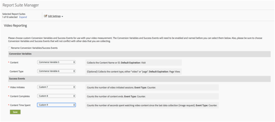

# Panoramica su Milestone{#milestone-overview}

>[!CAUTION]
>
>Questa opzione di misurazione è diventata obsoleta.

[Documentazione legacy di Milestone](milestone_analytics_video.pdf)

## Configurazione {#configuration}

### Configurazione video di Milestone

Per tracciare i video, definisci un set di *Variabili di conversione personalizzate* (eVar) ed *Eventi personalizzati* da utilizzare nel tracciamento e nella generazione di rapporti. Una variabile *Custom Insight* ( `s.prop` ) viene utilizzata anche per i percorsi.

Le variabili selezionate per ogni metrica vengono aggiunte alla pagina di configurazione video. Questo consente al sistema di generare e formattare automaticamente i rapporti video standard. L’eVar *nome video* e il contatore *visualizzazioni video* sono entrambi obbligatori. Altre variabili sono facoltative ma consigliate per la misurazione completa. Una volta abilitato il tracciamento video, è possibile visualizzare i rapporti generati dai dati video riportati mediante il tracciamento video.

È inoltre possibile tenere traccia di qualsiasi numero di metriche aggiuntive per i video. Ad esempio, se utilizzi più lettori video sul tuo sito, puoi popolare una eVar con il nome del lettore. Alcune delle variabili selezionate possono essere utilizzate anche in altre aree del sito. Ad esempio, se utilizzata in tutto il sito, la variabile *tipo di contenuto* può consentire di misurare la percentuale di visualizzazioni di pagina provenienti dal video e correlare gli eventi di conversione al video.

### Configurazione della generazione di rapporti di Milestone

Per configurare la generazione di rapporti video per un’implementazione Milestone, vai su **[!UICONTROL Admin > Report Suite Manager].** Seleziona la suite di rapporti, quindi scegli **[!UICONTROL Video Management > Video Reporting]:**

<!--
{width="248"}
-->


Nella prima schermata, con i dati Milestone funziona solo Video di base. Seleziona **[!UICONTROL Video Core]** e fai clic su **[!UICONTROL Save].**


Nella schermata successiva, seleziona **[!UICONTROL Use Custom Variables].**

<!--
{width="470"}
-->


Nella schermata finale, seleziona le due eVar e i tre eventi da utilizzare per la misurazione video:

<!--

-->



## Riferimento a una variabile video {#video-variable-reference}

La tabella seguente contiene ulteriori dettagli sulle variabili commerciali e sugli eventi personalizzati per i video:

| Metrica video | Tipo di variabile | Descrizione |
| --- | --- | --- |
| Contenuto | Scadenza predefinita eVar <br/>: visita | (obbligatorio) raccoglie il nome del video, come specificato nell’implementazione. |
| Tipo di contenuto | Scadenza predefinita eVar <br/>: visualizzazione pagina | Raccoglie dati relativi al tipo di contenuto visualizzato da un visitatore. Agli hit inviati dalla misurazione video viene assegnato il tipo di contenuto `video.` <br/>Questa variabile non deve essere riservata esclusivamente al tracciamento video. Se la stessa variabile viene usata anche per ottenere il tipo di altri contenuti, è possibile analizzare la distribuzione dei visitatori per diversi tipi di contenuto. Ad esempio, puoi usare questa variabile per assegnare valori quali `article` o `product page` ad altri tipi di contenuti. <br/>Dal punto di vista della misurazione dei video, il *tipo di contenuto* permette di individuare i visitatori che guardano un video e quindi calcolare i tassi di conversioni derivanti dal video. |
| Tempo trascorso dei contenuti | Tipo di <br/>evento: contatore | Conta il tempo, in secondi, trascorso a guardare un video dall&#39;ultimo processo di raccolta di dati di una richiesta di immagine. |
| Inizia video | Tipo di <br/>evento: contatore | Indica che un visitatore ha visualizzato una parte del video. Tuttavia, non fornisce informazioni sulla durata della visualizzazione o sulla parte di video visualizzata dal visitatore. |
| Completamento video | Tipo di <br/>evento: contatore | Indica che un utente ha visualizzato un video completo. Per impostazione predefinita, l&#39;evento completo è misurato 1 secondo prima della fine del video.  <br/>Durante l’implementazione, puoi specificare a quanti secondi dalla fine del video la visualizzazione potrà essere considerata come completa. Per i video in diretta e altri flussi che non hanno una fine definita, puoi specificare un punto personalizzato per misurare il completamento. Ad esempio, dopo un tempo di visualizzazione specifico. |

## Variabili del modulo multimediale {#media-module-variables}

Le seguenti variabili consentono di configurare la misurazione video. È necessario definire i valori delle variabili nella tabella Variabili richieste. Inoltre, per tracciare gli eventi nel lettore video, è necessario abilitare il tracciamento automatico (per i lettori supportati) o implementare il tracciamento degli eventi del lettore personalizzato utilizzando i metodi di apertura, riproduzione, interruzione e chiusura.

| Variabile | Descrizione |
| --- | --- |
| `Media.trackUsingContextData` | **Sintassi:** <br/><br/> `s.Media.trackUsingContextData = true;` <br/>Questa opzione consente il tracciamento video integrato. Quando è impostato su true, il modulo multimediale genera dati contestuali per il tracciamento dei contenuti multimediali, al posto di `pev3` legacy. <br/>Utilizza `Media.contextDataMapping` per mappare i dati contestuali alle eVar e agli eventi selezionati.<br/>Valore predefinito: `false` |
| `Media.contextDataMapping` | **Sintassi:** <br/><br/> `s.Media.contextDataMapping = {`<br/>      `"a.media.name":"eVar2, prop2",` <br/>     `"a.media.segment":"eVar3",` <br/>     `"a.contentType":"eVar1",` <br/>     `"a.media.timePlayed":"event3",` <br/>     `"a.media.view":"event1",` <br/>     `"a.media.segmentView":"event2",` <br/>     `"a.media.complete":"event7",` <br/>     `"a.media.milestones":{` <br/>         `25:"event4",` <br/>         `50:"event5",` <br/>         `75:"event6"` <br/>     ` }` <br/> `};` <br/><br/>Un oggetto che definisce la mappatura delle variabili alle eVar e agli eventi da utilizzare per la misurazione video. L’oggetto deve mappare i campi seguenti: <br/><br/> **a.media.name:** (obbligatorio) popola le variabili con il nome del video. Fornisci l’eVar selezionata per memorizzare il nome del video e la variabile video Custom Insight (`s.prop`) da utilizzare per il percorso del video. Fornisci i valori in un elenco separato da virgole. <br/><br/> **a.media.segment:** (facoltativo) l’eVar in cui memorizzare il nome del segmento multimediale. a.contentType: (facoltativo) l’eVar in cui memorizzare il valore video che contiene il tracciamento delle visite e dei visitatori abilitato per generare i relativi rapporti. La variabile selezionata è probabilmente già utilizzata per memorizzare dati come la presentazione dell’articolo o la pagina del prodotto <br/><br/> **a.media.view:** (obbligatorio) l&#39;evento da utilizzare per conteggiare le visualizzazioni multimediali. <br/><br/> **a.media.segmentView:** (facoltativo) l’evento da utilizzare per conteggiare le visualizzazioni dei segmenti. <br/><br/> **a.media.complete:** (facoltativo) l’evento da utilizzare per conteggiare le visualizzazioni complete. <br/><br/> **a.media.timePlayed:** (facoltativo, fortemente consigliato) l’evento numerico da utilizzare per memorizzare il numero di secondi di video riprodotti. <br/><br/> **a.media.milestones:** (facoltativo) un oggetto che mappa le attività cardine di s.Media.trackMilestones come contatore degli eventi. Media.segmentByMilestones deve essere impostato su true se si definiscono le attività cardine. <br/><br/> **Tracciamento degli annunci** Per tracciare gli annunci, sono disponibili le seguenti variabili di dati di contesto: <br/> **a.media.ad.name:** (obbligatorio) popola le variabili con il nome dell’annuncio. Fornisci l&#39;eVar selezionata per memorizzare il nome dell&#39;annuncio e la variabile Custom Insight Video (`s.prop`) da utilizzare per il percorso. Fornisci i valori in un elenco separato da virgole. <br/><br/> **a.media.ad.pod:** la posizione nel contenuto principale in cui è stato riprodotto l’annuncio. <br/><br/> **a.media.ad.podPosition:** la posizione all’interno del pod in cui viene riprodotto l’annuncio. <br/><br/> **a.media.ad.CPM:** il CPM o il CPM crittografato (con prefisso “~”) che si applica a questa riproduzione. <br/><br/> **a.media.ad.view:** funziona allo stesso modo di `a.media.view` <br/><br/> **a.media.ad.clicked:** conta il numero di clic per l’annuncio (chiamate `Media.click`) <br/><br/> **a.media.ad.timePlayed:** funziona allo stesso modo di `a.media.timePlayed` <br/><br/> **a.media.ad.complete:** funziona allo stesso modo di `a.media.complete` a.media.ad.segment: funziona allo stesso modo di `a.media.segment` <br/><br/> **a.media.ad.segmentView:** funziona allo stesso modo di `a.media.segmentView` <br/><br/> **a.media.ad.milestoni:** funziona allo stesso modo di `a.media.milestones` <br/><br/> **a.media.ad.offsetMilestones:** funziona allo stesso modo di `a.media.offsetMilestones` |
| `Media.trackVars` | **Sintassi:** <br/><br/> `s.Media.trackVars =` <br/>    `"events,` `prop2,` `eVar1,` `eVar2,` `eVar3";` <br/><br/>un elenco separato da virgole di tutte le variabili impostate nel codice di tracciamento video. |
| `Media.trackEvents` | **Sintassi:** <br/><br/> `s.Media.trackEvents =` <br/>    `"event1,` `event2,` `event3,` `event4,` `event5,` `event6,` `event7"` <br/><br/>un elenco separato da virgole di tutti gli eventi impostati nel codice di tracciamento video. |

## Variabili facoltative {#optional-variables}

|  Variabile    | Descrizione |
| --- | --- |
| `Media.autoTrack` | **Sintassi:** <br/><br/> `s.Media.autoTrack = true`<br/><br/>abilita il tracciamento automatico per i lettori supportati. I lettori supportati sono i seguenti: <ul> <li> Open Source Media Framework (OSMF) </li> <li> FLVPlayback (lettori video creati tramite la procedura guidata di importazione video in Flash Professional) </li> <li> Silverlight </li> <li> MediaDisplay </li> <li> MediaPlayback </li> <li> API Brightcove versioni 2 e 3 (consulta [Brightcove](https://integrations.support.brightcove.com/adobe/adobe-aem-brightcove-connector-using-connector.html)) </li> <li> Windows Media Player, Quicktime o Real Player con JavaScript </li> </ul> <br/><br/>Se non si utilizza uno dei lettori di cui sopra, per tracciare gli eventi del lettore, è possibile utilizzare `Media.open` `Media.play` `Media.stop` `Media.close`. |
| `Media.autoTrackNetStreams` | **Sintassi:** <br/><br/> `s.Media.autoTrackNetStreams = true` <br/><br/>Flash 10.3 ha introdotto nuove funzionalità per il componente NetStream che consentono un tracciamento video avanzato. Se utilizzi un lettore NetStream di Flash personalizzato, è possibile abilitare questa variabile per attivare funzionalità simili ad autoTrack. Questo metodo richiede che i video siano visualizzati in Flash 10.3 o versione successiva. |
| `Media.completeByCloseOffset` | **Sintassi:** <br/><br/> <br/><br/>`s.Media.completeByCloseOffset = true` <br/><br/>questa impostazione consente di contare una visualizzazione video completa pochi secondi prima della fine effettiva del video.  <br/><br/>L’evento viene inviato in base al numero di secondi specificati in `completeCloseOffsetThreshold`. Questo consente di misurare le visualizzazioni complete nei lettori video che non segnalano mai un offset uguale alla lunghezza del video.<br/><br/>Per impostazione predefinita, questo valore è impostato su true e la soglia è impostata su 1 secondo. Con queste impostazioni predefinite, l’evento completo viene inviato 1 secondo prima della fine del video. |
| `Media.completeCloseOffsetThreshold` | **Sintassi:** <br/><br/> `s.Media.completeCloseOffsetThreshold = 1` <br/><br/>questa soglia consente di contare una visualizzazione video completa pochi secondi prima della fine effettiva del video.  `Media.completeByCloseOffset` deve essere impostato su true per utilizzare questa soglia.<br/><br/>Il valore intero fornito determina la distanza in secondi dell’offset dalla lunghezza del video alla chiusura ed è conteggiato ancora come completo. Questo consente di misurare le visualizzazioni complete nei lettori video che non segnalano mai un offset uguale alla lunghezza del video.  <br/><br/>La soglia predefinita è di 1 secondo. |
| `Media.playerName` | **Sintassi:** <br/><br/> `s.Media.playerName = "Custom Player Name"` <br/><br/>specifica il nome di un lettore video personalizzato. |
| `Media.trackSeconds` | **Sintassi:** <br/><br/> `s.Media.trackSeconds = 15` <br/><br/>definisce l’intervallo, in secondi, per l’invio di dati di tracciamento video ai server di raccolta dati di Adobe durante la riproduzione del video. Il valore deve essere impostato in incrementi di 5 secondi. <br/><br/> L’abilitazione di `Media.trackSeconds` attiva solo gli eventi definiti in `Media.contextDataMapping`. Per inviare variabili aggiuntive al di fuori di quelle specificate per la misurazione video, è necessario utilizzare Media.Monitor. |
| `Media.trackMilestones` | Traccia le attività cardine come percentuale della lunghezza del video. <br/><br/> **Sintassi:** <br/><br/> `s.Media.trackMilestones = "25, 50, 75";` <br/><br/>definisce l’intervallo, in percentuale della lunghezza del video, per l’invio di dati di tracciamento video ai server di raccolta dati di Adobe. Specifica le attività cardine come un elenco separato da virgole di numeri interi. Ad esempio: 10 = 10%, 23 = 23%.  <br/><br/>Poiché queste attività cardine sono punti fissi nel video, se un visitatore visualizza oltre quella del 10%, poi torna indietro e la passa nuovamente, il modulo multimediale invia i dati di tracciamento più volte. Analogamente, se un visitatore passa rapidamente oltre un’attività cardine, il modulo multimediale non invia i dati di tracciamento per tale attività.  <br/><br/>L’abilitazione di `Media.trackMilestones` attiva solo gli eventi definiti in `Media.contextDataMapping`. Per inviare variabili aggiuntive al di fuori di quelle specificate per la misurazione video, è necessario utilizzare Media.Monitor. |
| `Media.trackOffsetMilestones` | Traccia le attività cardine come secondi trascorsi dall’inizio del video. <br/><br/> **Sintassi:** <br/><br/> `s.Media.trackOffsetMilestones = "20, 40, 60";` <br/><br/>definisce l’intervallo, in secondi trascorsi dall’inizio del video, per l’invio di dati di tracciamento video ai server di raccolta dati di Adobe. Specifica le attività cardine come un elenco separato da virgole di numeri interi. Ad esempio: 20 = 20 secondi, 40 = 40 secondi).  <br/><br/>Poiché queste attività cardine sono punti fissi nel video, se un visitatore visualizza oltre quella di 20 secondi, poi torna indietro e la passa nuovamente, il modulo multimediale invia i dati di tracciamento più volte. Analogamente, se un visitatore passa rapidamente oltre un’attività cardine, il modulo multimediale non invia i dati di tracciamento per tale attività.  <br/><br/>L’abilitazione di `Media.trackOffsetMilestones` attiva solo gli eventi definiti in `Media.contextDataMapping`. Per inviare variabili aggiuntive al di fuori di quelle specificate per la misurazione video, è necessario utilizzare Media.Monitor. |
| `Media.segmentByMilestones` | **Sintassi:** <br/><br/> `s.Media.segmentByMilestones = true;` <br/><br/>genera automaticamente il nome del segmento, il numero del segmento e i dati di lunghezza del segmento, in base alla lunghezza del contenuto multimediale e alle attività cardine specificate in `Media.trackMilestones` <br/><br/>La segmentazione per attività cardine è l’unico modo per definire i segmenti quando si utilizza `autoTrack`. <br/><br/>Valore predefinito: `false` |
| `Media.segmentByOffsetMilestones` | **Sintassi:** <br/><br/> `s.Media.segmentByOffsetMilestones = true;` <br/><br/>genera automaticamente il nome del segmento, il numero del segmento e i dati di lunghezza del segmento, in base alla lunghezza del contenuto multimediale e alle attività cardine specificate in `Media.trackOffsetMilestones` <br/><br/>La segmentazione per attività cardine è l’unico modo per definire i segmenti quando si utilizza `autoTrack`.  <br/><br/>Valore predefinito: `false` |

## Variabili di tracciamento degli annunci {#ad-tracking-variables}

Queste variabili vengono utilizzate per inviare informazioni sugli annunci insieme al metodo openAd. Consulta [Tracciamento annunci video VAST.](https://experienceleague.adobe.com/docs/media-analytics/using/media-overview.html?lang=it)

| Variabile    | Descrizione |
| --- | --- |
| `Media.adTrackSeconds` | **Sintassi:** <br/><br/> `s.Media.adTrackSeconds = 15;` <br/><br/>definisce l’intervallo, in secondi, per l’invio di dati di tracciamento di annunci video ai server di raccolta dati di Adobe durante la riproduzione del video. Il valore deve essere impostato in incrementi di 5 secondi.  <br/><br/>L’abilitazione di `Media.adTrackSeconds` attiva solo gli eventi definiti in `Media.contextDataMapping`. Per inviare variabili aggiuntive al di fuori di quelle specificate per la misurazione video, è necessario utilizzare `Media.monitor`. |
| `Media.adTrackMilestones` | Traccia le attività cardine di annunci come percentuale della lunghezza dell’annuncio. <br/><br/> **Sintassi:** <br/><br/> `s.Media.adTrackMilestones = "25, 50, 75";` <br/><br/>definisce l’intervallo, in percentuale della lunghezza dell’annuncio, per l’invio di dati di tracciamento degli annunci ai server di raccolta dati di Adobe. Specifica le attività cardine come un elenco separato da virgole di numeri interi. Ad esempio: 10 = 10%, 23 = 23%).  <br/><br/>Poiché queste attività cardine sono punti fissi nell’annuncio, se un visitatore visualizza oltre quella del 10%, poi torna indietro e la passa nuovamente, il modulo multimediale invia i dati di tracciamento più volte. Analogamente, se un visitatore passa rapidamente oltre un’attività cardine, il modulo multimediale non invia i dati di tracciamento per tale attività.  <br/><br/>L’abilitazione di `Media.adTrackMilestones` attiva solo gli eventi definiti in `Media.contextDataMapping`. Per inviare variabili aggiuntive al di fuori di quelle specificate per la misurazione video, è necessario utilizzare `Media.monitor`. |
| `Media.adTrackOffsetMilestones` | Traccia le attività cardine dell’annuncio come secondi trascorsi dall’inizio dell’annuncio. <br/><br/> **Sintassi:** <br/><br/> `s.Media.adTrackOffsetMilestones = "20, 40, 60";` <br/><br/>definisce l’intervallo, in secondi trascorsi dall’inizio dell’annuncio, per l’invio di dati di tracciamento degli annunci ai server di raccolta dati di Adobe. Specifica le attività cardine come un elenco separato da virgole di numeri interi. Ad esempio: 20 = 20 secondi, 40 = 40 secondi).  <br/><br/>Poiché queste attività cardine sono punti fissi nell’annuncio, se un visitatore visualizza oltre quella di 20 secondi, poi torna indietro e la passa nuovamente, il modulo multimediale invia i dati di tracciamento più volte. Analogamente, se un visitatore passa rapidamente oltre un’attività cardine, il modulo multimediale non invia i dati di tracciamento per tale attività.  <br/><br/>L’abilitazione di `Media.adTrackOffsetMilestones` attiva solo gli eventi definiti in `Media.contextDataMapping`. Per inviare variabili aggiuntive al di fuori di quelle specificate per la misurazione video, è necessario utilizzare `Media.monitor`. |
| `Media.adSegmentByMilestones` | **Sintassi:** <br/><br/> `s.Media.adSegmentByMilestones = true;` <br/><br/>genera automaticamente il nome del segmento, il numero del segmento e i dati di lunghezza del segmento, in base alla lunghezza del contenuto multimediale e alle attività cardine specificate in `Media.adTrackMilestones` <br/><br/>La segmentazione per attività cardine è l’unico modo per definire i segmenti quando si utilizza `autoTrack`.  <br/><br/>Valore predefinito: `false` |
| `Media.adSegmentByOffsetMilestones` | **Sintassi:** <br/><br/> `s.Media.adSegmentByOffsetMilestones = true;` <br/><br/>genera automaticamente il nome del segmento, il numero del segmento e i dati di lunghezza del segmento, in base alla lunghezza del contenuto multimediale e alle attività cardine specificate in `Media.adTrackOffsetMilestones` <br/><br/>La segmentazione per attività cardine è l’unico modo per definire i segmenti quando si utilizza `autoTrack`. <br/><br/>Valore predefinito: `false` |

## Metodi del modulo multimediale {#media-module-methods}

I metodi del modulo multimediale vengono utilizzati per monitorare manualmente gli eventi del lettore e per tracciare le metriche aggiuntive che non fanno parte dei rapporti video standard.

Se utilizzi `Media.autoTrack` e non desideri tracciare le metriche aggiuntive, non è necessario chiamare direttamente nessuno di questi metodi. Tutti gli argomenti sono obbligatori, a meno che non sia specificato come facoltativo.

| Metodo    | Descrizione |
| --- | --- |
| `Media.open` | **Sintassi:** <br/><br/> `s.Media.open(mediaName, mediaLength, mediaPlayerName)` <br/><br/>prepara il modulo multimediale per raccogliere i dati di tracciamento video. Questo metodo tiene conto dei seguenti parametri: <ul><li> **mediaName:** (obbligatorio) il nome del video come desideri che venga visualizzato nei rapporti video. </li><li>  **mediaLength:** (obbligatorio) la durata del video in secondi.  </li><li> **mediaPlayerName:** (obbligatorio) il nome del lettore multimediale utilizzato per visualizzare il video, come desideri che venga visualizzato nei rapporti video. </li></ul> |
| `Media.openAd` | **Sintassi:** <br/><br/> `s.Media.openAd(name, length, playerName, parentName,`<br/>   `parentPod, parentPodPosition, CPM)` <br/><br/>prepara il modulo multimediale per raccogliere i dati di tracciamento degli annunci. Questo metodo tiene conto dei seguenti parametri: <ul> <li> **name:** (obbligatorio) il nome o l’ID dell’annuncio.  </li> <li> **length:** (obbligatorio) la durata dell’annuncio.  </li> <li> **playerName:** (obbligatorio) il nome del lettore multimediale utilizzato per visualizzare l’annuncio.  </li> <li> **parentName:** il nome o l’ID del contenuto principale in cui l’annuncio è incorporato.  </li> <li> **parentPod:** la posizione nel contenuto principale in cui è stato riprodotto l’annuncio.  </li> <li> **parentPodPosition:** la posizione all’interno del pod in cui viene riprodotto l’annuncio.  </li> <li> **CPM:** il CPM o il CPM crittografato (con prefisso “~”) che si applica a questa riproduzione.  </li> </ul> |
| `Media.click` | **Sintassi:** <br/><br/> `s.Media.click(name, offset)` <br/><br/>traccia quando è stato fatto clic su un annuncio in un video. Questo metodo tiene conto dei seguenti parametri: <ul> <li> **name:** il nome dell’annuncio. Deve corrispondere al nome utilizzato in Media.openAd.  </li> <li> **offset:** l’offset nell’annuncio quando si è verificato il clic.  </li> </ul> |
| `Media.close` | **Sintassi:** <br/><br/> `s.Media.close(mediaName)` <br/><br/>termina la raccolta dati video e invia informazioni ai server di raccolta dati di Adobe. Chiama questo metodo alla fine del video. Questo metodo tiene conto del seguente parametro: <br/><br/> **mediaName:** il nome del video. Deve corrispondere al nome utilizzato in `Media.open`. |
| `Media.complete` | **Sintassi:** <br/><br/> `s.Media.complete(name, offset)` <br/><br/>questo metodo traccia manualmente un evento completo. Questo metodo viene utilizzato è necessario attivare eventi utilizzando una logica speciale che non può essere gestita utilizzando `Media.completeByCloseOffset`. <br/><br/>Ad esempio, se stai misurando un flusso live che non ha una fine definita, è possibile attivare un completamento dopo che un utente visualizza un flusso live per X secondi. È possibile misurare un completamento utilizzando un calcolo percentuale in base alla durata e al tipo di contenuto. Questo metodo tiene conto dei seguenti parametri: <ul> <li> **mediaName:** il nome del video. Deve corrispondere al nome utilizzato in Media.open.  </li> <li> **mediaOffset:** il numero di secondi trascorsi nel video quando l’evento di completamento deve essere inviato. Specifica l’offset in base al video a partire dal secondo zero. <br/><br/>Se il lettore multimediale traccia utilizzando i millisecondi, assicurati che il valore sia convertito in secondi prima di chiamare Media.complete.  </li> </ul> Se prevedi di effettuare una chiamata di tipo “completato“ manualmente, imposta <br/><br/> `s.Media.completeByCloseOffset = false`. |
| `Media.play` | **Sintassi:** <br/><br/> `s.Media.play(name, offset, segmentNum, segment, segmentLength)` <br/><br/>chiama questo metodo ogni volta che inizia la riproduzione di un video. Quando utilizzi la misurazione video manuale, è possibile fornire i dati del segmento corrente durante l’invio dei dati di misurazione video.  <br/><br/>Se il lettore passa da un segmento all’altro, per qualsiasi motivo, è necessario chiamare `Media.stop` `Media.play`. <br/><br/>Questo metodo tiene conto dei seguenti parametri: <br/><br/> **mediaName:** il nome del video. Deve corrispondere al nome utilizzato in Media.open. <br/><br/> **mediaOffset:** il numero di secondi dall&#39;inizio della riproduzione del video. Specifica l’offset in base al video a partire dal secondo zero. Se il lettore multimediale traccia utlizzando i millisecondi, assicurati che il valore sia convertito in secondi prima di chiamare Media.play. <br/><br/> **segmentNum:** (facoltativo) il numero del segmento corrente, utilizzato dai rapporti di marketing per ordinare la visualizzazione dei segmenti nei rapporti. Il parametro segmentNum deve essere maggiore di zero. <br/><br/> **segmento:** (facoltativo) il nome del segmento corrente. <br/><br/> **segmentLength:** (facoltativo) <br/><br/>la durata del segmento corrente, in secondi.  <br/><br/>Ad esempio: <br/><br/> `s.Media.play("My Video", 1800, 2,"Second Quarter", 1800)` <br/><br/> `s.Media.play("My Video", 0, 1,"Preroll", 30)` |
| `Media.stop` | **Sintassi:** <br/><br/> `s.Media.stop(mediaName, mediaOffset)` <br/><br/>Tiene traccia di un evento di arresto (interruzione, pausa, ecc.) per il video specificato. Questo metodo tiene conto dei seguenti parametri: <ul> <li> **mediaName:** il nome del video. Deve corrispondere al nome utilizzato in `Media.open`.  </li> <li> **mediaOffset:** il numero di secondi trascorsi nel video in cui si verifica l’evento di interruzione o pausa. Specifica l&#39;offset in base al video a partire dal secondo zero.  </li> </ul> |
| `Media.monitor` | **Sintassi:** <br/><br/> `s.Media.monitor(s, media)` <br/><br/> **Sintassi Silverlight:**<br/><br/> `s.Media.monitor =` <br/>  `new AppMeasurement_Media_Monitor(myMediaMonitor);` <br/><br/>il monitoraggio dei contenuti multimediali dell’app Silverlight implementa il pattern di progettazione del delegato Objective-C. Il metodo della classe `myMediaMonitor` classe tiene conto dei parametri `s` e `media`. <br/><br/>Utilizza questo metodo per inviare metriche video aggiuntive. È possibile configurare variabili aggiuntive (Prop, eVar, Eventi) e inviarle utilizzando `Media.track` in base allo stato corrente del video durante la riproduzione. <br/><br/>Consulta [Misurazione di metriche aggiuntive tramite Media.monitor.](https://experienceleague.adobe.com/docs/media-analytics/using/media-overview.html?lang=it) <br/><br/>Questo metodo tiene conto dei seguenti parametri: <br/><br/>  **s:** l’istanza `AppMeasurement` (oppure oggetto JavaScript `s`). <br/><br/> **media:** un oggetto con i membri che forniscono lo stato del video. Tali membri includono:  <ul><li> `media.name:` il nome del video. Deve corrispondere al nome utilizzato in `Media.open`; </li><li> `media.length:` la durata del video in secondi indicata nella chiamata a `Media.open`; </li><li> `media.playerName:` il nome del lettore multimediale fornito nella chiamata a `Media.open`; </li><li> `media.openTime:` un oggetto NSDate contenente dati su quando è stata effettuata la chiamata a `Media.open`; </li><li> `media.offset:` l’offset corrente, in secondi, nel video (punto effettivo nel video). L’offset inizia a zero (il primo secondo del video è il secondo 0); </li><li> `media.percent:` la percentuale corrente del video riprodotto, in base alla lunghezza del video e all’offset corrente;  </li><li> `media.timePlayed:` il numero totale di secondi riprodotti finora;  </li><li> `media.eventFirstTime:` indica se è stata la prima volta che l’evento multimediale è stato chiamato per questo video; </li><li> `media.mediaEvent:` una stringa contenente il nome dell’evento che ha causato la chiamata di monitoraggio. </li></ul> |
| | `media.mediaEvent` events: <ul><li> `OPEN:` quando la riproduzione viene osservata per la prima volta tramite `Media.autoTrack` o una chiamata a `Media.play`; </li><li> `CLOSE:` quando la riproduzione termina al completamento del video tramite `Media.autoTrack` o a una chiamata a `Media.close`;</li><li> `PLAY:` quando la riproduzione riprende dopo essere stata messa in pausa o viene eseguito lo scorrimento tramite `Media.autoTrack` o una seconda chiamata a `Media.play`;</li><li> `STOP:` quando la riproduzione si interrompe a causa di una pausa dell’inizio dello scorrimento tramite `Media.autoTrack` o una chiamata a `Media.stop`;</li><li> `MONITOR:` quando il monitoraggio automatico controlla lo stato del video durante la riproduzione (ogni secondo);</li><li> `SECONDS:` al secondo intervallo definito dalla variabile `Media.trackSeconds`;</li><li> `MILESTONE:` alle attività cardine definite dalla variabile `Media.trackMilestones`; </li></ul> |
| `Media.track` | **Sintassi:** <br/><br/> `s.Media.track(mediaName)` <br/><br/> invia immediatamente lo stato del video corrente, insieme a qualsiasi `Media.trackVars` e Media.trackEvents definiti. Questo metodo viene utilizzato in `Media.monitor`. <br/><br/>Consulta [Misurazione di metriche aggiuntive tramite Media.monitor.](https://experienceleague.adobe.com/docs/media-analytics/using/media-overview.html?lang=it) <br/><br/>Chiama `Media.open` e `Media.play` sul video prima di richiamare questo metodo. Questo metodo tiene conto del seguente parametro: <ul> <li> **mediaName**: il nome del video. Deve corrispondere al nome utilizzato in `Media.open`.</li> </ul> Questo metodo rappresenta l’unico modo per inviare variabili aggiuntive durante la riproduzione del video. Ripristina a zero i contatori dell’intervallo di secondi e della percentuale di attività cardine per evitare più hit di tracciamento. |


## Tracciare gli eventi del lettore video {#track-video-player-events}

È possibile tracciare i lettori multimediali creando funzioni collegate ai gestori di eventi del lettore video. Questo consente di chiamare `Media.open`, `Media.play`, `Media.stop` e `Media.close` nei momenti opportuni. Ad esempio:

* **Caricamento:** chiamata `Media.open` e `Media.play`
* **Pausa:** chiamata `Media.stop`. Ad esempio, se un utente mette in pausa un video dopo 15 secondi, effettua una chiamata `s.Media.stop("Video1", 15)`
* **Buffer:** chiama `Media.stop` durante il buffer del video. Effettua la chiamata `Media.play` quando riprende la riproduzione.
* **Ripresa:** chiamata `Media.play`. Ad esempio, quando un utente riprende un video dopo aver inizialmente riprodotto 15 secondi del video, effettua una chiamata `s.Media.play("Video1", 15)`.
* **Scrub (cursore):** quando l’utente trascina il cursore video, effettua una chiamata `Media.stop`. Quando l’utente rilascia il cursore video, effettua una chiamata `Media.play`.
* **Fine:** chiamata `Media.stop`, quindi `Media.close`. Ad esempio, alla fine di un video di 100 secondi, effettua una chiamata `s.Media.stop("Video1", 100)`, quindi `s.Media.close("Video1")`.

A tal fine, è possibile definire quattro funzioni personalizzate che possono essere chiamate dai gestori eventi del lettore multimediale. I vari parametri passati in `Media.open`, `Media.play`, `Media.stop` e `Media.close` provengono dal lettore. Lo pseudocodice seguente illustra come questa operazione potrebbe essere eseguita:

```javascript
/* Call on video load */
function startMovie() {
    s.Media.open(mediaName, mediaLength, mediaPlayerName);
    playMovie();
}

/* Call on video resume from pause and slider release */
function playMovie() {
    s.Media.play(mediaName,
                 mediaOffset,  
                 segmentNum,  
                 segment,  
                 segmentLength);
}
/* Call on video pause and slider grab */
function stopMovie() {
    s.Media.stop(mediaName, mediaOffset);
}

/* Call on video end */
/* Measuring Video for Developers 43 */
function endMovie() {
    stopMovie();
    s.Media.close(mediaName);
}
```

## Autotrack JavaScript {#javascript-autotrack}

Il modulo multimediale JavaScript identifica tutti i tag `<embed>` o `<object>` nella pagina HTML. Quindi cerca i dati in ogni tag per determinare quale lettore multimediale viene utilizzato, se presente. `autoTrack` può essere utilizzato se il lettore è Windows Media Player, Quicktime o Real Player, ma `autoTrack` per Windows Media Player funziona solo con Internet Explorer. Per supportare tutti gli altri browser è necessario il tracciamento manuale per Windows Media Player.

È necessario che l’attributo `classid` sia impostato sull’oggetto che desideri tracciare. `classid` è richiesto per esporre i gestori di eventi utilizzati dal modulo multimediale per tracciare automaticamente il video.

```javascript
s.Media.autoTrack = true
```

## Codice di esempio JavaScript {#javascript-sample-code}

```javascript
// Sample implementation
s.usePlugins=true
function s_doPlugins(s) {
    /* Add manual calls to modules and plugins here */
}

s.doPlugins=s_doPlugins

/*********Media Module Calls**************/
s.loadModule("Media")

/*Configure Media Module Functions */
s.Media.autoTrack= true;
s.Media.trackVars="events, prop2, eVar1, eVar2, eVar3";
s.Media.trackEvents="event1, event2, event3, event4, event5, event6, event7"
s.Media.trackMilestones="25, 50, 75";
s.Media.playerName="My Media Player";
s.Media.segmentByMilestones = true;
s.Media.trackUsingContextData = true;
s.Media.contextDataMapping = {
    "a.media.name":"eVar2, prop2",
    "a.media.segment":"eVar3",
    "a.contentType":"eVar1",
    "a.media.timePlayed":"event3",
    "a.media.view":"event1",
    "a.media.segmentView":"event2",
    "a.media.complete":"event7",
    "a.media.milestones":{
        25:"event4",
        50:"event5",
        75:"event6"
    }
}

s.Media.monitor = function (s, media) { } //If Needed

/* Turn on and configure debugging here */
s.debugTracking = true;
s.trackLocal = true;

/* WARNING: Changing any of the below variables will cause drastic changes to how your visitor
data is collected. Changes should only be made when instructed to do so by your account
manager.*/
s.visitorNamespace = "yourNamespace";
s.trackingServer="metrics.mysite.com" //Use only if using first party cookies
s.trackingServerSecure="smetrics.mysite.com" // Use only if using first party cookies in  
                                             // conjunction with SSL
s.dc = '122';

/************************** PLUGINS SECTION *************************/
/* Insert any plugins code you want to use here. */

/****************************** MODULES *****************************/
/* Insert the media module tracking code here. */
```
