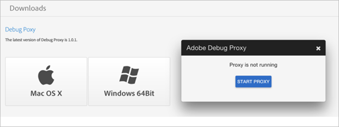

# Configurare Adobe Debug {#configure-adobe-debug}

## Accesso ad Adobe Debug {#accessing-adobe-debug}

Per accedere ad Adobe Debug:

1. Vai su [Experience Cloud](https://www.marketing.adobe.com/) e crea un nuovo utente Adobe Experience Cloud.

   >[!TIP]
   >
   >Questi dati di accesso non sono uguali al nome utente/password che usi per accedere ad Adobe Analytics.

1. Dopo aver creato un account di Experience Cloud, contatta il tuo rappresentante Adobe per richiedere l&#39;accesso ad Adobe Debug.
1. Una volta che ti è stato concesso l’accesso, vai su [https://debug.adobe.com](https://debug.adobe.com) e utilizza le tue credenziali Experience Cloud per accedere.

   

   I browser supportati per questo strumento sono:
   * Google Chrome
   * Mozilla Firefox
   * Apple Safari
   * Microsoft Internet Explorer versioni 9-11

I browser consigliati sono le versioni più recenti di Chrome e Firefox.

## Debug Proxy {#debug-proxy}

Scarica e configura Debug Proxy:

1. Scarica l’app Debug Proxy in [Download delle app.](https://debug.adobe.com/#/downloads)

   I sistemi operativi supportati sono:
   * OS X 10.7 a 64 bit o superiore
   * Windows 7.1 a 64 bit o superiore

   

1. Il server Debug Proxy verrà eseguito sul computer locale sulla porta 33284 e verrà impostato come proxy di sistema.

   Potrebbe essere necessario regolare le impostazioni del browser in base al sistema operativo e al browser.

## Scarica e installa il certificato SSL sul desktop o nelle app {#download-and-install-sSL-desktop}

La prima volta che esegui Adobe Debug, verrà generato un certificato SSL univoco. Se supporti il traffico HTTPS tra desktop e/o app, devi scaricare e installare il nostro certificato SSL.

Scarica e installa il certificato SSL:

1. Dopo aver installato e avviato Adobe Debug, passa a [https://proxy.debug.adobe.com/ssl](https://proxy.debug.adobe.com/ssl) e scarica la certificazione.
1. Importa il certificato

   **Mac OS**
   1. Fai doppio clic sul certificato CA principale per aprirlo in Accesso Portachiavi.
   1. Il certificato CA principale viene visualizzato nell’accesso.
   1. Sposta (trascina) il certificato CA principale in Sistema.
   1. È necessario copiare il certificato in Sistema per assicurarsi che sia attendibile per tutti gli utenti e i processi di sistema locali.
   1. Apri il certificato CA principale, espandi Attendibile, seleziona Sempre attendibile e salva le modifiche.

   **Windows**
   1. Completa una delle seguenti procedure:

      * [Aggiunta di certificati all’archivio Autorità di certificazione principale attendibili per un computer locale](https://technet.microsoft.com/it-it/library/cc754841.aspx#BKMK_addlocal)

   1. Per Firefox, completa la procedura descritta in [Installazione del certificato principale in Mozilla Firefox.](https://wiki.wmtransfer.com/projects/webmoney/wiki/Installing_root_certificate_in_Mozilla_Firefox)

      Per visualizzare la modifica, potrebbe essere necessario chiudere e riaprire Firefox.

   **Dispositivi iOS**
   1. Per utilizzare Adobe Debug come proxy HTTP, imposta il dispositivo iOS facendo clic su **[!UICONTROL Settings app]** **>** **[!UICONTROL Wifi settings]**.

   1. Su Safari, vai su [Esegui debug.](https://proxy.debug.adobe.com/ssl)

      In Safari ti verrà richiesto di installare il certificato SSL.

## Installa il certificato SSL per il dispositivo mobile {#install-sSL-for-mobile-device}

Se non disponi delle chiamate HTTPS in Adobe Debug, devi installare il certificato SSL per Adobe Debug sul dispositivo mobile.

### iOS

Per installare il certificato SSL su un dispositivo iOS:

1. Sul tuo PC, attiva Debug Proxy e passa ad [Adobe Debug.](https://debug.adobe.com)
1. Completa i seguenti passaggi sul tuo dispositivo iOS:
   1. Attiva la modalità aereo sul tuo dispositivo.
   1. Seleziona lo stesso segnale Wi-Fi utilizzato dal PC.
   1. Sul PC, imposta manualmente l&#39;IP e la porta visualizzati sull&#39;app Debug Proxy.
   1. Apri una finestra del browser Apple Safari.
   1. Vai a [https://proxy.debug.adobe.com/ssl.](https://proxy.debug.adobe.com/ssl)
   1. Scarica e installa il certificato SSL.

1. Sul PC, avvia la sessione di Adobe Debug.
1. Avvia il test sul dispositivo iOS.

### Android

Per installare il certificato SSL su un dispositivo Android:

1. Sul PC, attiva Debug Proxy e passa ad [Adobe Debug.](https://debug.adobe.com)
1. Completa i seguenti passaggi sul tuo dispositivo Android:
   1. Imposta la modalità aereo sul tuo dispositivo.
   1. Seleziona lo stesso segnale Wi-Fi utilizzato dal PC.
   1. Sul PC, imposta manualmente l&#39;IP e la porta visualizzati sull&#39;app Debug Proxy.
   1. Apri una finestra del browser.
   1. Vai su [https://proxy.debug.adobe.com/ssl.](https://proxy.debug.adobe.com/ssl)
   1. Scarica e installa il certificato SSL.

1. Sul PC, avvia la sessione di Adobe Debug.
1. Avvia il test sul dispositivo Android.
