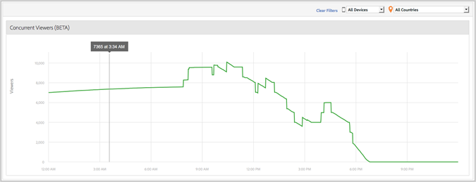

# Visualizzatori simultanei di contenuti multimediali{#media-concurrent-viewers}

Il dashboard Visualizzatori simultanei di file multimediali mostra gli utenti simultanei in un giorno. I dati possono essere filtrati in base al contenuto, al tipo di dispositivo o al Paese.

>[!TIP]
>
> Questo rapporto è basato su sessioni multimediali attive simultanee.  Per visualizzare i visualizzatori simultanei in base a un visitatore univoco, con le funzionalità aggiuntive per applicare un segmento, suddividere e confrontare, utilizzate la variabile [Pannello Visualizzatori simultanei  Analysis Workspace](https://docs.adobe.com/content/help/it-IT/analytics/analyze/analysis-workspace/panels/media-concurrent-viewers.html).

## Funzioni di report {#report-features}

Di seguito sono riportate alcune caratteristiche di questo rapporto:

* Questo non è in tempo reale. Ha una latenza normale  Adobe Analytics.
* La relazione copre un periodo di 24 ore. L&#39;asse x è l&#39;ora del giorno in base al fuso orario della suite di rapporti.
* Vengono visualizzati visualizzatori simultanei con granularità minima.
* Esiste un *Report visualizzatori simultanei* che mostra quanti visualizzatori possono guardare o ascoltare tutti i contenuti.
* È disponibile un rapporto Visualizzatori simultanei all&#39;interno del pannello *Dettagli supporto* rapporto che mostra quanti visualizzatori stanno visualizzando o ascoltando un elemento multimediale specifico.
* Il rapporto funziona solo in un giorno.
* Il cliente può esaminare i rapporti storici dei visualizzatori simultanei (limitati a un solo giorno).

## Limitazioni {#limitations}

Di seguito sono riportati alcuni limiti per questo rapporto:

* Se l&#39;intervallo selezionato non è un giorno intero, non verranno visualizzati dati.
* Non è possibile esportare i dati, ad esempio ReportBuilder.
* Non è possibile presentare i dati in un formato di tabella.
* Non potete inviare un rapporto tramite e-mail.
* Anche se non monitori gli annunci, devi riabilitare il tracciamento dei supporti e selezionare il modulo Media Ad.
* Questa funzionalità fornirà dati precisi quando si utilizza una libreria heartbeat con funzionalità di tracciamento Pausa.
