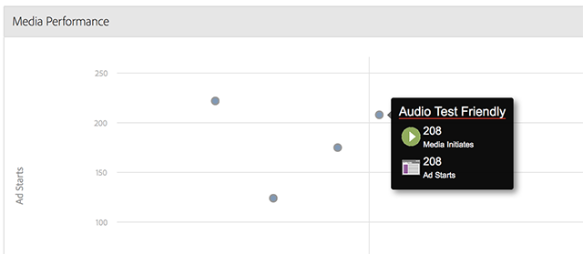

# Panoramica contenuti multimediali{#media-overview}

La dashboard Panoramica file multimediali è progettata per consentire il monitoraggio dei contenuti multimediali nel sito. La visualizzazione Panoramica file multimediali mostra diverse misurazioni aggregate in modo da poter monitorare rapidamente le prestazioni del supporto come previsto. Accanto a [[!UICONTROL Ad starts]](/help/reporting/metrics/ad-starts.md) viene visualizzato un grafico con [[!UICONTROL Content starts]](/help/reporting/metrics/content-starts.md) che consente di visualizzare rapidamente queste metriche per ogni elemento multimediale.

<!--
{width="672px"}
-->

## Filtri rapidi {#quick-filters}

Visualizza rapidamente le metriche dei contenuti multimediali in base al dispositivo o al paese geografico:

<!--
{width="400px"}
-->

## Prestazioni multimediali {#media-performance}

Fai clic e trascina per ingrandire, quindi passa il mouse per visualizzare le metriche granulari per specifici file multimediali. Fai clic su  

per reimpostare la visualizzazione dopo lo zoom.

<!--
{width="400px"}
-->
