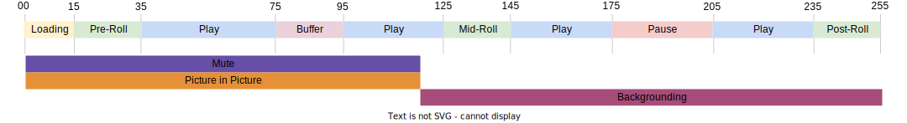

# Tracciamento di più stati del lettore

Ci sono situazioni in cui due stati di riproduzione iniziano e terminano contemporaneamente o quando la fine di uno stato è anche l&#39;inizio di un altro stato. Osserva il seguente esempio:



L’implementazione corrente consente di eseguire entrambe le operazioni:
- `stateStart(pictureInPicture)` - t0
- `stateStart(mute)` - t0
- `stateEnd(mute)` - t1
- `stateEnd(pictureInPicture)` - t1
- `stateStart(fullScreen)` - t1
- `stateEnd(fullScreen)` - t2

Tuttavia, il cliente deve emettere molti `stateStart` e `stateEnd` eventi per segnalare più modifiche simultanee dello stato. Per ottimizzare questo comportamento comune, è necessario `statesUpdate` è stato implementato il tipo di evento , che termina un elenco di stati e avvia un elenco di nuovi stati.

Utilizzo del nuovo `statesUpdate` evento, l&#39;elenco di eventi riportato sopra diventa:
- `statesUpdate(statesEnd=[], statesStart=[pictureInPicture, mute])` - t0
- `statesUpdate(statesEnd=[mute, pictureInPicture], statesStart=[fullScreen])` - t1
- `statesUpdate(statesEnd=[fullScreen], statesStart=[])` - t2

Il numero di chiamate per gli aggiornamenti di stato è stato ridotto da 6 a solo 3 per lo stesso comportamento. L&#39;ultimo evento avrebbe potuto essere anche un semplice `stateEnd(fullScreen)`.

## Implementazione API Media Collection

Esempi:

```
// statesUpdate (ex: mute and pictureInPicture are switched on)
http(s)://<Analytics_Visitor_Namespace>.hb-api.omtrdc.net/api/v1/sessions/<SID>/events
{
  "eventType": "statesUpdate",
  "params": {
    "statesStart": [
      {
        "media.state.name": "mute"
      },
      {
        "media.state.name": "pictureInPicture"
      }
    ]
  },
  "playerTime": {
    "playhead": 0,
    "ts": 1569999130627
  }
}
```

```
// statesUpdate (ex: mute and pictureInPicture are switched off, fullScreen is switched on)
http(s)://<Analytics_Visitor_Namespace>.hb-api.omtrdc.net/api/v1/sessions/<SID>/events
{
  "eventType": "statesUpdate",
  "params": {
    "statesEnd": [
      {
        "media.state.name": "mute"
      },
      {
        "media.state.name": "pictureInPicture"
      }
    ],
    "statesStart": [
      {
        "media.state.name": "fullScreen"
      }
    ]
  },
  "playerTime": {
    "playhead": 0,
    "ts": 1569999130627
  }
}
```

```
// statesUpdate (ex: fullScreen is switched off)
http(s)://<Analytics_Visitor_Namespace>.hb-api.omtrdc.net/api/v1/sessions/<SID>/events
{
  "eventType": "statesUpdate",
  "params": {
    "statesEnd": [
      {
        "media.state.name": "fullScreen"
      }
    ]
  },
  "playerTime": {
    "playhead": 0,
    "ts": 1569999130627
  }
}
```

## Implementazione di Media SDK

Non è disponibile alcuna implementazione Media SDK.
