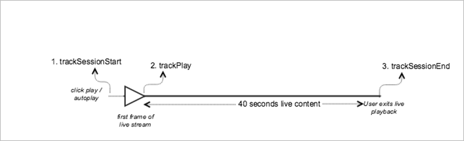

# Contenuto principale live{#live-main-content}

## Scenario {#scenario}

In questo scenario, esiste una risorsa live senza annunci riprodotti per 40 secondi dopo l’unione del flusso live.

| Attivatore | metodo Heartbeat | Chiamate di rete | Note   |
|---|---|---|---|
| Clic utente **[!UICONTROL Play]** | `trackSessionStart` | Inizio contenuto Analytics, inizio contenuto Heartbeat | Può trattarsi di un clic dell&#39;utente **[!UICONTROL Play]** o di un evento di riproduzione automatica. |
| Viene riprodotto il primo fotogramma dei media. | `trackPlay` | Riproduzione di contenuti Heartbeat | Questo metodo attiva il timer. Gli heartbeat vengono inviati ogni 10 secondi, a condizione che la riproduzione continui. |
| Il contenuto viene riprodotto. |  | heartbeat di contenuto |  |
| La sessione è finita. | `trackSessionEnd` |  | `SessionEnd` indica la fine di una sessione di visualizzazione. Questa API deve essere chiamata anche se l’utente non utilizza i file multimediali per il completamento. |

## Parametri {#parameters}

Molti degli stessi valori visualizzati nelle chiamate di avvio dei contenuti di Adobe Analytics vengono visualizzati anche nelle chiamate di avvio dei contenuti di Heartbeat. Vedrai anche molti altri parametri utilizzati da Adobe per popolare i vari rapporti multimediali in Adobe Analytics. Non li copriremo tutti qui, solo quelli più importanti.

### Inizio contenuto Heartbeat

| Parametro | Valore | Note |
|---|---|---|
| `s:sc:rsid` | &lt;your Adobe=&quot;&quot; Report=&quot;&quot; Suite=&quot;&quot; ID=&quot;&quot;> |  |
| `s:sc:tracking_serve` | &lt;your Analytics=&quot;&quot; Tracking=&quot;&quot; Server=&quot;&quot; URL=&quot;&quot;> |  |
| `s:user:mid` | `s:user:mid` | Deve corrispondere al valore mid nella chiamata di avvio del contenuto di Adobe Analytics |
| `s:event:type` | &quot;start&quot; |  |
| `s:asset:type` | &quot;main&quot; |  |
| `s:asset:mediao_id` | &lt;your Media=&quot;&quot; Name=&quot;&quot;> |  |
| `s:stream:type` | live |  |
| `s:meta:*` | facoltativo | Metadati personalizzati impostati sul supporto |

## heartbeat di contenuto {#content-heartbeats}

Durante la riproduzione dei contenuti multimediali, è presente un timer che invia uno o più heartbeat (o ping) ogni 10 secondi per i contenuti principali e ogni secondo per gli annunci. Questi heartbeat conterranno informazioni su riproduzione, annunci pubblicitari, buffering e molti altri elementi. Il contenuto esatto di ogni heartbeat va oltre l&#39;ambito di questo documento, la cosa fondamentale da convalidare è che gli heartbeat vengono attivati in modo coerente mentre la riproduzione continua.

Negli heartbeat dei contenuti, cerca alcuni aspetti specifici:

| Parametro | Valore | Note |
|---|---|---|
| `s:event:type` | &quot;play&quot; |  |
| `l:event:playhead` | &lt;playhead position=&quot;&quot;> ad esempio 50, 60, 70 | Ciò dovrebbe riflettere la posizione attuale del playhead. |

## Contenuto Heartbeat completato {#heartbeat-content-complete}

Non ci sarà una chiamata completa in questo scenario, perché il flusso live non è mai stato completato.

## Impostazioni dei valori della testina di riproduzione

Per i flussi LIVE, è necessario impostare il valore del playhead come numero di secondi dalla mezzanotte UTC di quel giorno, in modo che nel reporting, gli analisti possano determinare a quale punto gli utenti si uniscono e lasciano il flusso LIVE entro una visualizzazione di 24 ore.

### All&#39;inizio

Per i file multimediali LIVE, quando un utente inizia a riprodurre il flusso, è necessario impostare `l:event:playhead` sul numero di secondi trascorsi dalla mezzanotte UTC di quel giorno. Questo è diverso da VOD, dove si imposta il playhead su &quot;0&quot;.

Ad esempio, supponiamo che un evento di streaming LIVE inizi a mezzanotte e venga eseguito per 24 ore (`a.media.length=86400`; `l:asset:length=86400`). Quindi, supponiamo che un utente inizi a riprodurre lo streaming LIVE alle 12:00. In questo scenario, imposta `l:event:playhead` su 43200 (12 ore dalla mezzanotte UTC di quel giorno in secondi).

### In pausa

Quando un utente mette in pausa la riproduzione, deve essere applicata la stessa logica di &quot;playhead&quot; applicata all&#39;inizio della riproduzione. Quando l&#39;utente torna a riprodurre il flusso LIVE, è necessario impostare il valore `l:event:playhead` in base al nuovo numero di secondi dalla mezzanotte UTC, _not_ al punto in cui l&#39;utente ha messo in pausa il flusso LIVE.

## Codice di esempio {#sample-code}



### Android

Di seguito è riportato l’ordine di chiamata API previsto:

```java
// Set up mediaObject 
MediaObject mediaInfo = MediaHeartbeat.createMediaObject( 
  Configuration.MEDIA_NAME,  
  Configuration.MEDIA_ID,  
  Configuration.MEDIA_LENGTH,  
  MediaHeartbeat.StreamType.LIVE 
); 

HashMap<String, String> mediaMetadata = new HashMap<String, String>(); 
mediaMetadata.put(CUSTOM_VAL_1, CUSTOM_KEY_1); 
mediaMetadata.put(CUSTOM_VAL_2, CUSTOM_KEY_2); 

// 1. Call trackSessionStart() when the user clicks Play or if autoplay is used,  
//    i.e., there is an intent to start playback.  
_mediaHeartbeat.trackSessionStart(mediaInfo, mediaMetadata); 

...... 
...... 

// 2. Call trackPlay() when the playback actually starts, i.e., when the first  
//    frame of main content is rendered on the screen. 
_mediaHeartbeat.trackPlay(); 

....... 
....... 

// 3. Call trackSessionEnd() when user ends the playback session.  
//    Since the user does not watch live media to completion, there  
//    is no need to call trackComplete().  
_mediaHeartbeat.trackSessionEnd(); 
....... 
....... 
```

### iOS

Di seguito è riportato l’ordine di chiamata API previsto:

```
// Set up mediaObject 
ADBMediaObject *mediaObject =  
[ADBMediaHeartbeat createMediaObjectWithName:MEDIA_NAME  
                   length:MEDIA_LENGTH  
                   streamType:ADBMediaHeartbeatStreamTypeLIVE]; 
 
NSMutableDictionary *mediaContextData = [[NSMutableDictionary alloc] init]; 
[mediaContextData setObject:CUSTOM_VAL_1 forKey:CUSTOM_KEY_1]; 
[mediaContextData setObject:CUSTOM_VAL_2 forKey:CUSTOM_KEY_2]; 
 
// 1. Call trackSessionStart when the user clicks Play or if autoplay is used,  
//    i.e., there is an intent to start playback. 
[_mediaHeartbeat trackSessionStart:mediaObject data:mediaContextData]; 
...... 
...... 
 
// 2. Call trackPlay when the playback actually starts, i.e., when the first  
//    frame of the main content is rendered on the screen. 
[_mediaHeartbeat trackPlay]; 
....... 
....... 
 
// 3. Call trackSessionEnd when user ends the playback session. Since the user  
//    does not watch live media to completion, there is no need to call  
//    trackComplete. 
[_mediaHeartbeat trackSessionEnd]; 
........ 
........ 
```

### JavaScript

Di seguito è riportato l’ordine di chiamata API previsto:

```js
// Set up mediaObject 
var mediaInfo =  
MediaHeartbeat.createMediaObject(Configuration.MEDIA_NAME,  
                                 Configuration.MEDIA_ID,  
                                 Configuration.MEDIA_LENGTH,  
                                 MediaHeartbeat.StreamType.VOD); 

var mediaMetadata = { 
  CUSTOM_KEY_1 : CUSTOM_VAL_1,  
  CUSTOM_KEY_2 : CUSTOM_VAL_2,  
  CUSTOM_KEY_3 : CUSTOM_VAL_3 
}; 

// 1. Call trackSessionStart() when Play is clicked or if autoplay  
//    is used, i.e., there's an intent to start playback. 
this._mediaHeartbeat.trackSessionStart(mediaInfo, mediaMetadata); 

...... 
...... 

// 2. Call trackPlay() when the playback actually starts, i.e., when the  
//    first frame of media is rendered on the screen. 
this._mediaHeartbeat.trackPlay(); 

....... 
....... 

// 3. Call trackSessionEnd() when user ends the playback session.  
//    Since user does not watch live media to completion, there is  
//    no need to call trackComplete(). 
this._mediaHeartbeat.trackSessionEnd(); 

........ 
........ 
```
