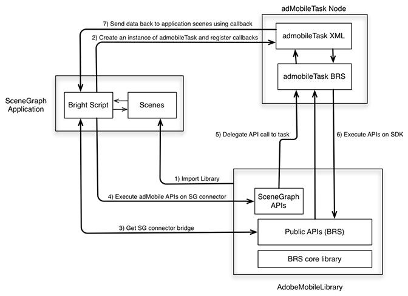

# Roku — Tracciamento in SceneGraph {#tracking-in-scenegraph-roku}

## Introduzione {#introduction}

Per sviluppare le applicazioni, è possibile utilizzare l’infrastruttura di programmazione XML Roku SceneGraph. Questa infrastruttura è caratterizzata da due concetti chiave:

* Rendering SceneGraph delle schermate dell’applicazione
* Configurazione XML delle schermate SceneGraph

L’SDK di Adobe Mobile per Roku è scritto in BrightScript. L’SDK utilizza molti componenti che non sono disponibili per un’app in esecuzione su SceneGraph (ad esempio, thread). Pertanto, uno sviluppatore di app Roku che intende utilizzare l’infrastruttura SceneGraph non può effettuare chiamate alle API SDK di Adobe Mobile (queste ultime sono simili a quelle disponibili sulle applicazioni legacy BrightScript).

## Architettura {#architecture}

Per aggiungere il supporto SceneGraph all’SDK di AdobeMobile, Adobe ha aggiunto una nuova API che crea un ponte connettore tra l’SDK di AdobeMobile e `adbmobileTask`. Quest’ultimo è un nodo SceneGraph utilizzato per l’esecuzione dell’API dell’SDK. (L’utilizzo di `adbmobileTask` viene descritto in dettaglio all’interno di questo documento).

Il ponte connettore è progettato per eseguire le seguenti operazioni:

* Il ponte restituisce un’istanza dell’SDK di AdobeMobile compatibile con SceneGraph. L’SDK compatibile con SceneGraph dispone di tutte le API che l’SDK legacy espone.
* In SceneGraph, l’utilizzo delle API SDK di AdobeMobile e quello delle API legacy è molto simile.
* Il ponte espone inoltre un meccanismo che consente di ascoltare i callback per le API che restituiscono determinati dati.



## Componenti {#components}

**Applicazione SceneGraph:**

* Utilizza le API `AdobeMobileLibrary` tramite il ponte connettore SceneGraph.
* Registra i callback di risposta su `adbmobileTask` per le variabili di dati di output previste.

**AdobeMobileLibrary:**

* Espone un set di API pubbliche (legacy), tra cui l’API del ponte connettore.
* Restituisce un’istanza del connettore SceneGraph che esegue il wrapping di tutte le API pubbliche legacy.
* Comunica con un nodo `adbmobileTask` di SceneGraph per l’esecuzione di API.

**Nodo adbmobileTask:**

* Un nodo attività SceneGraph che esegue API `AdobeMobileLibrary` su un thread in background.
* Agisce come delegato per restituire dati alle scene dell’applicazione.

## API pubbliche di SceneGraph {#public-scenegraph-apis}

### ADBMobileConnector

| Categoria | Nome metodo | Descrizione |
|---|---|---|
| **Costanti** | |  |
|  | `sceneGraphConstants` | Restituisce un oggetto contenente `SceneGraphConstants`. Per ulteriori informazioni, consulta la tabella precedente. |
|  | | |
| **Registrazione debug** | | |
|  | `setDebugLogging` | API di SceneGraph che consentono di impostare la registrazione debug sull’SDK ADBMobile. |
|  | `getDebugLogging` | API di SceneGraph che consentono di ottenere la registrazione debug dall’SDK ADBMobile. |
|  | Per ulteriori informazioni, consulta la sezione Registrazione debug dell’SDK legacy. | |
|  | | |
| **Stato privacy/Rinuncia** | | |
|  | `setPrivacyStatus` | API di SceneGraph che consentono di impostare lo stato della privacy sull’SDK di ADBMobile. |
|  | `getPrivacyStatus` | API di SceneGraph che consentono di ottenere lo stato della privacy dall’SDK di ADBMobile. |
|  | Per ulteriori informazioni, consulta la sezione Stato privacy/Rinuncia dell’SDK legacy. | |
|  | | |
| **Analytics** | | |
|  | `trackState` | API di SceneGraph che consentono di tenere traccia dello stato sull’SDK di ADBMobile. |
|  | `trackAction` | API di SceneGraph per tenere traccia dell’azione sull’SDK ADBMobile. |
|  | `trackingIdentifier` | API di SceneGraph per ottenere un identificatore di tracciamento dall’SDK ADBMobile. |
|  | `userIdentifier` | API di SceneGraph per ottenere un identificatore utente dall’SDK di ADBMobile. |
|  | `setUserIdentifier` | API di SceneGraph per impostare l’identificatore utente nell’SDK ADBMobile. |
|  | `getAllIdentifiers` | L’API di SceneGraph recupera tutte le identità utente note e mantenute dall’SDK Roku. |
|  | Per ulteriori informazioni consulta la sezione Analytics dell’SDK legacy. | |
|  | | |
| **Experience Cloud** | | |
|  | `visitorSyncIdentifiers` | API di SceneGraph per sincronizzare gli identificatori di Experience Cloud sull’SDK di ADBMobile. |
|  | `visitorMarketingCloudID` | API di SceneGraph per ottenere l’Experience Cloud ID del visitatore dall’SDK ADBMobile. |
|  | Per ulteriori informazioni consulta la sezione Experience Cloud dell’SDK legacy. | |
|  | | |
| **Audience Manager** | | |
|  | `audienceSubmitSignal` | API di SceneGraph per inviare un segnale Gestione del pubblico con caratteristiche. |
|  | `audienceVisitorProfile` | API di SceneGraph per ottenere un profilo visitatore di audience manager dall’SDK di ADBMobile. |
|  | `audienceDpid` | API di SceneGraph per ottenere un Dpid di pubblico dall’SDK di ADBMobile. |
|  | `audienceDpuuid` | API di SceneGraph per ottenere un pubblico Dpuuid dall’SDK di ADBMobile. |
|  | `audienceSetDpidAndDpuuid` | API di SceneGraph per impostare Dpid e Dpuuid del pubblico sull’SDK di ADBMobile. |
|  | Per ulteriori informazioni consulta la sezione Audience Manager dell’SDK legacy. | |
|  | | |
| **MediaHeartbeat** | | |
|  | `mediaTrackLoad` | API di SceneGraph per caricare contenuti video per il tracciamento MediaHeartbeat. |
|  | mediaTrackStart | API di SceneGraph per avviare la sessione di tracciamento video utilizzando MediaHeartbeat. |
|  | `mediaTrackUnload` | API di SceneGraph per scaricare contenuti video dal tracciamento MediaHeartbeat. |
|  | `mediaTrackPlay` | API di SceneGraph per tenere traccia della riproduzione di contenuto video. |
|  | mediaTrackPause | API di SceneGraph per tenere traccia del contenuto video in pausa. |
|  | `mediaTrackComplete` | API di SceneGraph per tenere traccia della riproduzione completata per il contenuto video. |
|  | `mediaTrackError` | API di SceneGraph per tenere traccia degli errori di riproduzione. |
|  | mediaTrackEvent | API di SceneGraph per tenere traccia degli eventi di riproduzione durante il tracciamento. Ad esempio: annunci, capitoli. |
|  | `mediaUpdatePlayhead` | API di SceneGraph per inviare aggiornamenti dell&#39;indicatore di riproduzione a MediaHeartbeat durante il tracciamento video. |
|  | `mediaUpdateQoS` | API di SceneGraph per inviare aggiornamenti QoS a MediaHeartbeat durante il tracciamento video. |
|  | Per ulteriori informazioni consulta la sezione MediaHeartbeat dell’SDK legacy. | |

### SceneGraphConstants

| Nome costante | Descrizione |
|---|---|
| `API_RESPONSE` | Utilizzato per recuperare l’oggetto di risposta dal campo `adbmobileTask` del nodo `adbmobileApiResponse` |
| `DEBUG_LOGGING` | Utilizzato come `apiName` per `getDebugLogging` |
| `PRIVACY_STATUS` | Utilizzato come `apiName` per `getPrivacyStatus` |
| `TRACKING_IDENTIFIER` | Utilizzato come `apiName` per `trackingIdentifier` |
| `USER_IDENTIFIER` | Utilizzato come `apiName` per `userIdentifier` |
| `VISITOR_MARKETING_CLOUD_ID` | Utilizzato come `apiName` per `visitorMarketingCloudID` |
| `AUDIENCE_VISITOR_PROFILE` | Utilizzato come `apiName` per `audienceVisitorProfile` |
| `AUDIENCE_DPID` | Utilizzato come `apiName` per `audienceDpid` |
| `AUDIENCE_DPUUID` | Utilizzato come `apiName` per `audienceDpuuid` |

### Nodo adbmobileTask

<table>
<thead>
<tr>
<td> Campo </td><td> Tipo </td><td> Impostazione predefinita </td><td> Utilizzo </td>
</tr>
</thead>
<tbody>
<tr>
<td> adbmobileApiCall </td>
<td> assocarray </td>
<td> Non valido </td>
<td> NON modificare questo campo o lasciare che sia utilizzato dall’applicazione. Questo campo viene utilizzato da SceneGraphConnector ADBMobile per indirizzare le chiamate API tramite i nodi SceneGraph e per recuperare le risposte. Pertanto, questa chiave/campo è riservata ad AdobeMobileSDK per la compatibilità con SceneGraph. <b>Importante:</b> eventuali modifiche a questo campo potrebbero causare il malfunzionamento di AdobeMobileSDK.</td>
</tr>
<tr>
<td> adbmobileApiResponse </td>
<td> assocarray </td>
<td> Non valido </td>
<td> Tutte le API eseguite su AdobeMobileSDK restituiranno risposte in questo campo di sola lettura. Registrati per un callback per ascoltare gli aggiornamenti a questo campo e ricevere gli oggetti di risposta. Di seguito è riportato il formato dell'oggetto di risposta:  
<pre>
response = {
  "apiName" : &lt;SceneGraphConstants.
               NOME_API&gt;
  "returnValue : &lt;RISPOSTA_API&gt;
}</pre>
Un’istanza di questo oggetto di risposta verrà inviata per qualsiasi chiamata API su AdobeMobileSDK che dovrebbe restituire un valore come indicato nella guida di riferimento API. Ad esempio, una chiamata API per visitorMarketingCloudID() restituirà il seguente oggetto di risposta:
<pre>
response = {
  "apiName" : m.
              adbmobileConstants
              VISITOR_MARKETING_CLOUD_ID  
  "returnValue : "07050x25671x33760x72644x14"  
}
</pre>
OPPURE, anche i dati di risposta possono non essere validi:
<pre>
response = {  
  "apiName" : m.
              adbmobileConstants
              VISITOR_MARKETING_CLOUD_ID  
  "returnValue : invalid
}
</pre>
</td>
</tr>
</tbody>
</table>

### `adbmobile.brs`

#### `getADBMobileConnectorInstance`

Firma API: `ADBMobile().getADBMobileConnectorInstance()`\
Input: `adbmobileTask`
Tipo restituito: `ADBMobileConnector`

#### `sgConstants`

Firma API: `ADBMobile().sgConstants()`
Input: nessuno\
Tipo di ritorno: `SceneGraphConstants`

>[!NOTE]
>Per informazioni, consulta il riferimento API `ADBMobileConnector`.

### Costanti ADBMobile

|  Funzione  | Nome costante | Descrizione   |
|---|---|---|
| Controllo delle versioni | `version` | Costante per il recupero delle informazioni sulla versione di AdobeMobileLibrary |
| Privacy/rinuncia | `PRIVACY_STATUS_OPT_IN` | Costante per lo stato di privacy acconsentito |
|   | `PRIVACY_STATUS_OPT_OUT` | Costante per lo stato di privacy rifiutato |
| Costanti MediaHeartbeat | Consulta le costanti della pagina: <br/><br/>[Metodi per heartbeat multimediali.](/help/use-cases/track-av-playback/track-core/track-core-roku.md) | Utilizza queste costanti con le API MediaHeartbeat |
| Metadati standard | Consulta le costanti della pagina: <br/><br/>[Parametri per i metadati standard.](/help/use-cases/track-av-playback/impl-std-metadata/impl-std-metadata-roku.md) | Utilizza queste costanti per allegare metadati di video/annunci standard nelle API MediaHeartbeat |


Utilità definita a livello globale `MediaHeartbeat`. Le API legacy di AdobeMobileLibrary sono accessibili *così come sono* nell’ambiente SceneGraph perché non utilizzano componenti BrightScript non disponibili nei nodi SceneGraph. Per ulteriori informazioni su questi metodi, consulta la tabella seguente:

### Metodi globali per MediaHeartbeat

| Metodo | Descrizione |
| --- | --- |
| `adb_media_init_mediainfo` | Questo metodo restituisce un oggetto Informazioni multimediali inizializzato. `Function adb_media_init_mediainfo(name As String, id As String, length As Double, streamType As String) As Object` |
| `adb_media_init_adinfo` | Questo metodo restituisce l&#39;oggetto Informazioni sull’annuncio inizializzato. `Function adb_media_init_adinfo(name As String, id As String, position As Double, length As Double) As Object` |
| `adb_media_init_chapterinfo` | Questo metodo restituisce l&#39;oggetto Informazioni sul capitolo inizializzato. `Function adb_media_init_adbreakinfo(name As String, startTime as Double, position as Double) As Object` |
| `adb_media_init_adbreakinfo` | Questo metodo restituisce l&#39;oggetto Informazioni sulla pausa annuncio inizializzato. `Function adb_media_init_chapterinfo(name As String, position As Double, length As Double, startTime As Double) As Object` |
| `adb_media_init_qosinfo` | Questo metodo restituisce un oggetto Informazioni QoS inizializzato. `Function adb_media_init_qosinfo(bitrate As Double, startupTime as Double, fps as Double, droppedFrames as Double) As Object` |

## Implementazione {#implementation}

1. **Scarica la libreria Roku:** scarica la [libreria Roku più recente.](https://github.com/Adobe-Marketing-Cloud/media-sdks/releases/tag/roku-v2.2.2)

1. **Configurare l&#39;ambiente di sviluppo**

   1. Copia `adbmobile.brs` (AdobeMobileLibrary) nella directory `pkg:/source/`.

   1. Per il supporto di SceneGraph, copia `adbmobileTask.brs` e `adbMobileTask.xml` nella directory `pkg:/components/`.

1. **Inizializza**

   1. Importa `adbmobile.brs` nella Scene.

      ```
      <script type="text/brightscript" uri="pkg:/source/adbmobile.brs" />
      ```

   1. Crea un’istanza di `adbmobileTask` nella Scene.

      ```
      m.adbmobileTask = createObject("roSGNode", "adbmobileTask")
      ```

   1. Ottieni un’istanza del connettore `adbmobile` per SceneGraph utilizzando l’istanza `adbmobileTask`.

      ```
      m.adbmobile = ADBMobile().getADBMobileConnectorInstance(m.adbmobileTask)
      ```

   1. Ottieni costanti SG `adbmobile`.

      ```
      m.adbmobileConstants = m.adbmobile.sceneGraphConstants()
      ```

   1. Registra un callback per ricevere l’oggetto di risposta per tutte le chiamate API `AdbMobile`.

      ```
      m.adbmobileTask.ObserveField(m.adbmobileConstants.API_RESPONSE,  
                                   "onAdbmobileApiResponse")
      
      ' Sample implementation of the callback
      ' Listen for all the constants for which API calls are made on the SDK
      function onAdbmobileApiResponse() as void
          responseObject = m.adbmobileTask[m.adbmobileConstants.API_RESPONSE]
      
          if responseObject <> invalid
              methodName = responseObject.apiName
              retVal = responseObject.returnValue
      
              if methodName = m.adbmobileConstants.DEBUG_LOGGING
                  if retVal
                      print "API Response: DEBUG LOGGING: " + "True"
                  else
                      print "API Response: DEBUG LOGGING: " + "False"
                  endif
              else if methodName = m.adbmobileConstants.PRIVACY_STATUS
                  print "API Response: PRIVACY STATUS: " + retVal
              else if methodName = m.adbmobileConstants.TRACKING_IDENTIFIER
                  if retVal <> invalid
                      print "API Response: TRACKING IDENTIFIER: " + retVal
                  else
                      print "API Response: TRACKING IDENTIFIER: " + "invalid"
                  endif
              else if methodName = m.adbmobileConstants.USER_IDENTIFIER
                  if retVal <> invalid
                      print "API Response: USER IDENTIFIER: " + retVal
                  else
                      print "API Response: USER IDENTIFIER: " + "invalid"
                  endif
              else if methodName = m.adbmobileConstants.VISITOR_MARKETING_CLOUD_ID
                  if retVal <> invalid
                      print "API Response: MCID: " + retVal
                  else
                      print "API Response: MCID: " + "invalid"
                  endif
              else if methodName = m.adbmobileConstants.AUDIENCE_DPID
                  if retVal <> invalid
                      print "API Response: AUDIENCE DPID: " + retVal
                  else
                      print "API Response: AUDIENCE DPID: " + "invalid"
                  endif
              else if methodName = m.adbmobileConstants.AUDIENCE_DPUUID
                  if retVal <> invalid
                      print "API Response: AUDIENCE DPUUID: " + retVal
                  else
                      print "API Response: AUDIENCE DPUUID: " + "invalid"
                  endif
              else if methodName = m.adbmobileConstants.AUDIENCE_VISITOR_PROFILE
                  if retVal <> invalid
                      print "API Response: AUDIENCE VISITOR PROFILE: Valid Object"
                  else
                      print "API Response: AUDIENCE VISITOR PROFILE: " + "invalid"
                  endif
              endif
          endif
      end function
      ```

## Implementazione di esempio {#sample-implementation}

### Chiamate API di esempio per l’SDK legacy

```
'get an instance of SDK
m.adbmobile = ADBMobile()

'execute setter APIs
m.adbmobile.setDebugLogging(true)

'execute getter APIs
debugLogging = m.adbmobile.getDebugLogging()
```

### Chiamate API di esempio per l’SDK SG

```
'create adbmobileTask instance
m.adbmobileTask = createObject("roSGNode", "adbmobileTask")

'get an instance of SDK using task instance
m.adbmobile =  
  ADBMobile().getADBMobileConnectorInstace(m.adbmobileTask)
m.adbmobileConstants = m.adbmobile.sceneGraphConstants()
'execute setter APIs
m.adbmobile.setDebugLogging(true)

'execute getter APIs
m.adbmobileTask.ObserverField(m.adbConstants.API_RESPONSE,  
                              "onAdbmobileApiResponse")
m.adbmobile.getDebugLogging()

'listen for return data in registered callbacks
function onAdbmobileApiResponse() as void
    responseObject = m.adbmobileTask[m.adbmobileConstants.API_RESPONSE]

        if responseObject <> invalid
            methodName = responseObject.apiName
            retVal = responseObject.returnValue

        if methodName = m.adbmobileConstants.DEBUG_LOGGING
            if retVal
                print "API Response: DEBUG LOGGING: " + "True"
            else
                print "API Response: DEBUG LOGGING: " + "False"
         endif
    endif
end function
```
