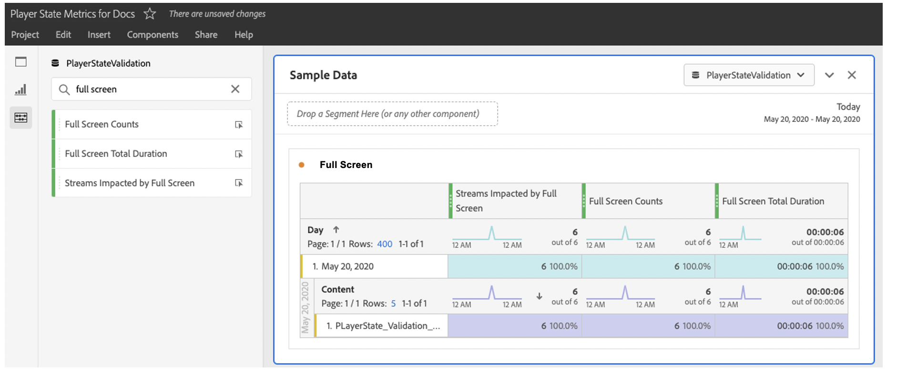

# Implementazione e reporting

Durante una sessione di riproduzione, ogni occorrenza di uno stato (dall’inizio alla fine) deve essere tracciata singolarmente. Media SDK e l’API Media Collection forniscono metodi di tracciamento per questa funzionalità.

Media SDK include due metodi per il tracciamento personalizzato dello stato:

`trackStateStart("state_name")`

`trackStateClose("state_name")`


L&#39;API Media Collection include due eventi che hanno `media.stateName` come parametro richiesto:

`stateStart` e `stateEnd`

## Implementazione di Media SDK

Avvio stato lettore

```
// StateStart (ex: Mute is switched on)
var stateObject = ADB.Media.createStateObject(ADB.Media.PlayerState.Mute);
tracker.trackEvent(ADB.Media.Event.StateStart, stateObject);
```

Fine stato lettore

```
// StateEnd (ex: Mute is switched off)
tracker.trackEvent(ADB.Media.Event.StateEnd, stateObject);
```


## Implementazione API Media Collection

Avvio stato lettore

```
// StateStart (ex: Mute is switched on)
http(s)://<Analytics_Visitor_Namespace>.hb-api.omtrdc.net/api/v1/sessions/<SID>/events
{
  "eventType": "stateStart",
  "params": {
    "media.state.name": "mute"
  },
  "playerTime": {
    "playhead": 0,
    "ts": 1569999130627
  }
}
```

Fine stato lettore

```
// StateEnd (ex: Mute is switched off)
http(s)://<Analytics_Visitor_Namespace>.hb-api.omtrdc.net/api/v1/sessions/<SID>/events

{
  "eventType": "stateEnd",
  "params": {
    "media.state.name": "mute"
  },
  "playerTime": {
    "playhead": 600,
    "ts": 1569999730638
  }
}
```

## Metriche di stato

Le metriche fornite per ogni singolo stato vengono calcolate e inviate ad Adobe Analytics come parametri di dati contestuali e memorizzate a scopo di reporting. Sono disponibili tre metriche per ogni stato:

* `a.media.states.[state.name].set = true` — Imposta su true se lo stato è stato impostato almeno una volta per ogni specifica riproduzione di un flusso.
* `a.media.states.[state.name].count = 4` — Identifica il numero di occorrenze di uno stato durante ogni singola riproduzione di un flusso
* `a.media.states.[state.name].time = 240` — Identifica la durata totale dello stato in secondi per ogni singola riproduzione di un flusso

## Reporting

Tutte le metriche dello stato del lettore possono essere utilizzate per qualsiasi visualizzazione di reporting disponibile in Analysis Workspace o in un componente (segmento, metriche calcolate) una volta che una suite di rapporti è abilitata per il tracciamento dello stato del lettore. Queste metriche possono essere abilitate nell’Admin Console per ogni singolo rapporto utilizzando la configurazione di Media Reporting (Modifica impostazioni > Gestione file multimediali > Media Reporting).


In Analysis Workspace, tutte le nuove proprietà si trovano nel pannello metriche. Ad esempio, puoi eseguire ricerche per `full screen` per visualizzare i dati a schermo intero nel pannello metriche.



## Importazione delle metriche dichiarate del lettore in Adobe Experience Platform

I dati memorizzati in Analytics possono essere utilizzati per qualsiasi scopo e le metriche dello stato del lettore possono essere importate in Adobe Experience Platform utilizzando XDM e utilizzate con Customer Journey Analytics. Le proprietà dello stato standard hanno proprietà specifiche, mentre gli stati personalizzati sono proprietà disponibili utilizzando gli eventi personalizzati. Per ulteriori informazioni sulle proprietà dello stato standard, consulta la sezione *Elenco delle proprietà per le identità XDM* dalla pagina [Parametri dello stato del lettore](/help/implementation/variables/player-state-parameters.md).
