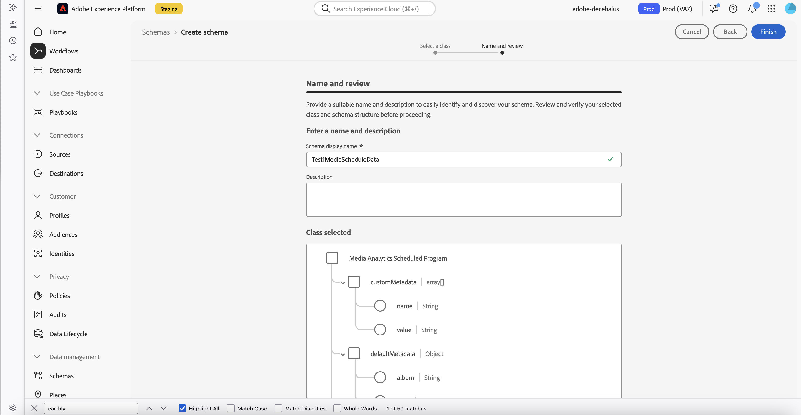

# Carica dati di pianificazione per tenere traccia del contenuto live

Puoi caricare i dati di pianificazione dei contenuti multimediali live passati per monitorare più facilmente e con precisione il pubblico di contenuti live. È possibile tenere traccia dei visualizzatori per singoli programmi e persino argomenti specifici o segmenti di programmi.

Di seguito sono riportati alcuni esempi di contenuti live supportati con la pianificazione del caricamento dei dati:

* Piattaforme FAST (Free Ad Supported TV)

* Flussi locali

* Sport live

* Notizie o programmazione di attualità

## Funzionalità

Sono disponibili varie funzionalità quando si utilizzano caricamenti di dati di pianificazione di contenuti live in streaming multimediali precedenti. In questa sezione vengono descritte alcune delle funzionalità chiave che consentono di analizzare le prestazioni del programma.

Queste funzionalità sono disponibili indipendentemente da come hai implementato Streaming Media Collection.

* **Monitora accuratamente le pianificazioni del programma**: identifica l&#39;ora di inizio e di fine di ogni singolo programma nel flusso live per il periodo di tempo che desideri analizzare. Con orari di inizio e fine precisi, il tempo di esecuzione preciso viene riflesso accuratamente e può essere analizzato rispetto a ogni sessione del visualizzatore.

  Ad esempio, gli orari precisi di inizio e fine non sono sempre noti per un evento sportivo live fino alla fine dell’evento. Pianificare i caricamenti di dati ti consente di ottenere rapporti precisi aggiornando gli orari di inizio e fine dopo il termine del programma.

* **Tieni traccia di singoli argomenti o segmenti di programmi**: crea nuove dimensioni basate sul tempo per argomenti specifici o segmenti di programmi (intervalli di tempo) all&#39;interno di un determinato programma. Queste dimensioni basate sul tempo consentono di analizzare i visualizzatori di un programma a un livello più specifico, aiutando a raccogliere informazioni su quali argomenti o segmenti di programma hanno avuto la migliore risonanza.

  Ad esempio, quando analizzi un evento sportivo live, ad esempio una partita di calcio, puoi creare dimensioni separate per la prima metà, l’ora e la seconda metà. Tracciando in questo modo argomenti o segmenti specifici all’interno di un programma, è possibile ottenere raggruppamenti più dettagliati del comportamento degli utenti.

* **Crea percorsi di utenti in Journey Optimizer**: tieni traccia dei programmi visualizzati da una persona in una determinata sessione (o anche degli argomenti o dei segmenti di programma visualizzati dalla persona), quindi utilizza questi dati in Adobe Journey Optimizer per creare percorsi di utenti per i clienti che hanno guardato un determinato programma o che hanno mostrato interesse per un particolare argomento.

## Comprendere come funzionano i dati di pianificazione per Streaming Media

La funzionalità di pianificazione dei dati per Streaming Media funziona nel modo seguente:

1. Legge dal set di dati del programma di pianificazione per i record del programma di pianificazione, filtrando in base alla data della pianificazione.

   Funziona solo per i programmi che si sono verificati da 24 ore a 48 ore nel passato.

2. Legge gli eventi di chiusura dei contenuti multimediali dal set di dati multimediali, filtrandoli per data e per il percorso XDM nei record del programma di pianificazione.

3. Per ogni evento di chiusura dei contenuti multimediali, viene generato lo stesso numero di eventi di inizio della pianificazione dei contenuti multimediali in quanto ci sono stati programmi che si sovrappongono alla sessione multimediale.

   Ogni evento di inizio della pianificazione multimediale contiene il nome e la lunghezza della pianificazione.

   Inoltre, una nuova metrica temporale denominata **scheduleTimePlayed** contiene il numero di secondi in cui la sessione multimediale si è sovrapposta al programma pianificato. Il timestamp dell’evento di inizio pianificazione è il timestamp dell’inizio dello spettacolo.

4. Scrive i nuovi eventi di inizio pianificazione nel set di dati multimediali di AEP.

## Prerequisiti

Per caricare i dati di pianificazione di contenuti live passati, l’ambiente Streaming Media deve soddisfare i seguenti prerequisiti:

* La raccolta di contenuti multimediali in streaming deve essere abilitata per il tracciamento del contenuto per il quale si desidera caricare i dati di pianificazione, come descritto in [Panoramica sul tracciamento](/help/use-cases/track-av-playback/track-core-overview.md). <!--specifics??? -->

* Utilizza Streaming Media Collection con Customer Journey Analytics. La possibilità di caricare dati di pianificazione non è disponibile con Adobe Analytics.

## Creare un set di dati di pianificazione del programma in AEP

Prima di poter inviare informazioni sulla pianificazione, devi creare un set di dati di pianificazione del programma in Experience Platform:

1. Crea uno schema basato sulla classe XDM del **Programma pianificato di Media Analytics**.

   

   Questa è la definizione XDM della classe di programma pianificato di Media Analytics.

   [https://github.com/adobe/xdm/blob/master/components/fieldgroups/tv-schedule/media-analytics-scheduled-program.schema.json](https://github.com/adobe/xdm/blob/master/components/fieldgroups/tv-schedule/media-analytics-scheduled-program.schema.json)

1. Crea un set di dati basato sullo schema creato.

1. Continua con la seguente sezione, [Informazioni sulla pianificazione push](#push-schedule-information).

## Informazioni pianificazione push

Dopo aver [creato un set di dati di pianificazione del programma](#create-a-program-schedule-dataset-in-aep), puoi inviare le informazioni di pianificazione:

1. Crea un file .json con le informazioni sulla pianificazione.

   Il file .json deve contenere un array di oggetti Schedule, in conformità allo schema XDM.

1. Carica il file .json:

   >[!NOTE]
   >
   >Gli esempi di cURL in questa sezione utilizzano le seguenti variabili:
   >
   >* Per l’autenticazione con Adobe Developer:
   >     * CUSTOMER_API_KEY
   >     * AUTH_TOKEN
   >* id organizzazione: CUSTOMER_ORG_ID
   >* ID del set di dati del record creato nell’impostazione: DATASET_ID
   >* ID batch creato nella prima richiesta utilizzata nel caricamento del file: BATCH_ID
   >* Nome del file utilizzato per inviare i record: FILE_NAME

   1. Crea un nuovo batch, quindi ottieni l’ID batch dalla risposta.

      Prendi in considerazione l’esempio seguente di utilizzo di cURL per creare un nuovo batch AEP:

      ```
          curl -i 'https://platform.adobe.io/data/foundation/import/batches' \
          -X POST \
          -H 'Accept: application/json' \
          -H 'x-api-key: <CUSTOMER_API_KEY>' \
          -H 'x-gw-ims-org-id: <CUSTOMER_ORG_ID>' \
          -H 'Content-Type: application/json' \
          -H 'Authorization: Bearer <OAUTH_TOKEN>' \
          --data-raw '{"datasetId":"<DATASET_ID>","inputFormat":{"format":"json","isMultiLineJson":true},"tags":{"test":["2"]}}'
      
          HTTP/1.1 201 Created
          {
              "id": "BATCH_ID",
              "imsOrg": "CUSTOMER_ORG_ID",
              "updated": 1749838941763,
              "status": "loading",
              "created": 1749838941763,
              "relatedObjects": [
                  {
                      "type": "dataSet",
                      "id": "DATASET_ID"
                  }
              ],
              "version": "1.0.0",
              ............
          }
      ```

   1. Invia il file .json contenente i record di dati della pianificazione del programma utilizzando l’ID batch.

      Per inviare informazioni sulla pianificazione devi utilizzare le API batch di AEP, come descritto in [Panoramica dell&#39;API di acquisizione in batch](https://experienceleague.adobe.com/en/docs/experience-platform/ingestion/batch/overview).

      Prendi in considerazione l’esempio seguente di utilizzo di cURL per inviare un file con i record di pianificazione:

      ```
          curl -i 'https://platform.adobe.io/data/foundation/import/batches/<BATCH_ID>/datasets/<DATASET_ID>/files/<FILE_NAME>' \
          -X PUT \
          -H 'x-api-key: <CUSTOMER_API_KEY>' \
          -H 'x-gw-ims-org-id: <CUSTOMER_ORG_ID>' \
          -H 'Content-Type: application/json' \
          -H 'Authorization: Bearer <OAUTH_TOKEN>' \
          --upload-file ./schedule_21_05_2025.json`
      ```

   1. Completa il batch.

      Prendi in considerazione l’esempio seguente di utilizzo di cURL per completare il batch:

      ```
          curl -i 'https://platform.adobe.io/data/foundation/import/batches/<BATCH_ID>?action=COMPLETE' \
          -X POST \
          -H 'x-api-key: <CUSTOMER_API_KEY>' \
          -H 'x-gw-ims-org-id: <CUSTOMER_ORG_ID>' \
          -H 'Content-Type: application/json' \
          -H 'Authorization: Bearer <OAUTH_TOKEN>'
      ```

1. Continua con la seguente sezione, [Registra un ticket di supporto con l&#39;Assistenza clienti Adobe](#log-a-support-ticket-with-adobe-customer-care).

## Registra un ticket di supporto con l’Assistenza clienti di Adobe

Registra un ticket di supporto presso l’Assistenza clienti di Adobe con le seguenti informazioni:

* **Set di dati multimediali**: specificare l&#39;ID del set di dati da cui vengono letti i dati delle sessioni multimediali.

* **Pianifica set di dati**: specifica l&#39;ID del set di dati a cui vengono inviati i record della pianificazione.

* **Set di dati multimediali di output**: specificare l&#39;ID del set di dati in cui vengono salvati gli eventi di avvio della pianificazione.

  Questo ID del set di dati può essere lo stesso ID del set di dati utilizzato per il set di dati Media. Se si tratta di un ID set di dati diverso, deve comunque avere lo stesso schema XDM del set di dati Media.

* **ID organizzazione**: specifica l&#39;ID organizzazione.

## Esempio di file .json di pianificazione con due record

L’esempio seguente è di un file .json di pianificazione con due record. Ogni file .json deve contenere tutti i programmi pianificati per un giorno.

```
   [
        {
            "_id": "any_identifier_as_id_1",
            "customMetadata": [
                {
                    "name": "Sample value",
                    "value": "Sample value"
                }
            ],
            "defaultMetadata": {
                "album": "Sample value",
                "artist": "Sample value",
                "assetID": "Sample value",
                "author": "Sample value",
                "cdn": "Sample value",
                "dayPart": "Sample value",
                "episode": "Sample value",
                "feed": "Sample value",
                "firstAirDate": "Sample value",
                "firstDigitalDate": "Sample value",
                "genreList": [
                    "Sample value"
                ],
                "label": "Sample value",
                "network": "Sample value",
                "originator": "Sample value",
                "publisher": "Sample value",
                "rating": "Sample value",
                "season": "Sample value",
                "show": "Sample value",
                "showType": "Sample value",
                "station": "Sample value",
                "streamFormat": "Sample value"
            },
            "mediaProgramDetails": {
                "length": 1800,
                "name": "Show Name",
                "startTimestamp": "2025-05-01T00:30:00+00:00"
            },
            "scheduleDate": "2025-05-01",
            "scheduleFilter": {
                "filterPath": "xdm.mediaReporting.sessionDetails.channel",
                "filterValue": "Channel Name"
            },
        },
        {
            "_id": "any_identifier_as_id_2",
            "customMetadata": [
                {
                    "name": "Sample value",
                    "value": "Sample value"
                }
            ],
            "defaultMetadata": {
                "album": "Sample value",
                "artist": "Sample value",
                "assetID": "Sample value",
                "author": "Sample value",
                "cdn": "Sample value",
                "dayPart": "Sample value",
                "episode": "Sample value",
                "feed": "Sample value",
                "firstAirDate": "Sample value",
                "firstDigitalDate": "Sample value",
                "genreList": [
                    "Sample value"
                ],
                "label": "Sample value",
                "network": "Sample value",
                "originator": "Sample value",
                "publisher": "Sample value",
                "rating": "Sample value",
                "season": "Sample value",
                "show": "Sample value",
                "showType": "Sample value",
                "station": "Sample value",
                "streamFormat": "Sample value"
            },
            "mediaProgramDetails": {
                "length": 3600,
                "name": "Show Name 2",
                "startTimestamp": "2025-05-01T01:00:00+00:00"
            },
            "scheduleDate": "2025-05-01",
            "scheduleFilter": {
                "filterPath": "xdm.mediaReporting.sessionDetails.channel",
                "filterValue": "Channel Name"
            }
        }
    ]
```

### Comprendere i campi del programma di programmazione nell&#39;esempio

1. **mediaProgramDetails**: deve contenere le informazioni minime necessarie per creare l&#39;evento di avvio della pianificazione:
   * **startTimestamp**: ora di inizio dello spettacolo.
   * **name**: nome descrittivo della presentazione.
   * **lunghezza**: il numero di secondi di durata dello spettacolo.

     >[!IMPORTANT]
     >
     >Se hai più richieste di dati di pianificazione, queste non possono avere orari di inizio e di fine sovrapposti.

1. **scheduleDate**: la data in cui lo spettacolo è stato trasmesso. Il formato deve essere AAAA-MM-GG. Viene utilizzato per filtrare il set di dati di pianificazione e ottenere tutte le pianificazioni per le quali Adobe crea un avvio di pianificazione.
1. **scheduleFilter**: utilizzato per filtrare tutti gli eventi di chiusura delle sessioni multimediali.
   * **filterPath**: percorso XDM del campo utilizzato per il filtro.
   * **filterValue**: valore utilizzato per il filtro.
1. **customMetadata**: i metadati personalizzati da aggiungere alla pianificazione avviano gli eventi. Questi metadati vengono utilizzati per sovrascrivere i metadati personalizzati presenti negli eventi di chiusura della sessione.
1. **defaultMetadata**: elenco specifico di dimensioni che possono aggiungere o sovrascrivere i medati predefiniti presenti nelle chiamate di chiusura dei contenuti multimediali.

   Prendi in considerazione i seguenti esempi di dimensioni che puoi creare e quindi generare rapporti in Customer Journey Analytics:

   * **[&quot;_Nome episodio_&quot;](https://experienceleague.adobe.com/en/docs/media-analytics/using/implementation/variables/audio-video-parameters#episode)**: questa dimensione può aiutarti a capire quali episodi di una particolare serie hanno prestazioni migliori.

   * **[ID risorsa](https://experienceleague.adobe.com/en/docs/media-analytics/using/implementation/variables/audio-video-parameters#asset-id)**

1. Continua con [Analizza dati in Customer Journey Analytics](#analyze-data-in-customer-journey-analytics).

## Analizzare i dati in Customer Journey Analytics

Entro un giorno dal caricamento del file di dati come descritto in [Richiedi e carica il file di dati di pianificazione](#request-and-upload-the-schedule-data-file), i tuoi dati sono pronti per generare report in Customer Journey Analytics.

Per creare rapporti sui dati multimediali in streaming passati in tempo reale in Customer Journey Analytics:

1. Crea un nuovo progetto o apri un progetto esistente.

1. Crea il progetto creando eventuali tabelle o visualizzazioni necessarie per l’analisi dei dati live Streaming Media passati.

   Durante la creazione del progetto, utilizza le informazioni incluse nel file di dati della pianificazione e inviate all’Assistenza clienti di Adobe. Ciò include la chiave corrispondente, le dimensioni ed eventuali metadati aggiuntivi. Per ulteriori informazioni, vedere [Richiedere e caricare il file di dati della pianificazione](#request-and-upload-the-schedule-data-file).


<!-- 

Extra

Things they need to upload:
Everything on that slide + other metadata
You can't overlap 2 schedules.
You can build a journey in AJO for the people who watch Mike, Mike, and Mike. e.g. 
This is recurring.
Available to all SKUs? "Increases cost for updated data by 22%, but included in the new higher tier Streaming Media SKU."

You can now upload schedule data of past live content to more easily and accurately track viewership. Live content includes content from FAST (Free Ad Supported TV) platforms or local streams.
You can track which programs a person viewed in a given session, or even which topics or program segments they viewed. These capabilities are available regardless of how you implemented Streaming Media Collection.
Previously, it was difficult to accurately tie a given session to specific programs when analyzing live content, and it wasn't possible to tie a given session to individual topics or program segments.
Schedule data uploads of live content in Streaming Media Collection includes the following capabilities:
Upload schedules for past live content, regardless of your Streaming Media Collection implementation.
Identify the start and end times of each individual program in the live stream for the period of time that you want to analyze. With accurate start and end times, the precise running time is accurately reflected and can be analyzed against each viewer session.
For example, precise beginning and end times are not always known for a live sporting event until the event is over. Schedule data uploads allow you to get accurate reporting by updating the start and end times after the program finishes.
Create new time-based dimensions for specific topics or program segments (time slots) within a given program. These time-based dimensions allow you to analyze viewership of a program at a more specific level, helping to gather insights about which topics or program segments resonated best.
For example, when analyzing a live sporting event, such as a soccer match, you can create separate dimensions for the first half, half time, and second half. This allows for more detailed breakdowns of viewer behavior for specific segments of a program.
These capabilities allow you to:
Analyze show viewership to understand performance.
Target users based on program viewership.
Analyze viewership based on metadata like topic, sports league, sponsorship, and so forth.
Target based on metadata viewership.
Correct media metrics for show dimensions of live sports/events for easier analysis at scale.
Increased ease of use for live sports

-->
