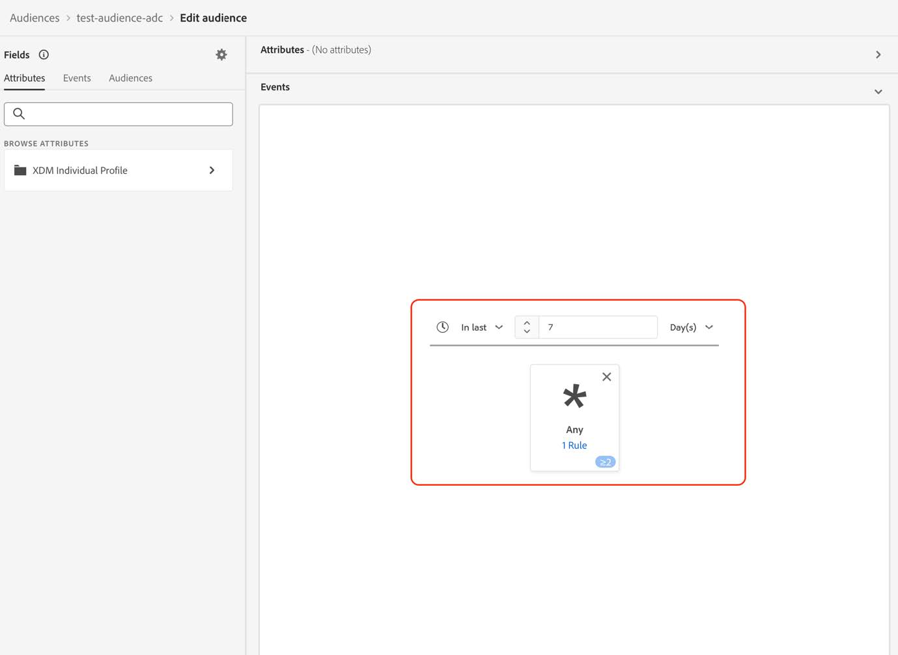
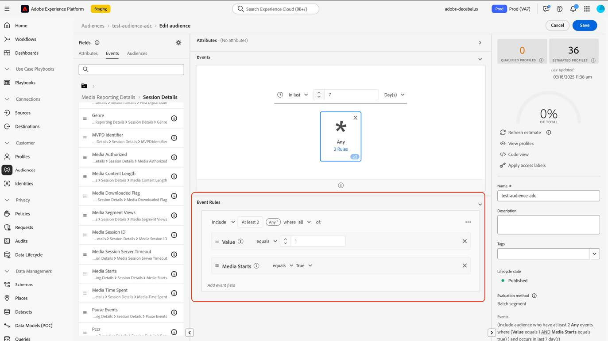

# Migrare i tipi di pubblico ai nuovi campi di Streaming Media

Questo documento descrive come un pubblico che utilizza campi del tipo di dati Adobe Streaming Media Collection denominato &quot;Media&quot; deve essere migrato per utilizzare il nuovo tipo di dati corrispondente denominato &quot;[Media Reporting Details](https://experienceleague.adobe.com/en/docs/experience-platform/xdm/data-types/media-reporting-details)&quot;.

## Migrare un pubblico

Per migrare un pubblico dal vecchio tipo di dati denominato &quot;Media&quot; al nuovo tipo di dati denominato &quot;[Dettagli report multimediali](https://experienceleague.adobe.com/en/docs/experience-platform/xdm/data-types/media-reporting-details)&quot;, è necessario modificare il pubblico e in ogni regola sostituire il vecchio campo dal tipo di dati obsoleto con il nuovo campo corrispondente del nuovo tipo di dati:

1. Individua le regole contenenti i campi del tipo di dati &quot;Media&quot; obsoleto. Questi sono tutti i campi che iniziano con il percorso, `media.mediaTimed`.

1. Duplica tali regole utilizzando i campi del nuovo tipo di dati &quot;[Dettagli report multimediali](https://experienceleague.adobe.com/en/docs/experience-platform/xdm/data-types/media-reporting-details)&quot;.

1. Mantieni entrambe le regole attive finché non verifichi che i tipi di pubblico funzionino come previsto.

1. Rimuovi le regole che contengono campi dal tipo di dati &quot;Contenuto multimediale&quot; obsoleto.

1. Verifica che i tipi di pubblico funzionino ancora come previsto.

Vedi il parametro [ID contenuto](https://experienceleague.adobe.com/en/docs/media-analytics/using/implementation/variables/audio-video-parameters#content-id) nella pagina [Parametri audio e video](https://experienceleague.adobe.com/it/docs/media-analytics/using/implementation/variables/audio-video-parameters) per eseguire il mapping tra i campi precedenti e i nuovi campi. Il vecchio percorso di campo si trova nella proprietà &quot;Percorso campo XDM&quot;, mentre il nuovo percorso di campo si trova nella proprietà &quot;Percorso campo XDM per reporting&quot;.

## Esempio

Per seguire più facilmente le linee guida per la migrazione, considera l’esempio seguente che contiene un pubblico con una singola regola. Poiché il pubblico dispone di una singola regola, è necessario applicare le linee guida per la migrazione una sola volta.

1. Seleziona il pulsante [!UICONTROL **Modifica pubblico**] nell&#39;angolo superiore destro.

1. Individua le regole configurate per il pubblico.

   

   

1. Seleziona la regola per aprirne la configurazione.

   

1. (Facoltativo) Per visualizzare il percorso del campo utilizzato nella regola, seleziona il pulsante Info accanto al nome del campo.

   

1. Identifica il nome del campo (in questo caso &quot;Media Starts&quot;).

   

1. Visita la pagina [Parametri audio e video](https://experienceleague.adobe.com/it/docs/media-analytics/using/implementation/variables/audio-video-parameters) per la mappatura tra i campi precedenti. Il vecchio percorso di campo si trova nella proprietà &quot;Percorso campo XDM&quot;, mentre il nuovo percorso di campo si trova nella proprietà &quot;Percorso campo XDM per reporting&quot;. Ad esempio, per il parametro [Media Starts](https://experienceleague.adobe.com/en/docs/media-analytics/using/implementation/variables/audio-video-parameters#media-starts), il corrispondente per `media.mediaTimed.impressions.value` è `mediaReporting.sessionDetails.isViewed`.

   

1. Aggiungi la stessa regola di quella esistente utilizzando il nuovo campo.

   

   

   

1. Seleziona [!UICONTROL **Salva**] per salvare il pubblico. Puoi mantenere questa configurazione per il tempo necessario a verificare che il pubblico funzioni ancora come previsto.

1. Al termine della convalida, rimuovi il campo precedente, quindi seleziona [!UICONTROL **Salva**] per salvare il pubblico.

   

1. Convalida di nuovo il pubblico.

   Il processo di migrazione del pubblico è stato completato.
