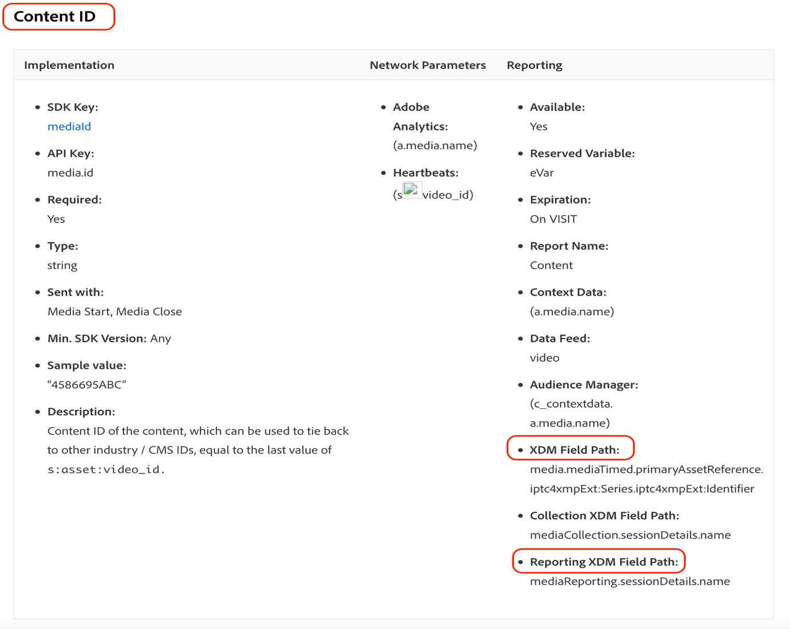

# Migra Customer Journey Analytics per utilizzare i nuovi campi per contenuti multimediali in streaming

In questo documento viene descritto come aggiornare una configurazione di Customer Journey Analytics che utilizza il tipo di dati di Adobe Streaming Media Services denominato &quot;Media&quot; per utilizzare il nuovo tipo di dati corrispondente denominato &quot;[Media Reporting Details](https://experienceleague.adobe.com/it/docs/experience-platform/xdm/data-types/media-reporting-details)&quot;.

## Migra Customer Journey Analytics

Per eseguire la migrazione di un&#39;installazione di Customer Journey Analytics dal vecchio tipo di dati denominato &quot;Media&quot; al nuovo tipo di dati denominato &quot;[Media Reporting Details](https://experienceleague.adobe.com/it/docs/experience-platform/xdm/data-types/media-reporting-details)&quot;, è necessario aggiornare le seguenti impostazioni che utilizzano il vecchio tipo di dati:

* Visualizzazioni dati

* Campi derivati

### Eseguire la migrazione delle visualizzazioni dati

Per migrare le visualizzazioni dati al nuovo tipo di dati:

1. Individua tutte le visualizzazioni dati utilizzando il tipo di dati &quot;Media&quot; obsoleto. In tutti i campi il percorso inizia con `media.mediaTimed`.

1. Esegui una delle operazioni seguenti:

   * In tali visualizzazioni dati, inserisci i campi dal nuovo tipo di dati &quot;Dettagli report multimediali&quot;.

   * Creare un campo derivato che utilizza il nuovo tipo di dati &quot;Dettagli di Media Reporting&quot;, se è impostato, o che utilizza il vecchio tipo di dati &quot;Media&quot; se non è impostato il tipo di dati &quot;Dettagli di Media Reporting&quot;.

### Migra campi derivati

Per migrare i campi derivati al nuovo tipo di dati:

1. Individua tutti i campi derivati utilizzando il tipo di dati &quot;Media&quot; obsoleto. Si tratta di tutti i campi derivati che contengono campi il cui percorso inizia con `media.mediaTimed`.

1. Sostituisci tutti i vecchi campi nel campo derivato con il nuovo campo corrispondente da &quot;Media Reporting Details&quot;.

Vedi il parametro [ID contenuto](https://experienceleague.adobe.com/it/docs/media-analytics/using/implementation/variables/audio-video-parameters#content-id) nella pagina [Parametri audio e video](https://experienceleague.adobe.com/it/docs/media-analytics/using/implementation/variables/audio-video-parameters) per eseguire il mapping tra i campi precedenti e i nuovi campi. Il vecchio percorso di campo si trova nella proprietà &quot;Percorso campo XDM&quot;, mentre il nuovo percorso di campo si trova nella proprietà &quot;Percorso campo XDM per reporting&quot;.

## Esempio

Per seguire più facilmente le linee guida per la migrazione, considera l’esempio seguente che contiene una visualizzazione dati con campi del vecchio tipo di dati &quot;Media&quot; obsoleto. In questa visualizzazione dati, devi aggiungere i nuovi campi corrispondenti.

### Aggiornare la visualizzazione dati

Per aggiornare la visualizzazione dati, puoi utilizzare una delle seguenti opzioni:

#### Opzione 1

1. Individua una metrica o una dimensione che utilizza il vecchio campo del tipo di dati obsoleto.

   

1. Controlla il nuovo campo corrispondente nella sezione [Offset capitolo](https://experienceleague.adobe.com/it/docs/media-analytics/using/implementation/variables/chapter-parameters#chapter-offset) nell&#39;articolo [Parametri capitolo](https://experienceleague.adobe.com/it/docs/media-analytics/using/implementation/variables/chapter-parameters).

1. Individua il nuovo campo corrispondente nella visualizzazione dati.

   

1. Trascina il nuovo campo nella metrica o dimensione.

1. Ripeti questo processo per tutte le metriche e le dimensioni che utilizzano campi del tipo di dati &quot;Media&quot; obsoleto.

#### Opzione 2

Questa opzione crea un campo derivato che seleziona il valore dal campo precedente o il valore dal nuovo campo in base al quale esiste un campo per un evento specifico. Questo campo derivato sostituisce il vecchio tipo di dati &quot;Media&quot; in tutti i progetti in cui viene utilizzato.

Se si desidera creare un campo derivato per il &quot;Nome capitolo&quot; che utilizza il nuovo tipo di dati &quot;Dettagli di Media Reporting&quot;, se è impostato, o che utilizza il vecchio tipo di dati &quot;Media&quot; se il tipo di dati &quot;Dettagli di Media Reporting&quot; non è impostato:

1. Trascinare una clausola &quot;Case When&quot; nei campi derivati.

   

1. Compilare la clausola [!UICONTROL **If**] utilizzando il valore del **Percorso campo XDM per reporting**, come mostrato nel parametro [Nome capitolo](https://experienceleague.adobe.com/it/docs/media-analytics/using/implementation/variables/chapter-parameters#chapter-name) nella pagina [Parametri capitolo](https://experienceleague.adobe.com/it/docs/media-analytics/using/implementation/variables/chapter-parameters).

   

   

   

   

1. Popola il valore di fallback utilizzando il vecchio campo del tipo di dati &quot;Media&quot; obsoleto.

   

   

   Definizione finale del campo derivato.

   

1. Per aggiornare i campi derivati, individuare un campo derivato che utilizza i campi obsoleti (percorso che inizia con `media.mediaTimed`).

   

1. Passa il puntatore del mouse sul campo derivato che desideri aggiornare, quindi seleziona l&#39;icona [!UICONTROL **Modifica**].

1. Individuare tutti i campi del vecchio tipo di dati (percorso che inizia con `media.mediaTimed`) e sostituirli con il nuovo campo corrispondente.

   

1. Controllare il nuovo campo corrispondente nella sezione [Nome contenuto (variabile)](https://experienceleague.adobe.com/it/docs/media-analytics/using/implementation/variables/audio-video-parameters#content-name-variable) nell&#39;articolo [Parametri di Streaming Media](https://experienceleague.adobe.com/it/docs/media-analytics/using/implementation/variables/audio-video-parameters#content-name-variable).

1. Sostituire il campo precedente con il nuovo campo.

   

1. Ripeti questo processo per tutti i campi derivati utilizzando i campi del vecchio tipo di dati &quot;Media&quot; obsoleto.

   La migrazione della configurazione di CJA è stata completata.
