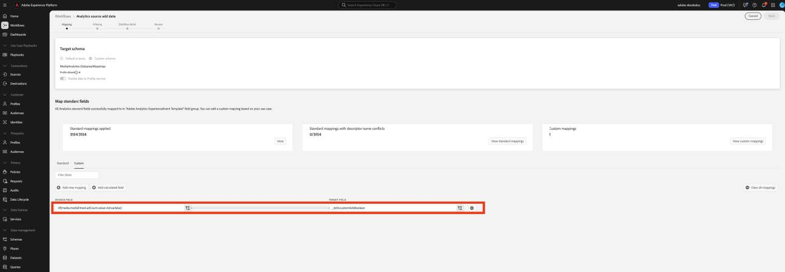

# Migrare la preparazione dati per i campi personalizzati ai nuovi campi di Streaming Media

Questo documento descrive il processo di migrazione del servizio di preparazione dati esistente sopra i flussi di raccolta dati di Adobe abilitati per i dati di raccolta multimediale in streaming di Adobe. La migrazione converte una mappatura della preparazione dati dal tipo di dati Adobe Streaming Media Collection denominata &quot;Media&quot; per utilizzare il nuovo tipo di dati corrispondente denominato &quot;[Media Reporting Details](https://experienceleague.adobe.com/en/docs/experience-platform/xdm/data-types/media-reporting-details)&quot;.

## Migra preparazione dati per campi personalizzati

Per eseguire la migrazione delle mappature della preparazione dati dal vecchio tipo di dati denominato &quot;Media&quot; al nuovo tipo di dati denominato &quot;[Media Reporting Details](https://experienceleague.adobe.com/en/docs/experience-platform/xdm/data-types/media-reporting-details)&quot;, è necessario modificare le mappature della preparazione dati:

>[!IMPORTANT]
>
>Per evitare la perdita di dati, assicurati che il connettore di origine di Analytics sia stato distribuito utilizzando i nuovi campi `mediaReporting` prima di completare i passaggi in questa sezione.

1. In Adobe Experience Platform, nella sezione [!UICONTROL **Origini**], vai alla scheda [!UICONTROL **Flussi dati**].

1. Individua il flusso di dati responsabile dell’importazione di dati multimediali in streaming da Adobe Analytics a Adobe Experience Platform tramite Raccolta dati di Adobe.

1. Seleziona [!UICONTROL **Aggiorna flusso di dati**] per modificare la configurazione della preparazione dati sostituendo ogni mappatura di origine personalizzata contenente un campo obsoleto con il nuovo campo corrispondente del nuovo oggetto XDM.

1. Individua le mappature contenenti i campi sorgente dall’oggetto &quot;Media&quot; obsoleto.

1. Sostituire tali origini utilizzando i campi del nuovo oggetto &quot;Dettagli di Media Reporting&quot;.

1. Verifica che le mappature funzionino ancora come previsto.

Vedi il parametro [ID contenuto](https://experienceleague.adobe.com/en/docs/media-analytics/using/implementation/variables/audio-video-parameters#content-id) nella pagina [Parametri audio e video](https://experienceleague.adobe.com/it/docs/media-analytics/using/implementation/variables/audio-video-parameters) per eseguire il mapping tra i campi precedenti e i nuovi campi. Il vecchio percorso di campo si trova nella proprietà &quot;Percorso campo XDM&quot;, mentre il nuovo percorso di campo si trova nella proprietà &quot;Percorso campo XDM per reporting&quot;.

## Esempio

Per seguire più facilmente le linee guida per la migrazione, considera il seguente flusso di dati di esempio che contiene una singola mappatura. In questo caso, è necessario applicare le linee guida sulla migrazione una sola volta.

1. In Adobe Experience Platform, nella sezione [!UICONTROL **Origini**], vai alla scheda [!UICONTROL **Flussi dati**].

1. Individua il flusso di dati responsabile dell’importazione di dati multimediali in streaming da Adobe Analytics a Adobe Experience Platform tramite Raccolta dati di Adobe.

1. Selezionare **[!UICONTROL Update dataflow]** per accedere all&#39;interfaccia utente di modifica, come illustrato nell&#39;immagine seguente.

   

1. Nella scheda **[!UICONTROL Mapping]**, selezionare **[!UICONTROL Custom]**.

1. Identificare i mapping personalizzati che si basano sui campi `media.mediaTimed` come origini.

   

   In questo esempio, poiché hai creato un gruppo di campi personalizzato sullo schema nell&#39;organizzazione di sviluppo, il campo di destinazione si trova in `_dcbl`. Il percorso del gruppo di campi personalizzato varia in base al nome dell’organizzazione.

1. Per ogni mapping che utilizza l&#39;oggetto `media.mediaTimed`, trovare il corrispondente nell&#39;oggetto `mediaReporting` utilizzando questa documentazione.

   Ad esempio, per Rete, il corrispondente per `media.mediaTimed.primaryAssetViewDetails`.broadcastNetwork è `mediaReporting.sessionDetails.network`.

   

1. Nel campo **[!UICONTROL Source field]**, sostituire il percorso `media.mediaTimed` con il percorso `mediaReporting`. Il campo di destinazione rimane invariato.

   

1. Seleziona **[!UICONTROL Next]** per salvare le modifiche.

   Lo stato visualizzato è **[!UICONTROL Processing]**. Dopo l&#39;applicazione delle modifiche, lo stato visualizzato è **[!UICONTROL Enabled]**.

   

## Esempio con tipi di dati diversi

Nell’esempio precedente, tutti i tipi di dati interessati erano di tipo String, pertanto la mappatura veniva sostituita direttamente.

Se il tipo di dati del campo di origine è diverso dal tipo di dati del campo di destinazione, è necessario seguire le linee guida della [Guida alla risoluzione dei problemi della preparazione dati](https://experienceleague.adobe.com/en/docs/experience-platform/data-prep/troubleshooting-guide), [Gestione dei formati di dati con le funzioni di mappatura della preparazione dati](https://experienceleague.adobe.com/en/docs/experience-platform/data-prep/data-handling) e [Funzione di mappatura della preparazione dati](https://experienceleague.adobe.com/en/docs/experience-platform/data-prep/data-handling).

Ad esempio, se il tipo di origine è una stringa e il tipo di destinazione è booleano, Preparazione dati può analizzare automaticamente il valore e convertirlo in booleano.

Se il tipo di origine è un numero e il tipo di destinazione è booleano, è necessario utilizzare le funzioni di manipolazione dei dati:

Mappatura con `media.mediaTimed` a un campo personalizzato.

Mappatura con `mediaReporting` allo stesso campo personalizzato:

