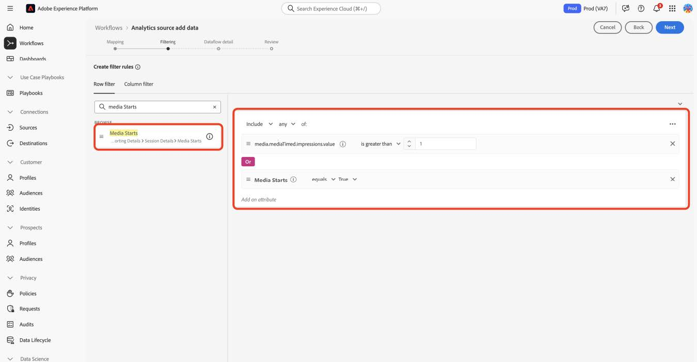

# Migrare i profili ai nuovi campi di Streaming Media

Questo documento descrive il processo di migrazione del servizio di filtro profili esistente sopra i flussi di raccolta dati di Adobe abilitati per i dati di Adobe Analytics for Streaming Media. La migrazione converte il servizio di filtro dei profili dall&#39;utilizzo del tipo di dati Adobe Streaming Media Collection denominato &quot;Media&quot; al nuovo tipo di dati corrispondente denominato &quot;[Media Reporting Details](https://experienceleague.adobe.com/en/docs/experience-platform/xdm/data-types/media-reporting-details)&quot;.

## Migrare i profili

Per migrare il filtro dei profili dal vecchio tipo di dati denominato &quot;Media&quot; al nuovo tipo di dati denominato &quot;[Media Reporting Details](https://experienceleague.adobe.com/en/docs/experience-platform/xdm/data-types/media-reporting-details)&quot;, è necessario modificare le regole di filtro dei profili esistenti:

1. In Adobe Experience Platform, nella sezione [!UICONTROL **Origini**], vai alla scheda [!UICONTROL **Flussi dati**].

1. Individua il flusso di dati responsabile dell’importazione di dati multimediali in streaming da Adobe Analytics a Adobe Experience Platform tramite Raccolta dati di Adobe.

1. Seleziona [!UICONTROL **Aggiorna flusso di dati**] per modificare l&#39;impostazione del filtro dei profili sostituendo ogni regola personalizzata contenente un campo obsoleto con il nuovo campo corrispondente dal nuovo oggetto XDM.

1. Individua i filtri contenenti i campi dell’oggetto &quot;Media&quot; obsoleto.

1. Aggiungi questi filtri aggiungendo campi dal nuovo oggetto &quot;Dettagli di Media Reporting&quot;.

1. Utilizza un operatore OR tra i due campi;

1. Verifica che i profili funzionino ancora come previsto.

Vedi il parametro [ID contenuto](https://experienceleague.adobe.com/en/docs/media-analytics/using/implementation/variables/audio-video-parameters#content-id) nella pagina [Parametri audio e video](https://experienceleague.adobe.com/it/docs/media-analytics/using/implementation/variables/audio-video-parameters) per eseguire il mapping tra i campi precedenti e i nuovi campi. Il vecchio percorso di campo si trova nella proprietà &quot;Percorso campo XDM&quot;, mentre il nuovo percorso di campo si trova nella proprietà &quot;Percorso campo XDM per reporting&quot;.

## Esempio

Per seguire più facilmente le linee guida per la migrazione, considera il seguente flusso di dati di esempio che contiene una singola regola di filtro del profilo. In questo caso, poiché esiste una sola regola, è necessario applicare le linee guida sulla migrazione una sola volta.

1. In Adobe Experience Platform, nella sezione [!UICONTROL **Origini**], vai alla scheda [!UICONTROL **Flussi dati**].

1.Individua il flusso di dati responsabile dell’importazione di dati multimediali in streaming da Adobe Analytics a Adobe Experience Platform tramite Adobe Analytics.

1. Selezionare **[!UICONTROL Update dataflow]** per accedere all&#39;interfaccia utente di modifica, come illustrato nell&#39;immagine seguente.

   

1. Selezionare **[!UICONTROL Next]** per passare alla scheda Filtro.

   

1. Nella scheda **[!UICONTROL Filtering]**, identificare le regole di filtro che si basano sui campi `media.mediaTimed`.

   

   Per ogni filtro che utilizza l&#39;oggetto meda.mediaTimed, trovare il corrispondente nell&#39;oggetto `mediaReporting` utilizzando la pagina [Parametri audio e video](https://experienceleague.adobe.com/it/docs/media-analytics/using/implementation/variables/audio-video-parameters) per la mappatura tra i campi precedenti e i nuovi campi. Il vecchio percorso di campo si trova nella proprietà &quot;Percorso campo XDM&quot;, mentre il nuovo percorso di campo si trova nella proprietà &quot;Percorso campo XDM per reporting&quot;. Ad esempio, per [Media Starts](https://experienceleague.adobe.com/en/docs/media-analytics/using/implementation/variables/audio-video-parameters#media-starts), il corrispondente per `media.mediaTimed.impressions.value` è `mediaReporting.sessionDetails.isViewed`.

   

1. Trascina il campo `mediaReporting` rilevante nella regola di filtro e utilizza l&#39;operatore OR tra le due regole. Aggiungi la stessa regola di quella esistente quando utilizzi il nuovo campo.

   

1. Seleziona **[!UICONTROL Next]** per salvare le modifiche.
